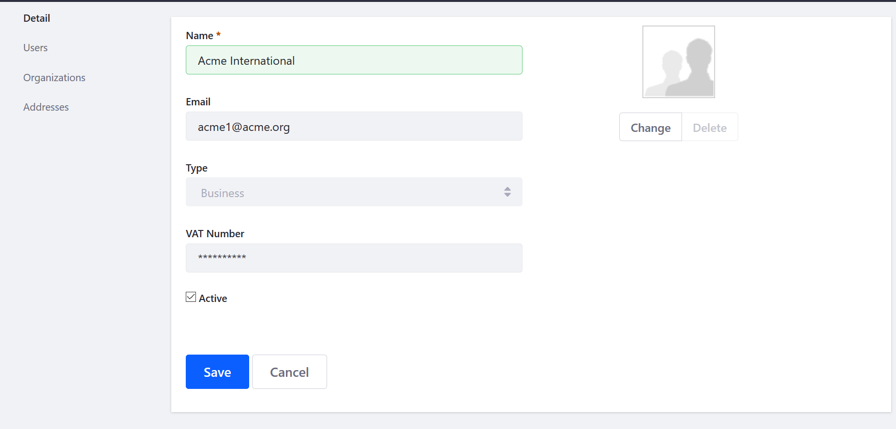

# Adding Organizations to Accounts

There are two ways to add organizations to an account: 1) using the _Account Management_ widget and 2) through the _Control Panel_. Access to the _Control Panel_ is typically restricted to those with administrative permissions for the store or installation.

## Using the Account Management Widget

1. Click the left _Navigation Menu_ → _Account Management_.
1. Click on an account (for example _South Bay Auto Parts Distributors_).
1. Click the _Add Organizations_ button.

    

1. Enter a valid Organization or select one from the list (for example, _Italy - South_)

    

2. Click _Add Organization_.

The Organization has been added to the Account.

(a lot of old stuff below, though not 100% of it is old)

## Using the Control Panel

Users who have administrative permissions for the store or installation may create and update account information in the _Control Panel_.

1. Navigate to the _Control Panel_ → _Users_ → _Accounts_.
1. Click the (+) button to add a new account.
1. Enter the following:
    * **Name**: _your company name_ (Acme International)
    * **Email**: _your company email_ (Acme1@acme.org)
    * **Type**: _Business_
    * **VAT Number**: _your VAT number*_

    

1. Click _Save_.

The new account has been created using the Control Panel. Click _Addresses_ to update the account's addresses. For more information, see the [Adding Addresses to an Account](../adding-addresses-to-an-account/README.md#using-the-control-panel) article.

## Additional Information

* [Account Roles](../account-management/account-roles.md)
* [Commerce Roles Permissions Reference](../account-management/commerce-roles-permissions-reference.md)
* [Introduction to Accounts](../account-management/introduction-to-accounts.md)
* [Adding Users to Organizations](../account-management/adding-users-to-organizations.md)

# Adding Users to Organizations