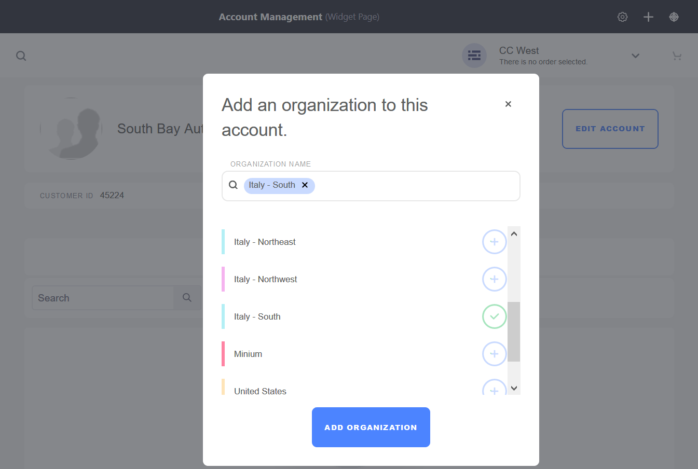

# Adding Organizations to Accounts

There are two ways to add an existing organization to an account: 1) using the _Account Management_ widget and 2) through the _Control Panel_. Access to the _Control Panel_ is typically restricted to those with administrative permissions for the store or installation.

## Using the Account Management Widget

1. Click the left _Navigation Menu_ → _Account Management_.
1. Click on an account (for example _South Bay Auto Parts Distributors_).
1. Click the _Add Organizations_ button.

    

1. Enter a valid Organization or select one from the list (for example, _Italy - South_).

    

2. Click _Add Organization_.

The organization has been added to the account using the Account Management Widget.

## Using the Control Panel

Users who have administrative permissions for the store or installation may create and update account information in the _Control Panel_.

1. Navigate to the _Control Panel_ → _Users_ → _Accounts_.
1. Click on an account (for example _South Bay Auto Parts Distributors_).
1. Click _Organizations_ on the left.
1. Click the (+) button to add a new organization.
1. Check the boxes for all the organizations to be added (for example, _Italy - South_).
1. Click Add.

    

The organization has been added to the account using the Control Panel.

## Additional Information

* [Account Roles](../account-management/account-roles.md)
* [Commerce Roles Permissions Reference](../account-management/commerce-roles-permissions-reference.md)
* [Introduction to Accounts](../account-management/introduction-to-accounts.md)
* [Adding Users to Organizations](../account-management/adding-users-to-organizations.md)
