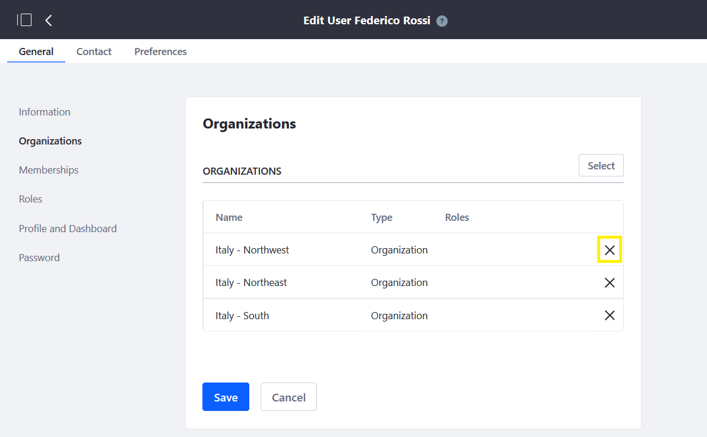

# Adding Users to Organizations

When a User (for example, a Sales Agent) belongs to a specific Organization in Liferay Commerce, he or she can then view (or depending on the role, possibly manage) the accounts associated with that Organization.

To add a User to an Organization:

(old content below)

1. Navigate to the _Control Panel_ → _Users_ → _Users and Organizations_.
1. Click on a user (for example _Federico Rossi_).
1. Click _Organizations_ on the left.
1. Click _Select_.
1. Click _Choose_ to select the Organization (for example, _Italy - South_)
1. Click Save.

    

The user has been added to the organization using the Control Panel.

To remove a User from an Organization, repeat the first three steps above and then:

1. Click the "x" to the far right of an Organization.
1. Click Save.

    

There's another way to add a User to an Organization in the Control Panel. Simply:

1. Navigate to the _Control Panel_ → _Users_ → _Users and Organizations_.
2. Click on the _Organizations_ tab.
3. Click on an organization (or multiple clicks to the sub-Organization) (for example _Minium / Italy / Italy - South_).
4. Click the (+) button to _Assign Users_ to the Organization (for an existing User). (Alternatively, a _New User_ can be created here, too.)
5. Check the boxes for all the users to be added (for example, _Francesca Puccini_).
6. Click Done.

    

To remove a User from an Organization, repeat the first three steps above and then:

1. Click the 3-dot icon to the far right of an Organization.
2. Click Remove.

    

## Additional Information

(To do still: update this list of articles. What are the most relevant articles?)

* [Adding Organizations to Accounts](../account-management/adding-organizations-to-accounts.md)
* [Introduction to Accounts](../account-management/introduction-to-accounts.md)
* [Account Roles](../account-management/account-roles.md)
* [Commerce Roles Permissions Reference](../account-management/commerce-roles-permissions-reference.md)
