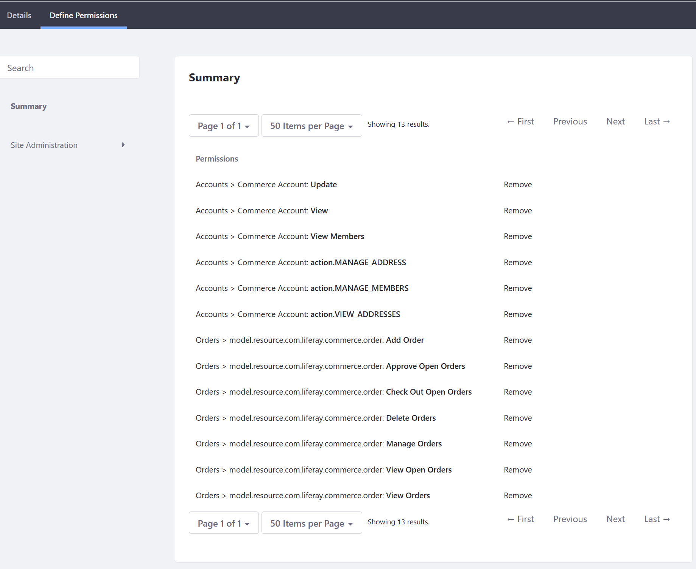
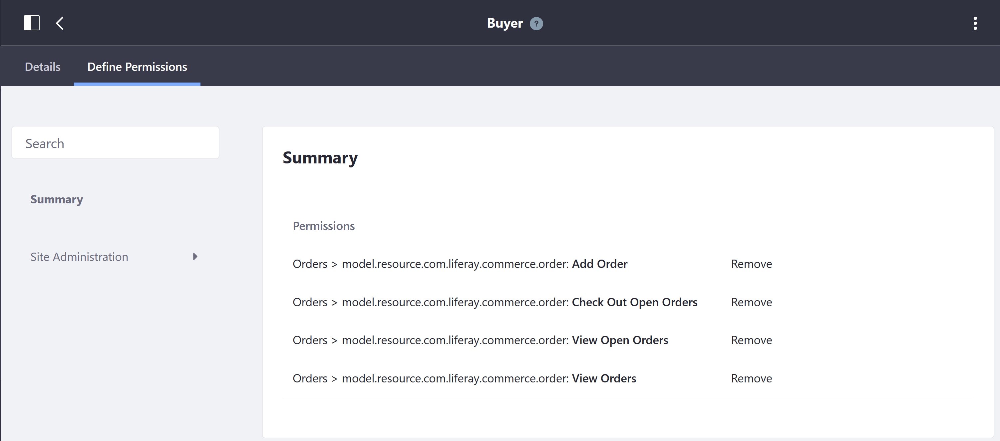
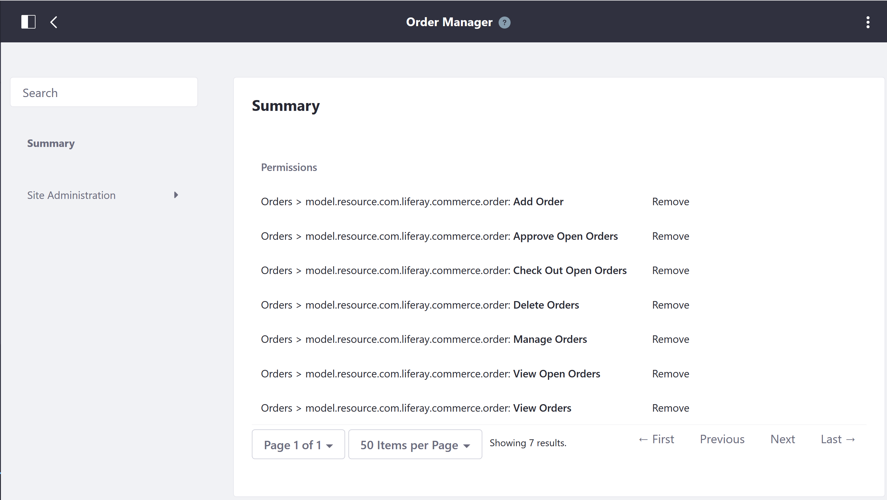
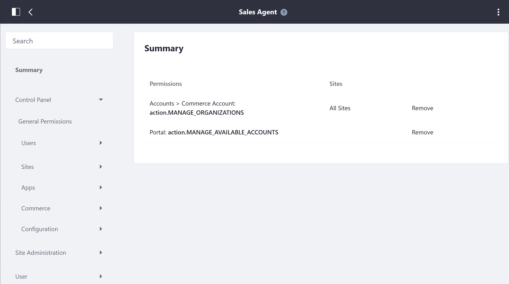

# Commerce Roles Permissions Reference

Liferay Commerce offers four Commerce [account roles](./account-roles.md) out of the box: Account Administrator, Buyer, Order Manager, and Sales Agent. This article serves as a reference for the specific permissions keys associated with each role.

> **Note:** These permission keys may change in future updates.

To view the permissions associated with each Commerce account role:

1. Navigate to the _Control Panel_ → _Users_ → _Roles_.
1. Click the _Site Roles_ tab.
1. Click (Commerce Role) (for example, _Account Administrator_).
1. Click the _Define Permissions_ tab.

## Account Administrator

An Account Administrator can modify the account, invite and add users to join the account, and assign roles to other account members. Note that a Liferay Commerce account administrator cannot create or delete an account. This permission is reserved for the store administrator.

The following set of permissions pertain to the Account Administrator Role's ability to modify accounts in a B2B setting.

| Permissions | Description |
| --- | --- |
| Accounts > Commerce Account: Update | |
| Accounts > Commerce Account: View | Ability to view all accounts |
| Accounts > Commerce Account: View Members | Ability to view all members in an account |
| Accounts > Commerce Account: Manage Address | Ability to add a new billing, a shipping, or a combined address |
| Accounts > Commerce Account: Manage Members | Ability to invite a new member or an organization and modify his or her credentials |
| Accounts > Commerce Account: View Addresses | Ability to view all the addresses associated with an account |

The following set of permissions pertain to the Account Administrator Role's ability to modify orders regardless of the store type (B2B or B2C).

| Permissions | Description |
| --- | --- |
| Add Order | Ability to add an order to the Buyer's specified account (can have more than one account) |
| Approve Open Orders | Allow account administrator to approve orders if workflow has been enabled |
| Check Out Open Orders | Ability to complete the checkout process for new, incomplete orders |
| Delete Orders | Grants the ability to delete an order |
| Manage Orders | Change Order details such as mailing and billing addresses; ability to add a note to the order |
| View Open Orders | Ability to view all open orders |
| View Orders | Ability to view all orders regardless of their statuses |

## Buyer

Users assigned this role can view, create, and check out orders.

There are four permissions set by default:

| Permissions | Description |
| --- | --- |
| Add Order | Ability to add an order to the Buyer's specified account (can have more than one account) |
| Checkout Open Orders | Ability to complete the checkout process for new, incomplete orders |
| View Open Orders | Ability to view all open orders |
| View Orders | Ability to view all orders regardless of their statuses |

## Order Manager

Order Managers have all the permissions of buyers, and can also manage, delete and approve orders. The following permissions have been assigned to the Order Manager role.

The following permissions are set by default:

| Permissions | Description |
| --- | --- |
| Add Order | Allows order managers to add an order |
| Approve Open Orders | Allow order managers to approve orders if workflow has been enabled |
| Check Out Open Orders | Ability to complete the checkout process for new, incomplete orders |
| Delete Orders | Allow order managers to delete orders |
| Manage Orders | Change Order details such as mailing and billing addresses; ability to add a note to the order |
| View Open Orders | Ability to view all open orders |
| View Orders | Ability to view all orders regardless of their statuses |

## Sales Agent

The Sales Agent is a regular role in Liferay Commerce and assignees are able to manage any account assigned to the role without granting administrative permissions. Because it is a regular role, it is found in the _Regular Roles_ tab.

1. Navigate to the _Control Panel_ → _Users_ → _Roles_.
1. Click the _Regular Roles_ tab.
1. Click _Sales Agent_.
1. Click the _Define Permissions_ tab.

| Permissions | Description |
| --- | --- |
| Manage Organizations | Ability to add or remove organizations |
| Manage Available Accounts | Ability to manage accounts that the sales agent is a member of |
