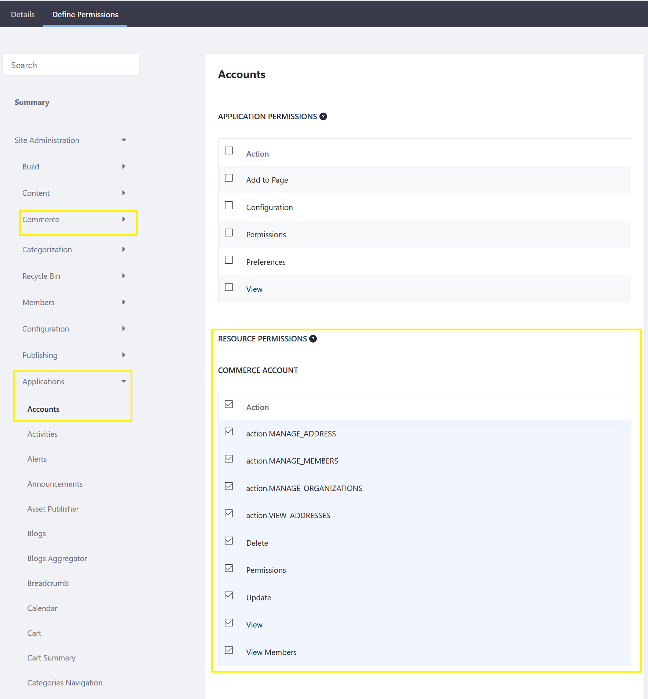
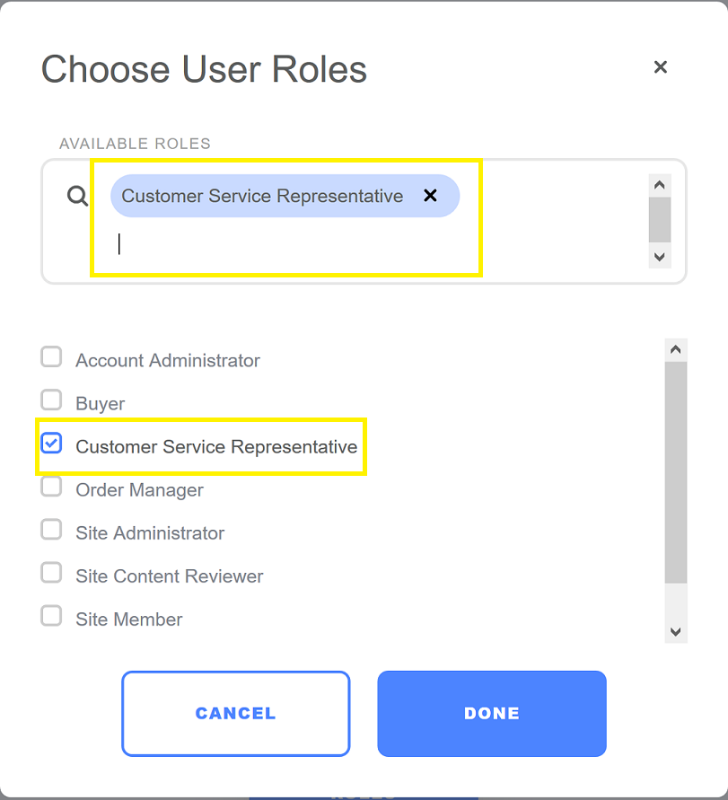

# Creating a Custom Account Role

Liferay Commerce offers four account roles by default: Account Administrator, Buyer, Order Manager, and Sales Agent. To learn more about the roles in general, see [Account Roles](./account-roles.md). In addition, please consult the [Commerce Roles Permissions Reference](./commerce-roles-permissions-reference.md) to find out the associated permissions key for each role. If a store administrator determines that none of the existing roles are sufficient for particular needs, administrators have the ability to create a new role. As always, store administrators can add more permissions to each account role.

To add a new Commerce account role:

1. Navigate to the _Control Panel_ → _Users_ → _Roles_.
1. Click the _Site Roles_ tab.
1. Click the _Add Site Role_ button.
1. Enter the following:
    * **Name**: Customer Service Representative.
1. Click _Save_.
1. Click _Define Permissions_.
1. Click _Site Administration_ to expand the dropdown menu.

    

    > Commerce-specific permissions keys are located in two different places. In the _Commerce_ sub-menu, the following Commerce widgets' permissions keys are listed here:

    * Wish Lists
    * Settings

    > The following Commerce widgets' permission keys are found in the _Applications_ sub-menu.

    * Accounts
    * Cart
    * Cart Summary
    * Checkout
    * Commerce Addresses
    * Commerce BOM
    * Commerce Categories Navigation
    * Coupon Code Entry
    * Dashboard Forecasts Chart
    * Mini Cart
    * Open Carts
    * Option Facet
    * Orders
    * Shipments
    * Specification Facet
    * Wish List Contents
    * Wish Lists

1. Select the Commerce permissions from the _Site Administration_.

    

1. Click _Save_.

Once the new role has been created, it will be listed in the _Site Roles_ menu in the Control Panel and also the _Account Management_ widget.

## Additional Information

* [Roles and Permissions](https://help.liferay.com/hc/articles/360017895212-Roles-and-Permissions)
