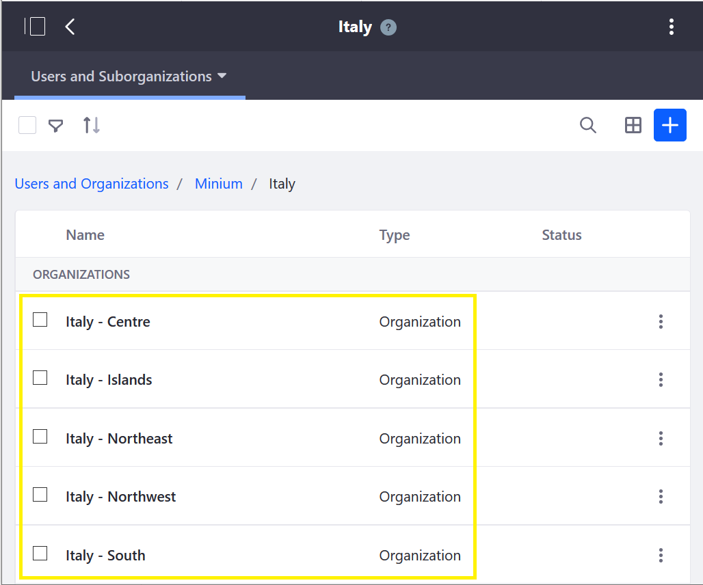
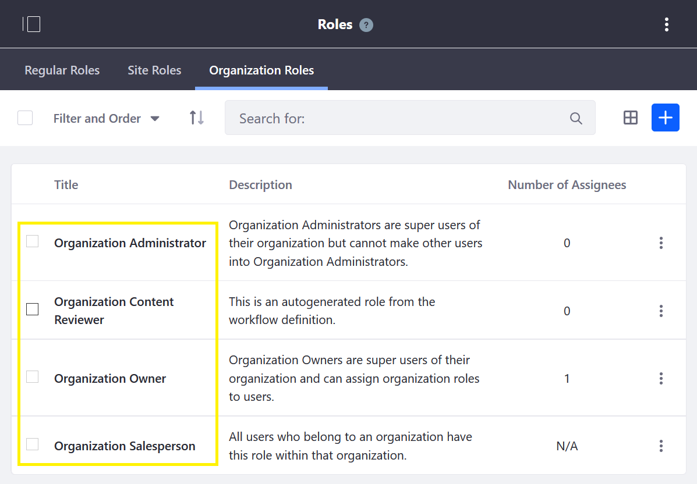
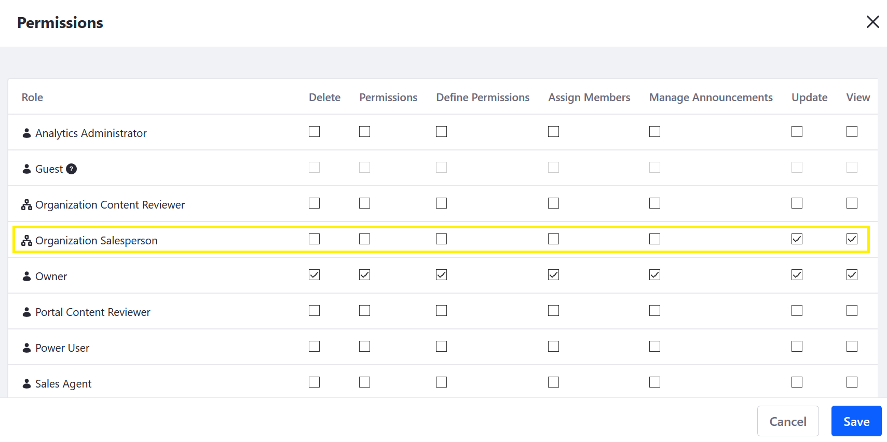
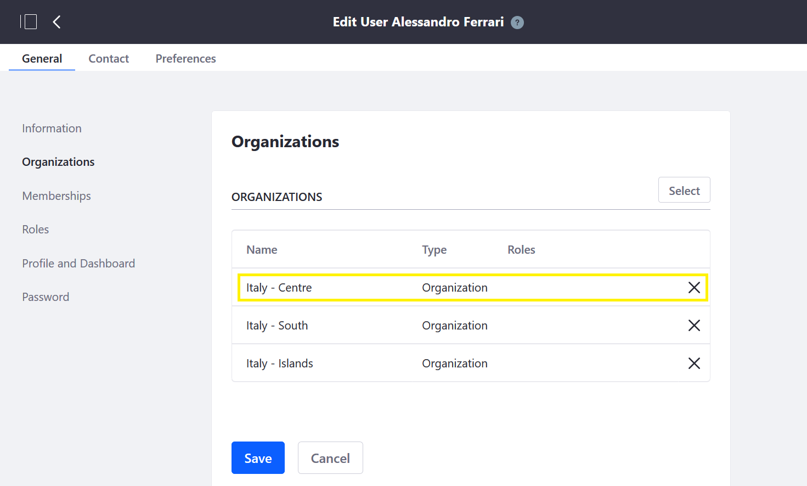

# Using Organizations to Create a Sales Network

The organizational structure of B2B sales networks can be mirrored in Liferay Commerce using the Organizations feature. Organizations are hierarchical arrangements of Users that can model real-world organizational hierarchies that enable distributed and simplified management of Users, Roles, Permissions and Accounts.

```note::
   A Role is a collection of permissions that can be assigned to a User. A Permission is any specific assignable action a User may take, such as viewing a menu, account or widget, assigning Roles to other users, or adding a new product. See the articles on `Roles <https://help.liferay.com/hc/en-us/articles/360018174371-Managing-Roles>`_ and `Permissions <https://help.liferay.com/hc/en-us/articles/360018174391-Defining-Role-Permissions>`_, for more information.
```

When Organizations are used along with assigning permissions to Organization Roles, Users assigned to an Organization automatically inherit the role-based permissions that were defined for that Organization.
<!-- The following sentence is removed because I read it and I don't know what specifically it's telling someone - maybe: Organizations (and sub-organizations) can have accounts assigned to them - ensuring that members of an organization have access to the right accounts at the right time.

For example, a B2B company can give everyone in their sales network access to the right Account information through their organizational membership.

-->

Organizations make user management simple. When a user in an organization is re-assigned or transfers to another organization, their roles and permissions automatically update based on their new organization membership. For a sales network, this means streamlined and secure access management to customer accounts.

## Mirror Real-World Organizational Hierarchies

<!-- I'm commenting out the following image because I don't think it clearly depicts how to use organizations to model a sales network. First - it would seem that the image states that "Minium" is the company - and then the company has a sub-org named "Italy". And then "Italy" has sub-orgs per region. I don't think real companies organize like that. The correct model (I think) would be - to make it extremely clear how to understand the image: "Minium Corporation" (Parent Org) > Minium Corporation - Italy Sales Department > [Regions]. Or alternatively: Minium Sales Group > Italy Sales Region > [Regions] - something in the naming to make the hierarchy clearer.
 -->

Organizing a sales network and accounts exactly as in the real world makes it easy for sales team members to navigate within Liferay Commerce. To learn more about creating and structuring organizations learn more [here](https://learn.liferay.com/dxp/7.x/en/users-and-permissions/organizations/creating-and-managing-organizations.html).

## Define Account Management and Access With Organization Roles and Permissions

Assigning Roles with associated permissions to users specifies what they can and can't do within the system. Liferay Commerce comes with several Organization Roles available out-of-the-box:



Assigning a collection of permissions to each role defines that role's access within Liferay Commerce (which can then be applied to users). Some examples of permissions include: view sub-organizations (for example, Regions), account data or order history; manage orders, and assign Roles. For more on Permissions, see [Defining Role Permissions](https://help.liferay.com/hc/en-us/articles/360018174391-Defining-Role-Permissions).



## Manage Long-Term Access With Organizational Membership

Managing Roles and Permissions long-term can be easily accomplished within Liferay Commerce by updating a user's organizational membership (once Organizations, Roles and Permissions are set up and assigned).



<!--
(Double/Dual-Screenshot: Show User's permissions before the move and after the move)
-->

## Additional Information

* [Creating and Managing Organizations](https://learn.liferay.com/dxp/7.x/en/users-and-permissions/organizations/creating-and-managing-organizations.html)
* [Adding a New Organization Type](https://learn.liferay.com/dxp/7.x/en/users-and-permissions/organizations/adding-a-new-organization-type.html)
* [Managing Roles](https://help.liferay.com/hc/en-us/articles/360018174371-Managing-Roles)
* [Defining Role Permissions](https://help.liferay.com/hc/en-us/articles/360018174391-Defining-Role-Permissions)
* [Adding Organizations to Accounts](./adding-organizations-to-accounts.md)
