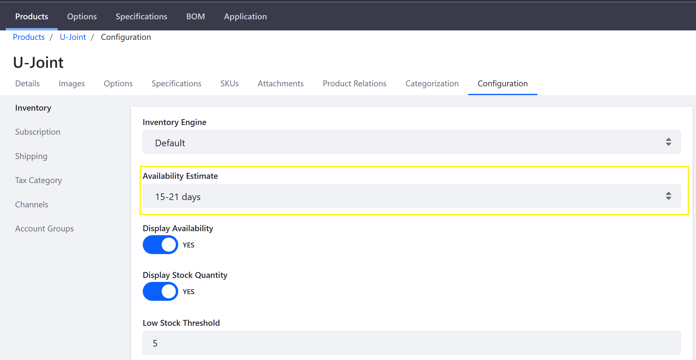

# Availability Estimates

This article documents how to create Availability Estimates. If a product becomes unavailable, store owners can provide customers with an estimate for when a product will be restocked.

A set of Availability Estimates are created when using an [Accelerator](../starting-a-store/accelerators.md) to create a storefront.

To create an Availability Estimate:

1. Navigate to the _Control Panel_ → _Commerce_ → _Settings_.
1. Click the _Availability Estimates_ tab.
1. Click the (+) button to add a new estimate.
1. Enter the following:
    * Title: 15-21 days
    * Priority: 4.0
1. Click _Save_.

The new Availability Estimate has been added. Note that because the priority is set to _4.0_, this means this time period is displayed last in the menu.

When configuring the low stock threshold, this Availability Estimate option is displayed in the _Product Configuration_ → _Inventory_ menu.

## Additional Information

* [Introduction to Managing Inventory](./introduction-to-managing-inventory.md)
* [Product Inventory Configuration Reference](./product-inventory-configuration-reference.md)
