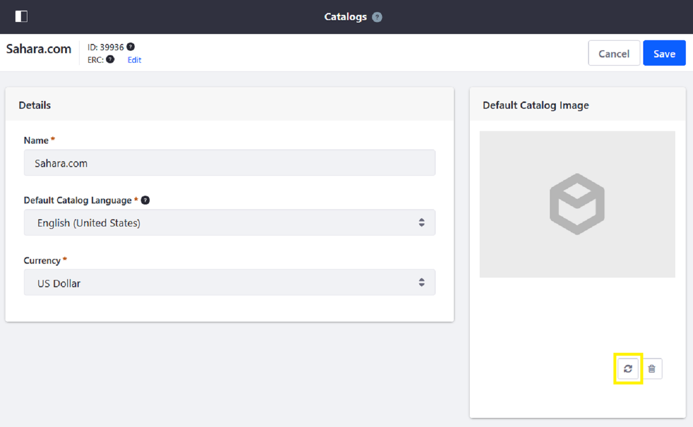
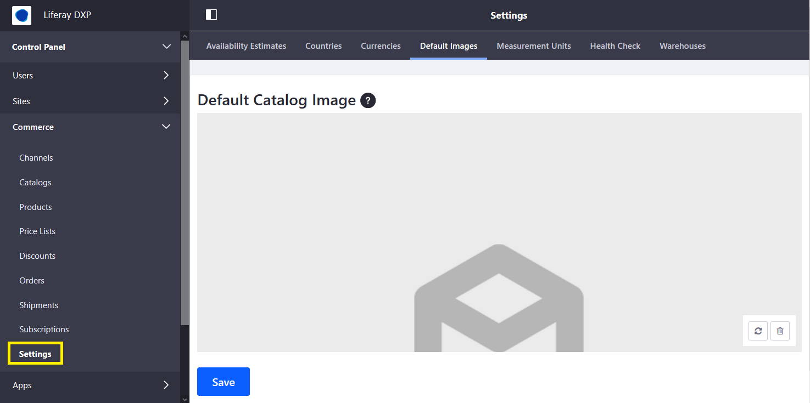

# Configuring a Product Placeholder Image

Products in a catalog that do not have an associated [product image](./creating-and-managing-products/products/product-images.md) use a placeholder image until one is configured. The default placeholder image is defined for each catalog.

## Setting a Placeholder Image

To set a catalog placeholder image:

1. Navigate to the _Control Panel_ &rarr; _Commerce_ &rarr; _Catalogs_.
1. Click on the catalog (for example, _Sahara.com_).
1. Click the Refresh icon. <!-- Please just add a refresh icon in line here and take out the following image. -->

    

1. Drag and drop a new file or click _Select File_ to add a new image. <!-- Replace the following screenshot with one that shows me where to drag and drop or click "Select File" - I don't see it in any of the screenshots. -->

     

1. Click _Save_ when finished.

The placeholder image is now set for this catalog and is used for all products in the catalog without an image.

## Liferay Commerce 2.0 and Below

```tip::
   On Liferay Commerce 2.0 and below, the same placeholder image is used globally across catalogs created on a Liferay Commerce instance.
```

To configure your placeholder image:

1. Navigate to the _Control Panel_ &rarr; _Commerce_ &rarr; _Settings_.

    

1. Click the _Default Image_ tab.
1. Click the Refresh icon.
1. Drag and drop a new file or click _Select File_ to add a new image.
1. Click _Save_ when finished.

The new image has been applied to the entire instance.

## Additional Information

* [Creating a New Catalog](./creating-a-new-catalog.md)
