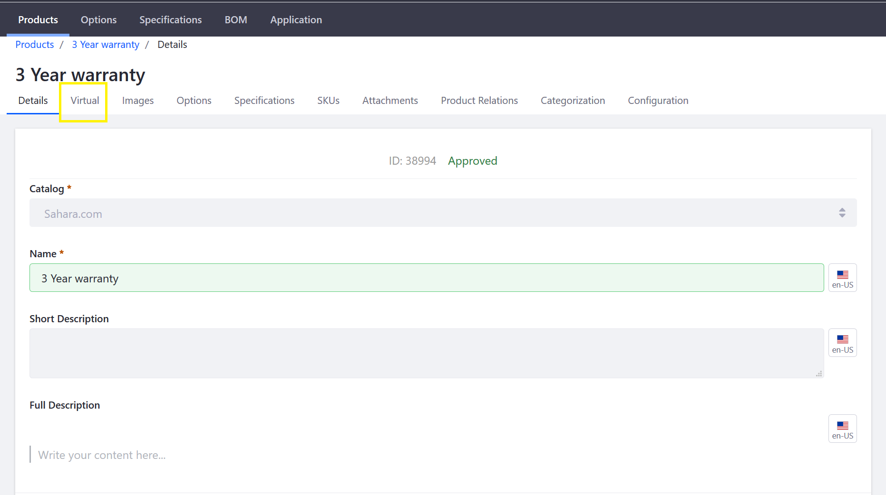

# Creating a Virtual Product

A Virtual Product is a non-tangible product that can be downloaded. Examples include a music file, a video, or an electronic publication. In some cases, a virtual product is defined by a set duration. These virtual products could also include warranties and service contracts. Virtual products may be sold individually or as part of a Grouped Product.

## Roadmap

* [Create a Virtual Product](#create-a-virtual-product)
* [Set Virtual Product Details](#set-virtual-product-details)
* [Apply Product Options](#apply-product-options)
* [Set Prices and Quantities](#set-prices-and-quantities)
* [Add Product Specifications](#add-product-specifications)
* [Upload Product Images and Attachments](#upload-product-images-and-attachments)
* [Organize with Categories](#organize-with-categories)
* [Associate with Related Products](#associate-with-related-products)

### Create a Virtual Product

1. Navigate to _Control Panel_ → _Commerce_ → _Products_.
1. Click the (+) button then _Virtual_.
1. Enter the following:
    * **Catalog**: Sahara.com
    * **Name**: 3 Year Warranty
    * **Short Description**: 3 Year Warranty
    * **Full Description**: 3 Year Warranty for all products purchased on Sahara.com
    * **Friendly URL**: (auto-generated)
    * **Meta Title**: 3 Year Warranty
    * **Meta Description**: 3 Year Warranty for all products
    * **Meta Keywords**: warranty, goods, year
1. Click _Publish_.

Once this virtual product has been created, store administrators need to associate the digital assets and legal rights with the product.

### Set Virtual Product Details

1. Click the _Virtual_ sub-tab to continue.

   

1. Enter the following:
    * **Insert the URL or select a file of your virtual product.**: Upload warranty.pdf
    * **Activation Status**: Completed
    * **Duration**: 0
    * **Max Number of Downloads**: 0
    * **Enable Sample**: unchecked
    * **Enable Terms of Use**: No

   

1. Click _Save_.

For more information about each field, see the [Virtual Product Reference](../managing-a-catalog/virtual-product-reference.md) article.

### Apply Product Options

You can apply [Product Options](../managing-a-catalog/customizing-your-product-with-product-options.md) templates to the virtual product. For example, an e-book might have alternate front covers depending on different markets.

Click the _Options_ sub-tab to continue.

### Set Prices and Quantities

To set product prices and quantities:

1. Click the _3-dot_ icon then _Edit_ next to _default_.
1. Click _Pricing_ on the left menu.
1. Enter the following:
    * **Price**: 12.00
    * **Promo Price**: 0.00
    * **Cost**: 0.00
1. Click _Save_. (If Promo Price and Cost fields are left as 0.00, no discounts or promotions are applied at this point.)
1. Click _Price List_ to apply this product to any existing [Price Lists](./adding-products-to-a-price-list.md).

>To learn more about pricing see: [Introduction to Product Pricing Methods](./introduction-to-product-pricing-methods.md)

To learn how to configure inventory for your product, see: [Setting Inventory by Warehouse](./setting-inventory-by-warehouse.md).

### Add Product Specifications

[Product specifications](../managing-a-catalog/specifications.md) contain useful pieces of product information about the product, such as dimensions, color, weight, capacity, or almost any other attribute. Click the _Specifications_ sub-tab to add specifications.

### Upload Product Images and Attachments

[Product images](../managing-a-catalog/product-images.md) help to ensure that customers know what they are buying. Each product variant (SKU) can have their own associated product image. Click the _Images_ sub-tab to add all product images.

Store administrators can also add attachments that are associated with a particular product. Click the _Attachments_ sub-tab to add documents.

### Organize with Categories

[Product Categories](../managing-a-catalog/creating-a-new-product-category.md) are used to organize products. Product categories may be used to apply discounts or other offers to a set of products, to assist buyers in finding products, or to promote certain products to a specified account or account group.

### Associate with Related Products

[Product Relations](./related-products-up-sells-and-cross-sells.md) can be used to connect products. Once connected, a product displays the links to other products. Every related product must be assigned to a Product Relation Type.

## Additional Information

* [Introduction to Product Types](../managing-a-catalog/introduction-to-product-types.md)
* [Creating a Grouped Product](../managing-a-catalog/creating-a-grouped-product.md)
* [Creating a Simple Product](../managing-a-catalog/creating-a-simple-product.md)
* [Virtual Product Reference](../managing-a-catalog/virtual-product-reference.md)
