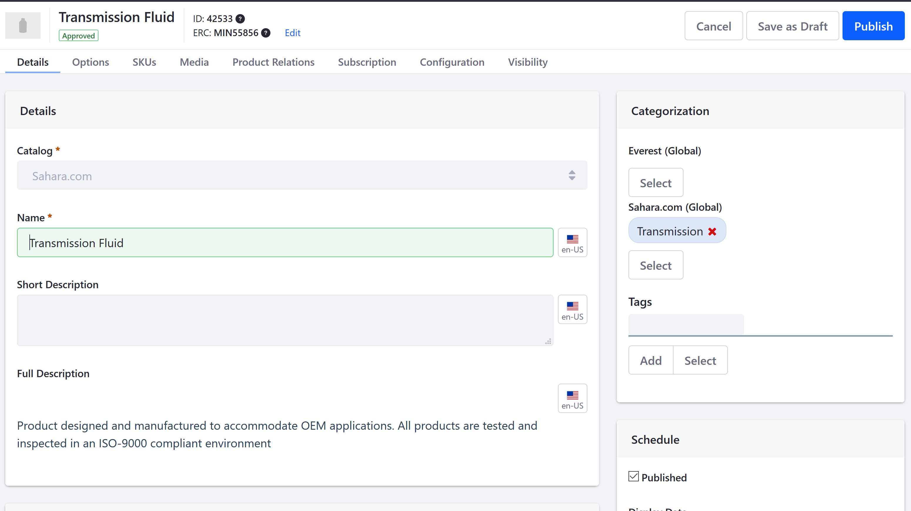
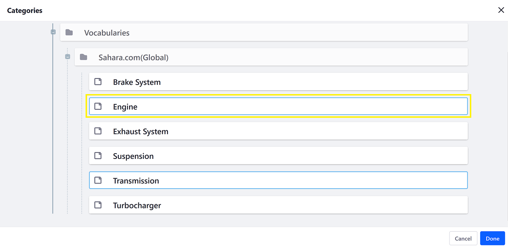
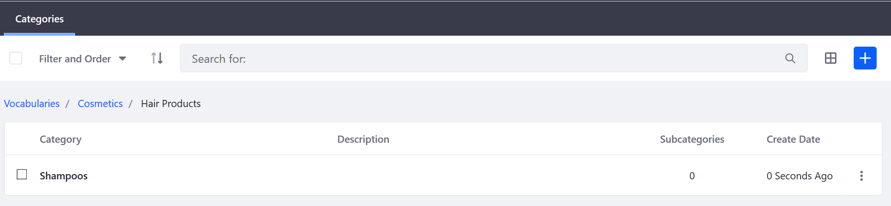
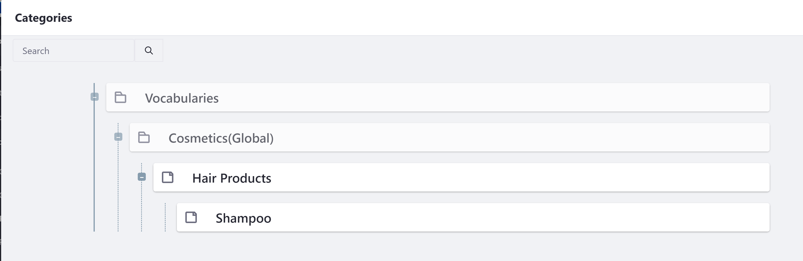
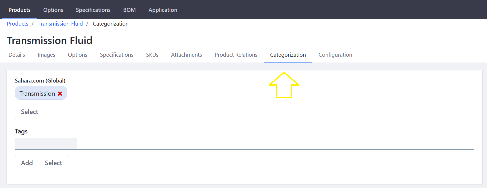

# Organizing Your Catalog with Product Categories

Products can be organized into Categories. These groupings allow multiple products to be grouped and handled collectively. Product categories can be used to apply discounts or other offers to a set of products, to assist buyers in finding products, or to promote certain products to a specified account or account group.

Categories may also be organized hierarchically to form a taxonomy of categories. To organize products into categories, you must create the categories first and then assign products to them. Furthermore, because all Liferay Commerce Products are handled at the global level, all Vocabularies and Categories have to be at the global scope level.

For more information about global scope and site management, see this article about [Data Scopes](https://help.liferay.com/hc/articles/360018168991-Data-Scopes) and [Configuration Scope](https://help.liferay.com/hc/articles/360017895452-Introduction-to-Setting-Up#configuration-scope)

## Prerequisites

Before organizing your catalog, it needs to be populated with Categories. See the [Creating a New Product Category](./creating-a-new-product-category.md) article.

```note::
   If you used an accelerator like Minium to create your site with sample data, the Vocabulary and Categories are populated in the Global scope. This means all the sample categories are available in all sites.
```

## Managing Product Categories

Once you have created your taxonomy using your Vocabulary and Categories, you can start adding categories to the products in the catalog.

1. Navigate to the _Control Panel_ → _Commerce_ → _Products_.
1. Click on a product. (If you used Minium to create a site with sample data, click _Transmission Fluid_. Note that the _Transmission Fluid_ product already has been linked to the sample Vocabulary and Category.)

    

1. On the _Details_ tab, click _Select_ next to the catalog in the _Categorization_ widget.
1. Click on the _Select_ button under the label for the appropriate vocabulary, and in the pop-up that appears the check the box next to each category that applies.

    

1. Click _Done_.

### Commerce 2.0 and Below

1. Navigate to the _Control Panel_ → _Commerce_ → _Products_.
1. Click on a product then the _Categorization_ tab. (If you used Minium to create a site with sample data, click _Transmission Fluid_. Note that the _Transmission Fluid_ product already has been linked to the sample Vocabulary and Category.)
1. Click on the _Select_ button under the label for the appropriate vocabulary, and in the pop-up that appears the check the box next to each category that applies.

    

1. Click _Done_.

The category is now associated with the product.



Repeat as necessary for all other products that might fall under this category.

Navigate to the _Control Panel_ → _Commerce_ → _Products_. Click on a product then the _Categorization_ tab. (If you used Minium to create a site with sample data, click _Transmission Fluid_. Note that the _Transmission Fluid_ product already has been linked to the sample Vocabulary and Category.)



Click on the _Select_ button under the label for the appropriate vocabulary, and in the pop-up that appears the check the box next to each category that applies.

## Additional Information

* [Creating a New Product Category](./creating-a-new-product-category.md) to start organizing your products.
