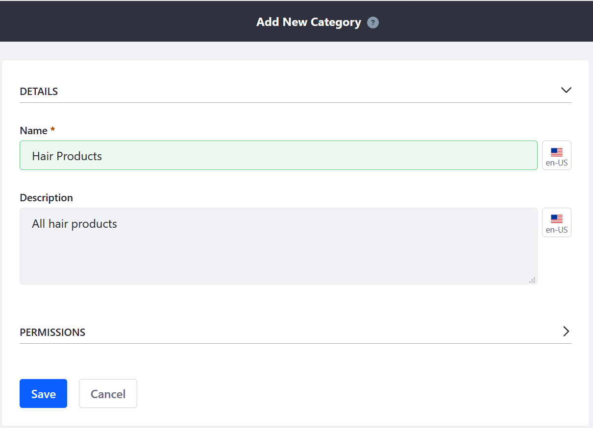
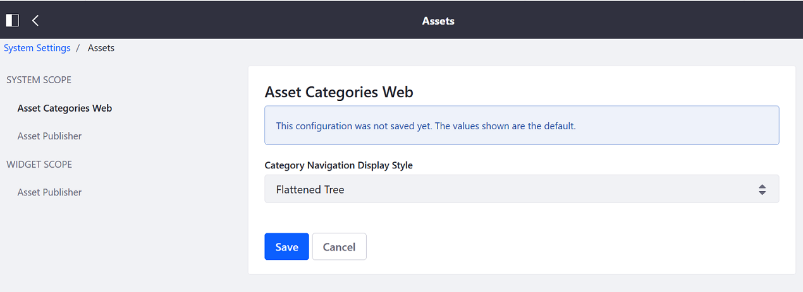

# Creating a New Product Category

Product Categories are used to organize your products. These groupings allow multiple products to be handled as a single unit. For example, a product category could be used to apply discounts or other offers to a set of products, to assist buyers in finding products, or to promote certain products to a specified account or account group.

## Creating a Vocabulary

1. Navigate to the _Control Panel_ →  _Go to Other Site_ → _My Sites_ → _Global_.
1. Once on the _Global_ site, click _Categorization_ → _Categories_.
1. Click the (+) button to create a Vocabulary first.
1. Enter the following:
    * **Name**: Cosmetics
    * **Description**: All Cosmetics
    * **Allow Multiple Categories**: Yes
    * **Choose Asset Type**: Commerce Product
    * **Required**: Yes

        

1. Click _Save_.

The new Vocabulary has been created and Categories can now be added.

| Field | Description |
| --- | ---|
| Name | Name of the Vocabulary |
| Description | Description of the Vocabulary |
| Allow Multiple Categories | Toggle to allow one-to-one or one-to-many relationship |
| Choose Asset Type | List of all Asset Types in Liferay DXP which includes Commerce Product |
| Required | Toggle to control whether all Commerce Products must have an associated Category |

## Creating a Category

Because categories can be nested, store owners can organize their categories with subcategories. For example, a category called _Hair Products_ could have its own subcategories such as _Shampoo_, _Hair Gels_, and _Color Dyes_.

To create a Category:

1. Click the Vocabulary where the Categories are to be added. To continue the previous example, click _Cosmetics_.
1. Click the (+) button to add a new Category.
1. Enter the following:
    * **Name**: Hair Products
    * **Description**: All hair products

    

1. Click _Save_.

The new Category has been created. You can either create another Category for another product that sits parallel in the hierarchy or create a nested subcategory in the description above. To create a subcategory, click the _Hair Products_ link and then click the (+) button to create another Category. Once the new Category has been created, the hierarchy can be observed in the breadcrumb navigation.

## Configuring Product Categories

Categories nest hierarchically. While this allows multiple categories to be grouped together and handled as a single unit, it also can makes it difficult for administrators to view the entire vocabulary. It is possible to view all categories at once.

To configure the Product Category's Hierarchy:

1. Navigate to the _Control Panel_ → _Configuration_ → _System Settings_.
1. Click _Assets_ under the Contents section.
1. On the _Asset Categories Web_ on the left menu, select _Flattened Tree_ from the _Category Navigation Display Style_ drop-down menu.

    

1. Click _Save_ to apply the changes. You can always change it back to the default view later.

## What's Next

* [Organizing Your Catalog with Product Categories](./organizing-your-catalog-with-product-categories.md)
