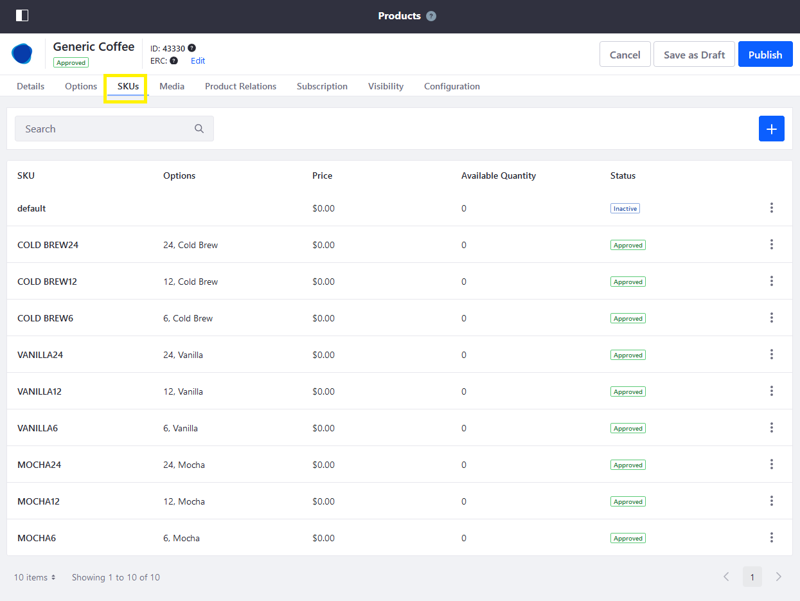

# Creating Shipping Overrides

A Shipping Override allows users to set a product's specifications at the SKU level. This is useful if a product has multiple SKUs and each SKU has unique specifications, such as different weights.

 For example, a product may be sold in as a 6-pack or as a 12-pack with each option identified by a unique SKU. The 6-pack weighs less than the 12-pack and thus requiring a Shipping Override. Because each SKU can have a different weight, this affects shipping calculations that factor in the weight of a product.

To create a shipping override:

1. Navigate to the _Control Panel_ &rarr; _Commerce_ &rarr; _Products_.
1. Click on a product (for example, _Generic Coffee_).
1. Click on the _SKUs_ tab.

    

1. Click on the desired SKU (VANILLA24).
1. On the _Details_ tab, scroll down to the _Shipping Override_ section.
1. Enter the SKU's dimensions.

    

1. Click _Publish_ when finished.

The Shipping Override has been created for this SKU. Repeat these steps for all other SKUs.

## Additional Information

* [Specifications](./specifications.md)
* [Adding SKUs to Your Products](./adding-skus-to-your-products.md)
