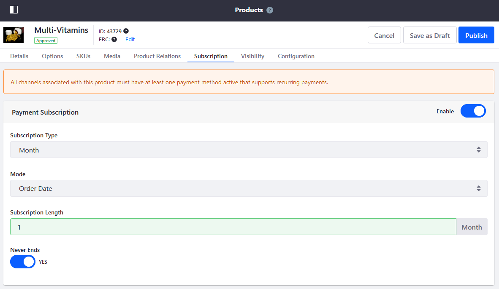

# Enabling a Subscription

Liferay Commerce allows store inventory managers to create and manage subscriptions in products. Example of subscriptions include (but not limited to) magazines, service contracts with options to renew, vitamins and supplements, and other items consumed on a regular basis.

## Prerequisites

In order to enable subscriptions for a product, store administrators must activate a payment method that supports recurring payments. By default, Liferay Commerce supports only [Paypal](../../../store-administration/configuring-payment-methods/paypal.md) as a recurring payment method.

## Enabling a Payment Subscription

Subscriptions can be enabled in a [Simple](../product-types/creating-a-simple-product.md), a [Grouped](../product-types/creating-a-grouped-product.md), or a [Virtual](../product-types/creating-a-virtual-product.md) Product. In this example, we are using a Simple Product template.

1. Create a [Simple](../product-types/creating-a-simple-product.md).
1. Enter the following:
    * **Catalog**: Sahara.com
    * **Name**: Multi-Vitamins

    

1. Click the _Subscription_ tab when finished creating the product.

    

1. Switch the toggle to _Enable_ in the Payment Subscription.
1. Select the _Month_ from the _Subscription Type_ dropdown menu.
1. Select _Order Date_ from the _Mode_ dropdown menu.
1. Enter _1_ from the _Subscription Length_ dropdown menu.
1. Switch the _Never Ends_ to _YES_.

    

1. Click the _Publish_ button.

A payment subscription has been enabled for this product.

To enable a Delivery Subscription:

1. Switch the toggle to _Enable_ in the Delivery Subscription.
1. Select the _Month_ from the _Subscription Type_ dropdown menu.
1. Select _Order Date_ from the _Mode_ dropdown menu.
1. Enter _1_ from the _Subscription Length_ dropdown menu.
1. Switch the _Never Ends_ to _YES_.

    

1. Click the _Publish_ button.

A delivery subscription has been enabled for this product.

## Additional Information

* [Subscription Management Reference Guide](../../../orders-and-fulfillment/subscription-management-reference-guide.md)
* [Implementing a new payment method](../../../developer-guide/tutorials/implementing-a-new-payment-method.md)
