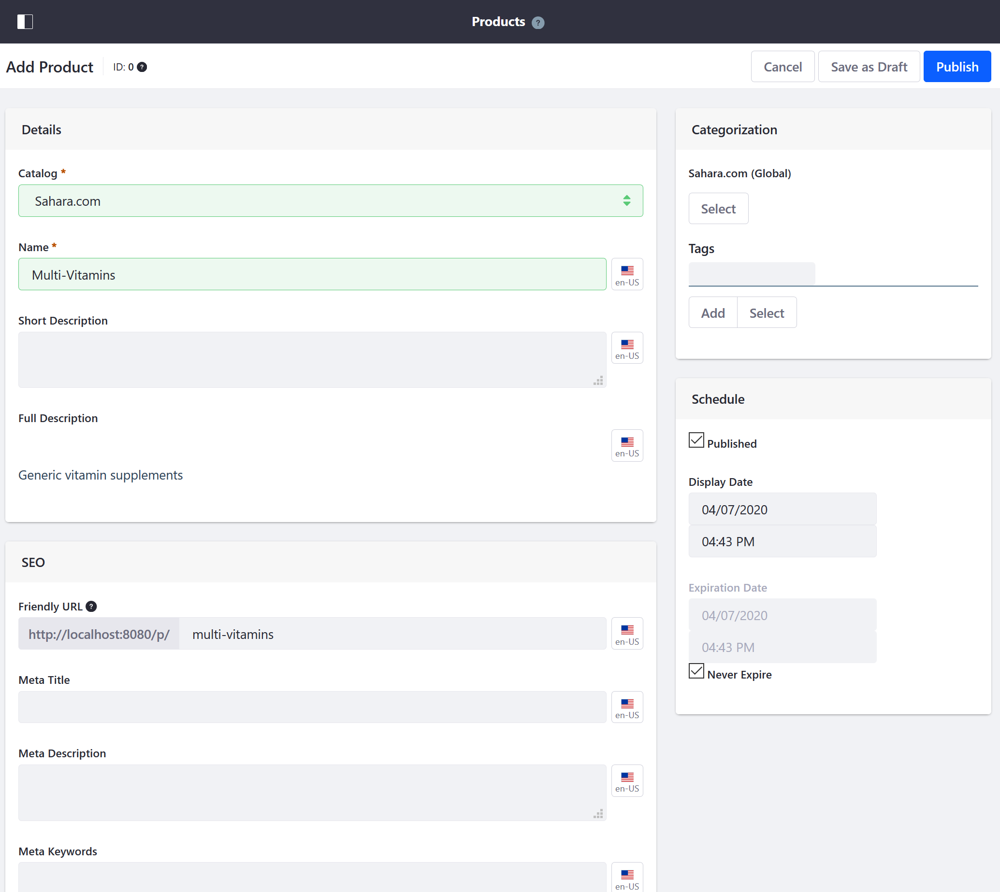
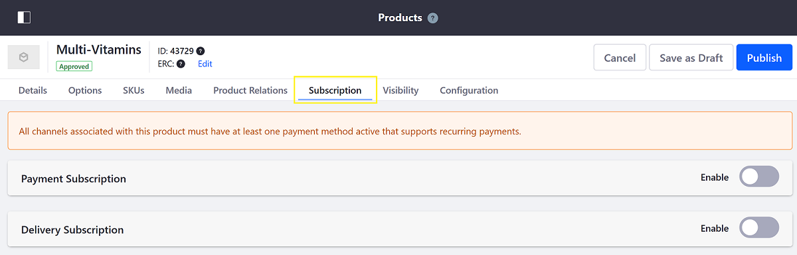
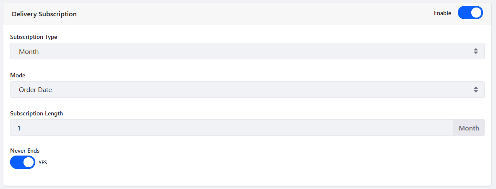
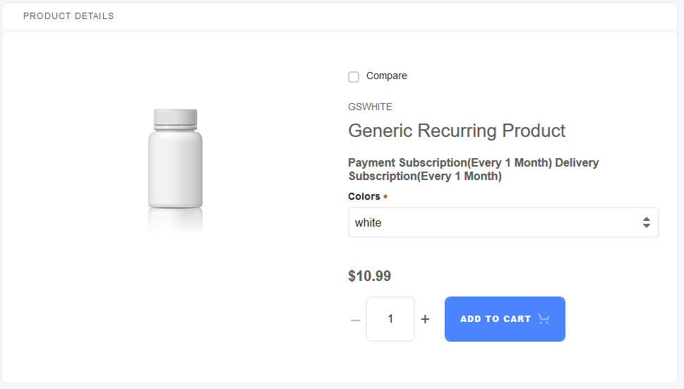

# Enabling Subscriptions for a Product

Liferay Commerce allows store users to create and manage subscriptions for products. Examples of subscriptions include (but are not limited to) magazines, service contracts with options to renew, and items consumed on a regular basis.

## Prerequisites

In order to enable subscriptions for a product, store administrators must activate a payment method that supports recurring payments. By default, Liferay Commerce supports [Paypal](../../../store-administration/configuring-payment-methods/paypal.md) as a recurring payment method.

## Enabling a Payment Subscription

Subscriptions can be enabled for [Simple](../product-types/creating-a-simple-product.md), [Grouped](../product-types/creating-a-grouped-product.md), or [Virtual](../product-types/creating-a-virtual-product.md) products. In this example, we are using a Simple Product.

1. Create a [Simple](../product-types/creating-a-simple-product.md).
1. Enter the following:

    * **Catalog**: Sahara.com
    * **Name**: Multi-Vitamins

    

1. Click the _Subscription_ tab when you have finished creating the product.

    

1. Switch the toggle to _Enable_ in the Payment Subscription.
1. Select the _Month_ from the _Subscription Type_ dropdown menu.
1. Select _Order Date_ from the _Mode_ dropdown menu.
1. Enter _1_ from the _Subscription Length_ dropdown menu.
1. Switch the _Never Ends_ to _YES_.

    

1. Click the _Publish_ button.

A payment subscription is now enabled for this product.

Once you have enabled a payment subscription, you can continue on to enable a Delivery Subscription.

## Enabling a Delivery Subscription

To enable a Delivery Subscription:

1. Switch the toggle to _Enable_ in the Delivery Subscription.
1. Select the _Month_ from the _Subscription Type_ dropdown menu.
1. Select _Order Date_ from the _Mode_ dropdown menu.
1. Enter _1_ from the _Subscription Length_ dropdown menu.
1. Switch the _Never Ends_ to _YES_.

    

1. Click the _Publish_ button.

A delivery subscription is now enabled for this product.

```tip::
   You can implement a custom payment method that has supports recurring methods. See `Implementing a New Payment Method <../../../developer-guide/tutorials/implementing-a-new-payment-method.md>`_ to learn more.
```

## Viewing Subscriptions in Product Details

If a product has subscription enabled, users can view the payment and subscription details on the Product Details widget in the catalog.



## Additional Information

* [Subscription Administration Reference Guide](../../../orders-and-fulfillment/subscription-administration-reference-guide.md)
* [Managing Subscriptions](../../../orders-and-fulfillment/managing-subscriptions.md)
