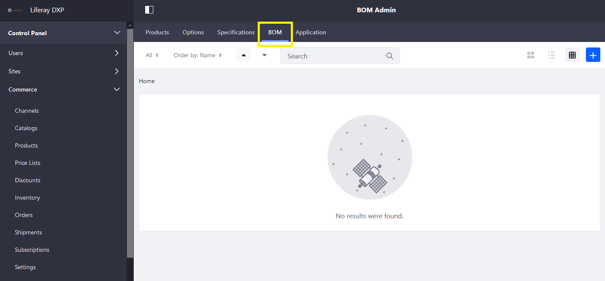
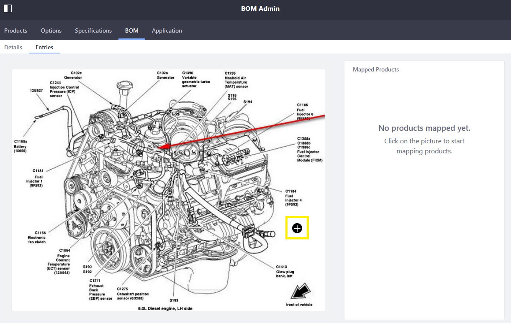
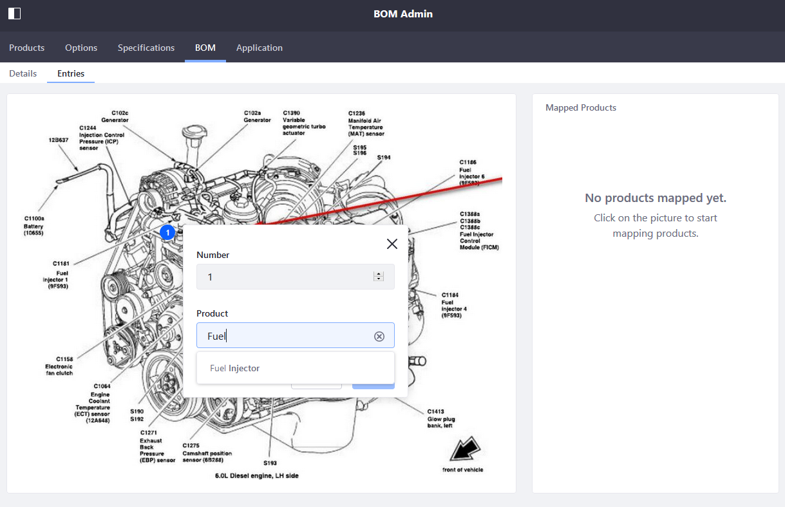
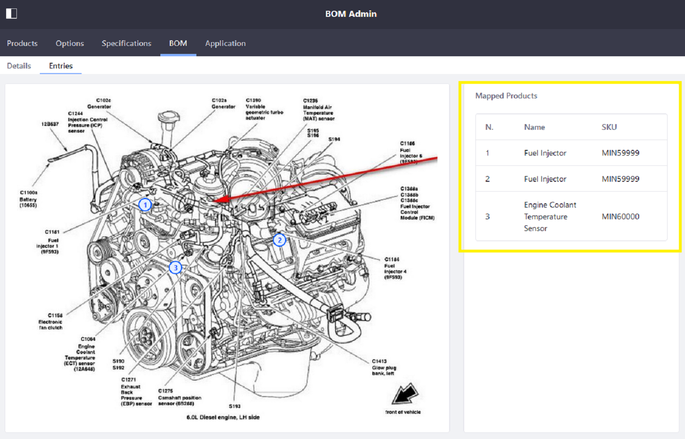
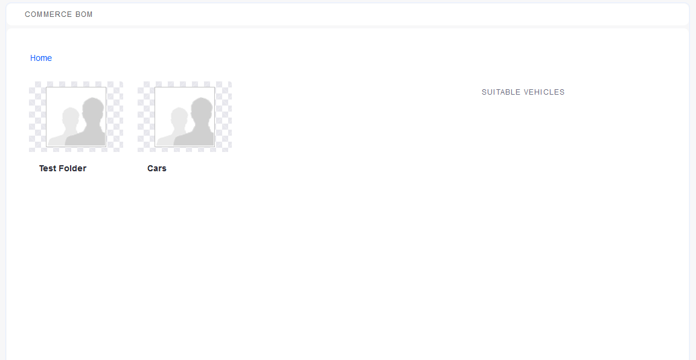
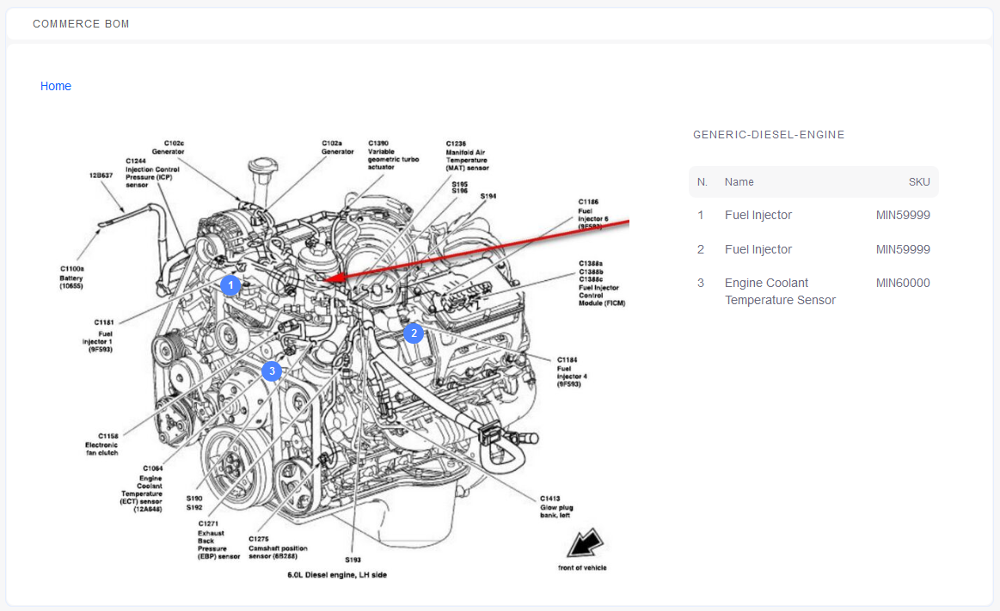

# Managing BOMs

Bill of Materials (BOM) diagrams identify component parts belonging to a product.

To add a new BOM:

1. Navigate to the _Control Panel_ &rarr; _Commerce_ &rarr; _Products_.
1. Click _BOM_.

    

1. Click Add () then _Add Definition_.
1. Click _Select File_ or drag and drop the product image.
1. Enter a name for the product (Generic Diesel Engine).
1. Click _Save_.

## Creating a Definition

1. Click the _Entries_ tab.

    

1. The _Mapped Products_ pane on the right lists all subparts. WHen users hover the mouse over the diagram, a plus sign appears.

    

1. Click on the part of the diagram that is associated wih product (for example, _Fuel Injector 1_).
1. Enter the following:

    * **Number**: 1 (order of the Mapped Products)
    * **Product**: MIN59999 (the product name or SKU)

    

1. Click _Save_.

Continue adding the rest of the products. Each entry must have a unique identifier in the Maps, even if there are more than one component. (In this example, there are four fuel injectors and all four have different number of the map.) As each entry is added, it appears on the right pane.

## Displaying BOM

The Commerce BOM widget displays each BOM diagram.

1. Navigate to the site page where the BOM widget has been deployed.

    

1. Navigate to where the BOM definition was created (in a folder or at root level).
1. Click the BOM thumbnail.

    

The BOM widget displays the diagram.

## Adding a BOM Folder

As an option, you can create folders to group BOMs.

To add a folder:

1. Click Add () then _Add Folder_.
1. Enter the following:
    * **Name**: Folder name (Car parts)
1. Click _Save_.

## Additional Information

* [Adding SKUs to Your Products](./adding-skus-to-your-products.md)
* [Adding Pages to a Site](https://learn.liferay.com/dxp-7.x/site-building/creating-pages/adding-pages/adding-a-page-to-a-site.html)
* [Adding a Widget to a Page](https://learn.liferay.com/dxp-7.x/site-building/creating-pages/using-widget-pages/adding-widgets-to-a-page.html)
