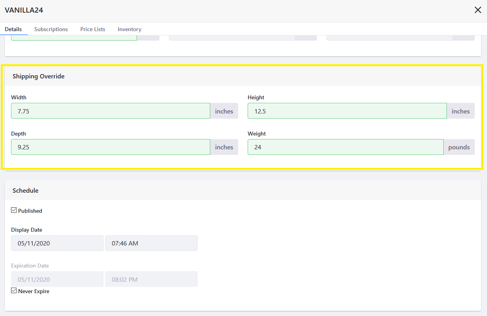

# Overriding Product Level Information

Product SKUs in a catalog typically inherit the specifications and configurations from the parent product. You can override certain product configurations or specifications on a per SKU basis.

## Overriding Product Shipping Values

SKUs can be configured to have shipping weights and dimensions that are distinct from the those configured for the product. Altering SKU weights and dimensions will update shipping calculations for that particular SKU, independently from the product.

To create a shipping override:

1. Navigate to the _Control Panel_ &rarr; _Commerce_ &rarr; _Products_.
1. Click on a product (for example, _Generic Coffee_).
1. Click on the _SKUs_ tab.

    

1. Click on the desired SKU (VANILLA24).
1. On the _Details_ tab, scroll down to the _Shipping Override_ section.
1. Enter the SKU's dimensions.

    

1. Click _Publish_ when finished.

A Shipping Override has been created for this SKU.

## Overriding Product Subscription Settings

Individual product SKUs can be configured to be available on a subscription basis, even when the Product itself is not configured for subscription.

To override a product's Subscription settings for a specific SKU:

1. Navigate to the _Control Panel_ &rarr; _Commerce_ &rarr; _Products_.
1. Click on a product (for example, _Generic Coffee_).
1. Click on the _SKUs_ tab.
1. Click on the desired SKU (COLD BREW6-PACK).
1. Click on the _Subscriptions_ tab.
1. Slide the _Override Subscription Settings_ toggle to _YES_.
1. Slide the _Enable Payment Subscription_ toggle to _YES_.
1. Enter the desired values for the subscription.

    

1. Slide the _Enable Delivery Subscription_ toggle to _YES_.
1. Enter the desired values for the subscription.

    

1. Click _Save_ when finished.

The SKU is now available on a subscription basis.

## Additional Information

* [Specifications](./specifications.md)
* [Adding SKUs to Your Products](./adding-skus-to-your-products.md)
