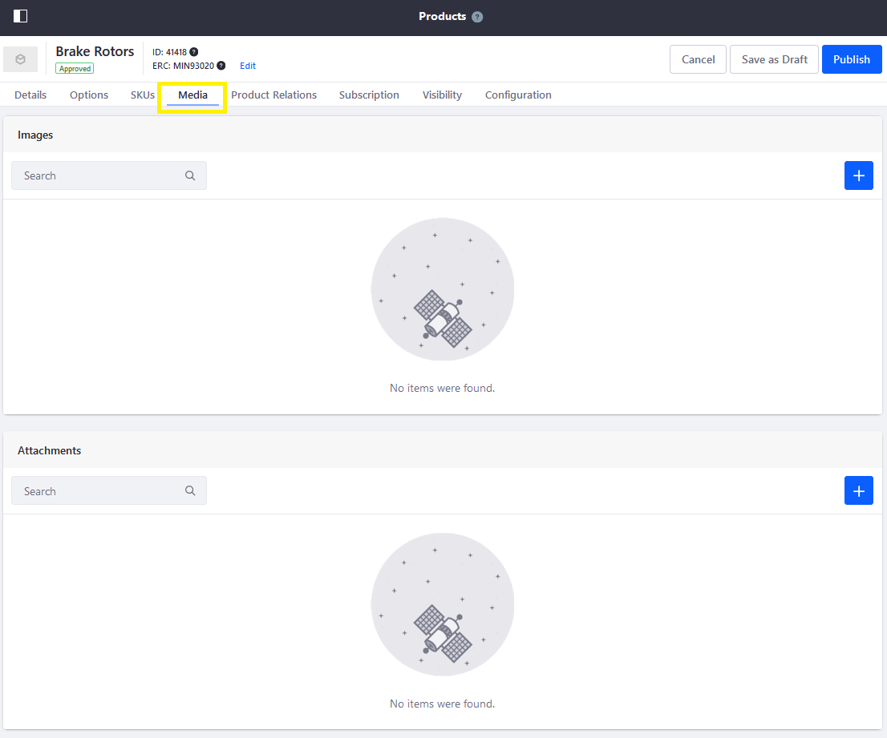
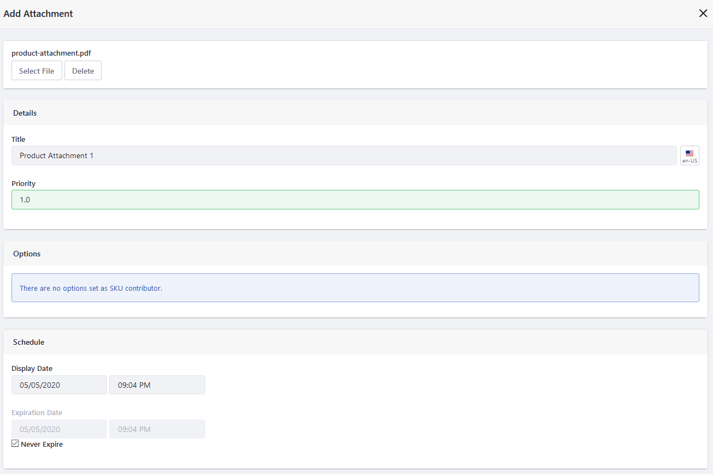
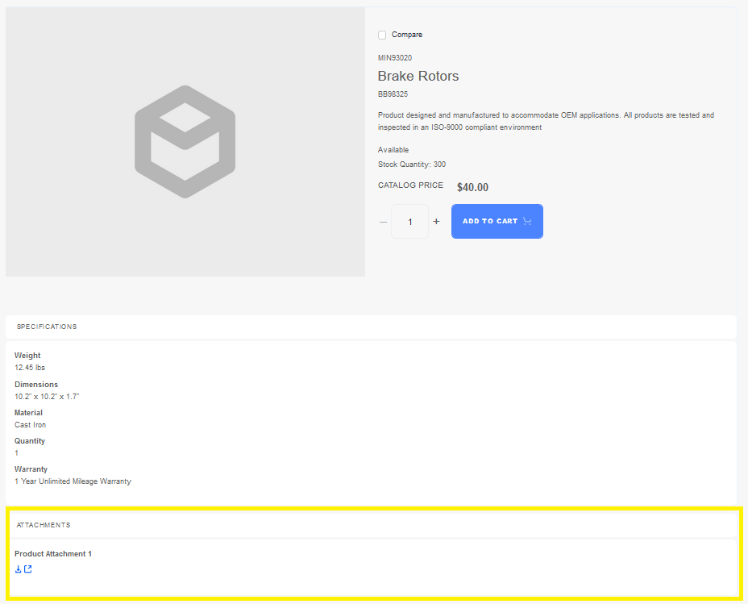
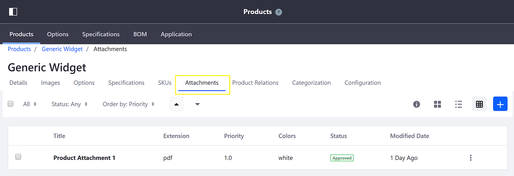

# Product Attachments

Catalog managers can upload a downloadable document as an attachment for a product. A product attachment often provides additional information that is not already in the product's description or specifications. You can upload multiple attachments, especially if there are more than one SKU (product variant).

To add a product attachment:

1. Navigate to the _Control Panel_ &rarr; _Commerce_ &rarr; _Products_.
1. Click on a product.
1. Click on the _Media_ tab.

    

1. Click the () button next to Attachments.
1. Click _Select File_. This opens the _Documents and Media_ window.
1. Select an existing file or upload a new file.
1. Enter the following:

    * **Title**: Product Attachment 1
    * **Priority**: 1.0

1. Select any applicable product variant (SKU).

    

1. Click _Publish_ when finished.

Customers can download the product attachment when browsing for products on the Catalogs page. The attachment is located towards the bottom in the _Product Details_ widget.

## Commerce 2.0 and Below

To add a product attachment:

1. Navigate to the _Control Panel_ &rarr; _Commerce_ &rarr; _Products_.
1. Click on a product.
1. Click on the product's _Attachments_ tab.

    

1. Click on the add button ().
1. Click _Select File_. This opens the _Documents and Media_ window.
1. Select an existing file or upload a new file.
1. Enter the following:

    * **Title**: Product Attachment 1
    * **Priority**: 1.0

1. Select any applicable product options.
1. Click _Publish_ when finished.

The product attachment has been added.

## Additional Information

* [Product Images](./product-images.md)
* [Specifications](./specifications.md)