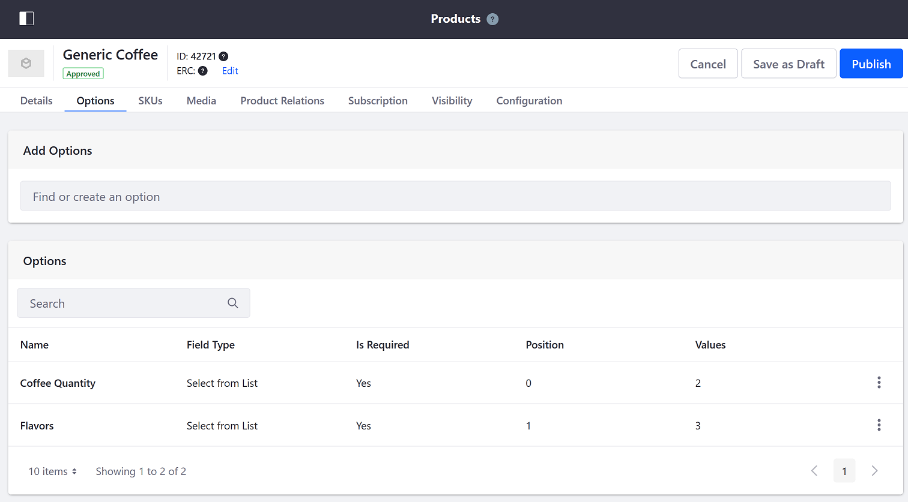
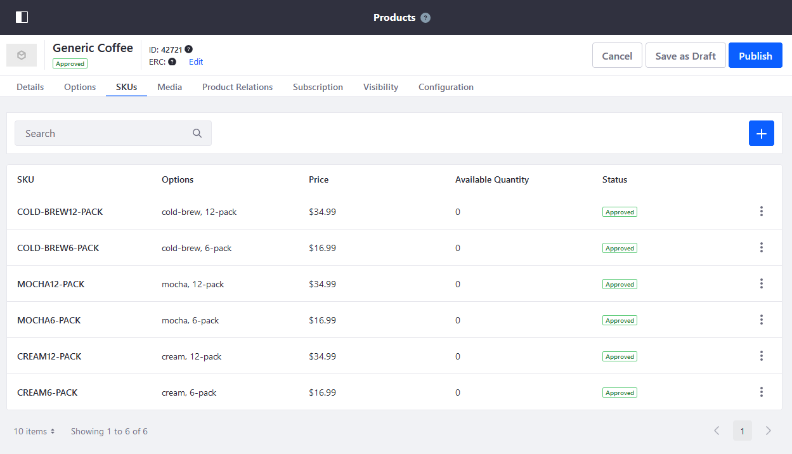
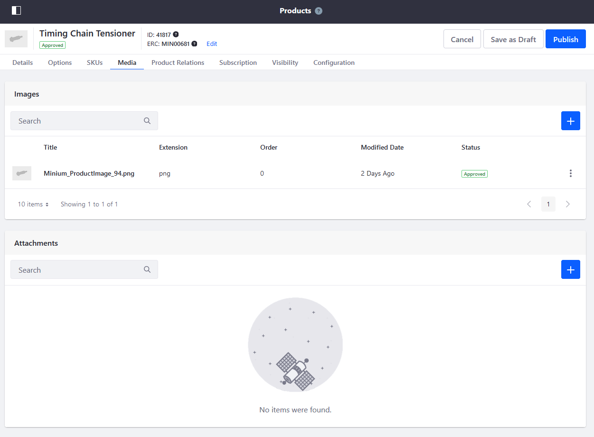
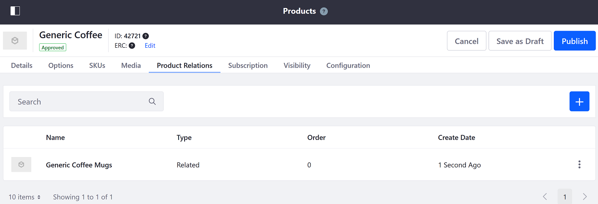
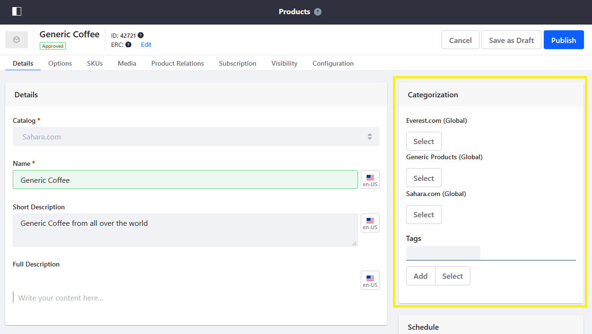
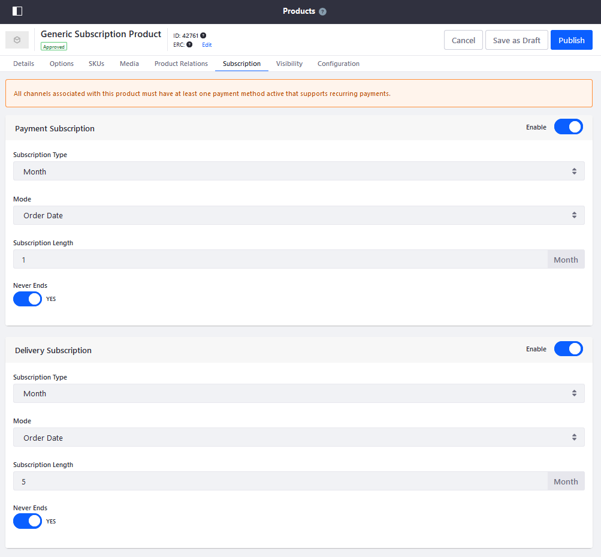
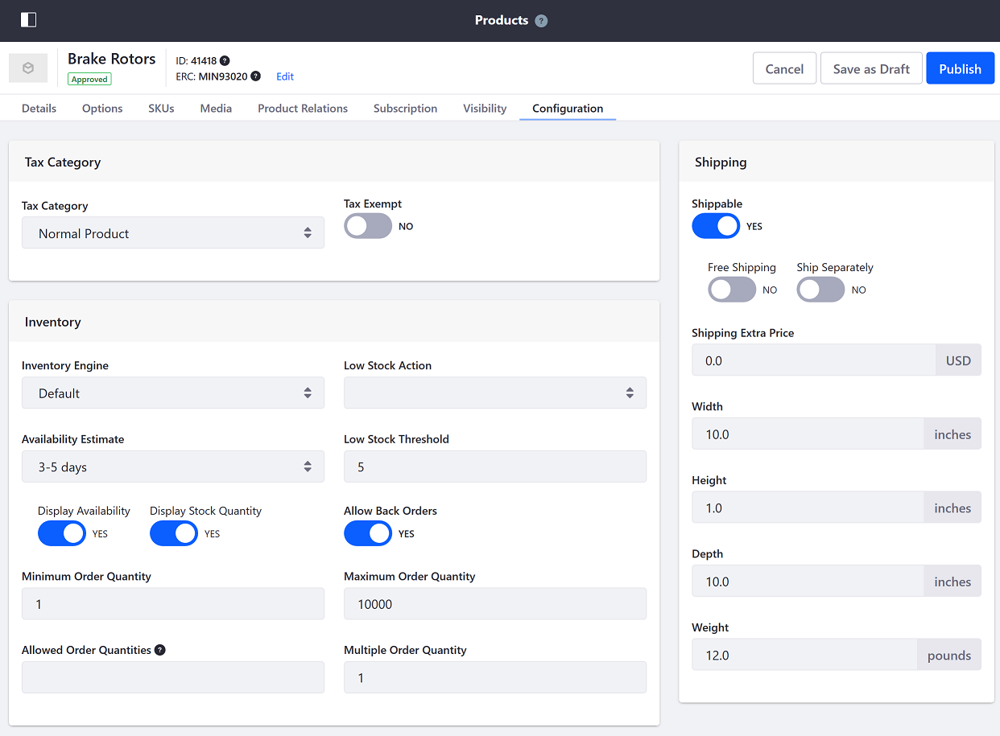
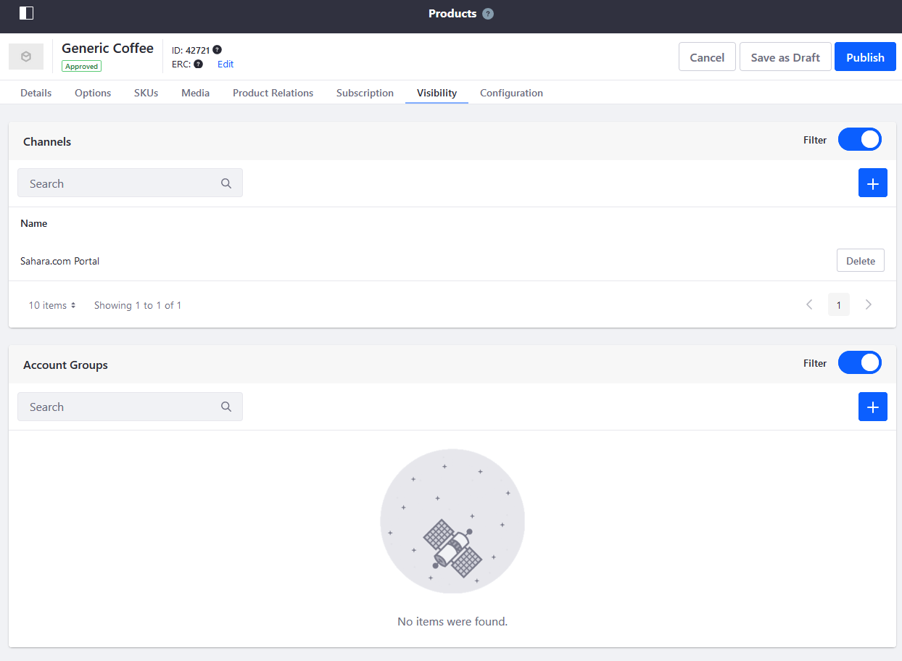
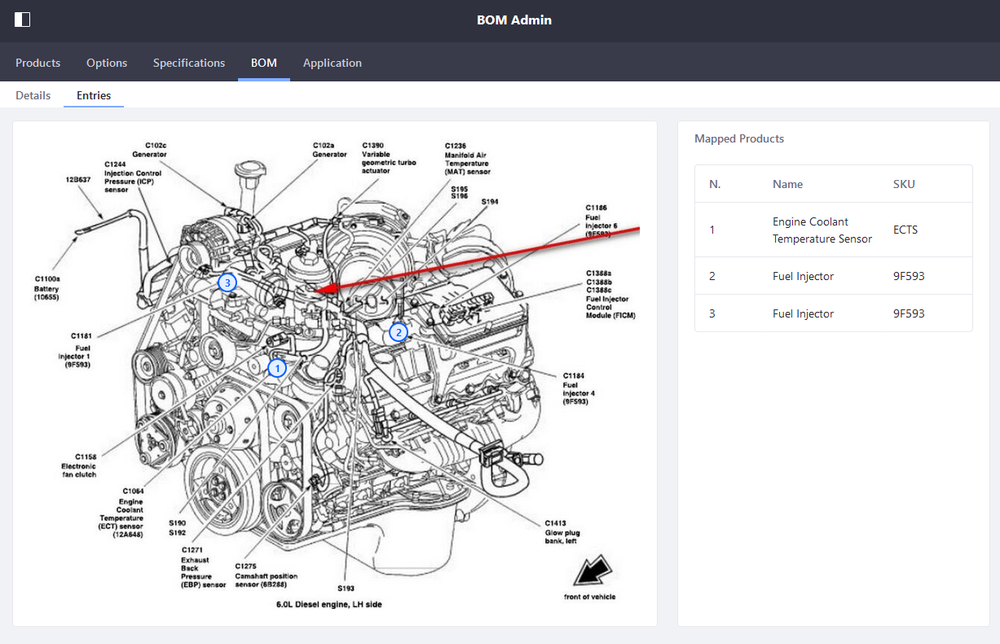

# Products Overview

Products are the assets that drive your store and which are listed in the store's [Catalog](../../catalogs/creating-a-new-catalog.md).

In Liferay Commerce, users can add three types of product: [Simple](../product-types/creating-a-simple-product.md), [Grouped](../product-types/creating-a-grouped-product.md), and [Virtual](../product-types/creating-a-virtual-product.md). See [Introduction to Product Types](../product-types/introduction-to-product-types.md) for more information.

## Product Information

Once a product has been created in the catalog, users can add the following information and metadata.

### Product Options

Users can create Product Options as an easy and flexible way to offer products that have a variety of options such as size, quantity, and color.

See [Customizing Your Product with Product Options](./customizing-your-product-with-product-options.md) to learn more.



### SKUs

SKUs track different product variants based on the product's color, size, and quantity (see previous Product Options section).

```tip::
   If a product has only one version, there is only one SKU.
```

To add SKUs, see [Adding SKUs to Your Products](./adding-skus-to-your-products.md).



Normally, a SKU inherits the parent product's specifications for shipping purposes. However, users can create a Shipping Override especially if there are multiple SKUs and each SKU has a different weight. For example, a six-pack of transmission fluid weighs half as much as a 12-pack of the same and thus necessitating a Shipping Override. See [Overriding Product Level Information](./overriding-product-level-information.md)

### Media

Users can upload multiple product images and attachments. See [Product Images](./product-images.md) and [Product Attachments](./product-attachments.md) to learn more.



### Product Relations and Categories

Often, related products are sold together, such as brake rotors and brake pads. To group products together, users can use Product Relation Type templates. See [Related Products, Up-Sells, and Cross-Sells](./related-products-up-sells-and-cross-sells.md)



Furthermore, users can group products using Tags and Categories. See [Organizing Your Catalog with Product Categories](./organizing-your-catalog-with-product-categories.md)



### Subscriptions

Products classified as subscriptions are recurring orders; some examples include (but are not limited to) magazines, service contracts with options to renew, and items consumed on a regular basis.



See [Enabling Subscriptions for a Product](./enabling-subscriptions-for-a-product.md) to learn more.

### Inventory

Once the product has been created, users can configure its inventory rules. Users can configure whether to continue to display or sell a product if the inventory falls below a set threshold, the maximum or minimum quantity a user can buy in a single order, and whether the store will take back orders.



### Visibility

A product may be sold across multiple [channels](../channels/introduction-to-channels.md). Furthermore, users can advertise a product to specific [Account Groups](../../../account-management/creating-a-new-account-group.md).



## BOM

Bill of Materials (BOM) diagrams identify component parts belonging to a product. Users can create and annotate BOM diagrams in Liferay Commerce that reference products in the store. BOM diagrams can then be displayed on a site page.



To create a BOM, see [Managing BOMs](./managing-boms.md)

## Additional Information

* [Creating a Simple Product](../product-types/creating-a-simple-product.md)
* [Creating a Grouped Product](../product-types/creating-a-grouped-product.md)
* [Creating a Virtual Product](../product-types/creating-a-virtual-product.md)
* [Implementing a Custom Low Stock Activity](../../../developer-guide/tutorials/implementing-a-custom-low-stock-activity.md)
