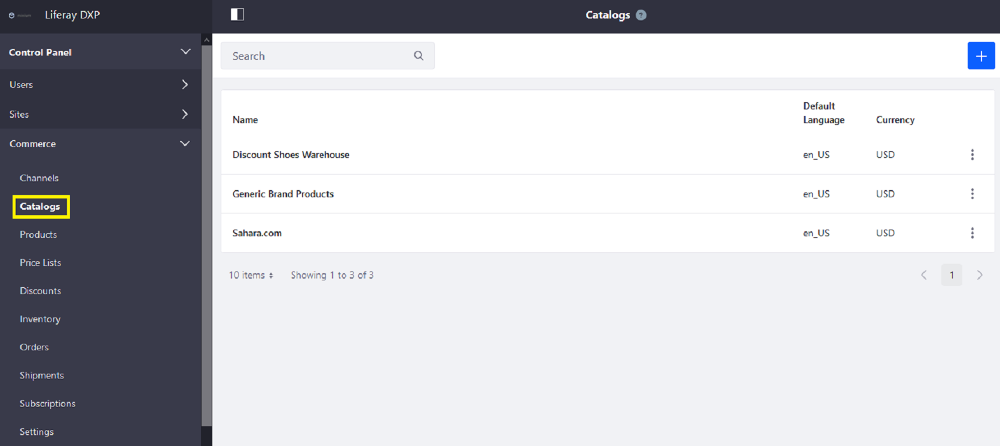
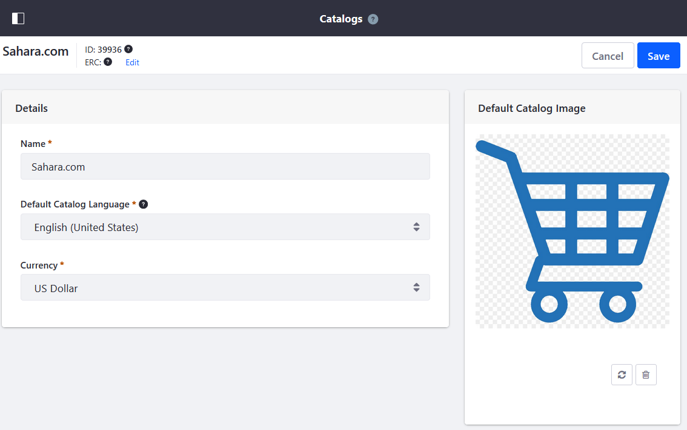
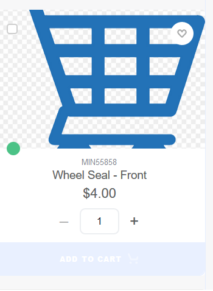

# Customizing A Catalog's Placeholder Image

Normally an item in the catalog can have at least one associated [product image](./creating-and-managing-products/products/product-images.md). If an product does not have a product image, Liferay Commerce uses the following image:


If there are multiple catalogs on the same Liferay Commerce instance, you can use a different placeholder image for each catalog.

To customize a catalog's placeholder image:

1. Navigate to the _Control Panel_ &rarr; _Commerce_ &rarr; _Catalogs_.

    

1. Click on the catalog (for example, _Sahara.com_).
1. Click the Refresh icon.

    

1. Drag and drop a new file or click _Select File_ to add a new image.

     

1. Click _Save_ when finished.

The new image has been applied to all products without their own product images.



## Liferay Commerce 2.0 and Below

```tip::
   The same placeholder image is used for all catalogs created on the same Liferay Commerce instance.
```

To customize your placeholder image:

1. Navigate to the _Control Panel_ &rarr; _Commerce_ &rarr; _Settings_.

    

1. Click the _Default Image_ tab.
1. Click the Refresh icon.
1. Drag and drop a new file or click _Select File_ to add a new image.
1. Click _Save_ when finished.

The new image has been applied to the entire instance.

## Additional Information

* [Creating a New Catalog](./creating-a-new-catalog.md)
