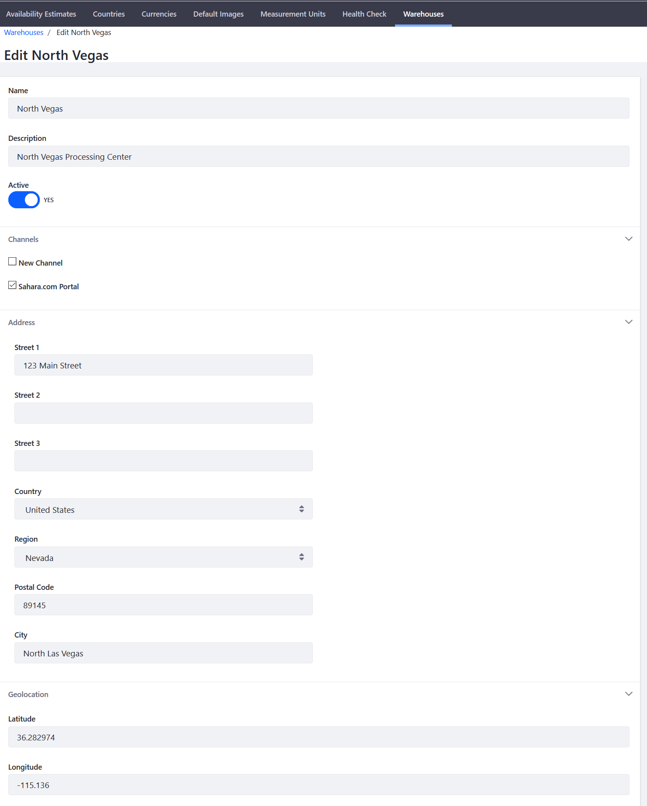

# Adding a New Warehouse

Warehouses represent physical locations where product inventory is stored. If the [Minium Accelerator](../../starting-a-store/using-the-minium-accelerator-to-jump-start-your-b2b-store.md) was used to create the store, there are three warehouses already created. Users can add additional warehouses, especially for other geographic regions.

Before users can enter the address for a warehouse, they may need to enter and activate the applicable country and region (state or province) in the _Countries_ tab at _Control Panel_ → _Commerce_ → _Settings_.
  
To add a warehouse:

1. Go to _Control Panel_ → _Commerce_ → _Settings_.
1. Click the _Warehouses_ tab.
1. Click the _Add Warehouse_ () button.
1. Enter the following:
   * *Name:* _Warehouse name_ (e.g. North Vegas Warehouse)
   * *Description:* _Warehouse description_ (e.g. North Vegas Processing Center)
1. Switch the toggle to _Active_.
1. Enter the warehouse address.
1. Select any applicable channel. This allows the channel to draw inventory from this warehouse.
1. Enter the geolocation data (required):
    * *Latitude*: 36.282974
    * *Longitude*: -115.136

    

1. Click _Save_ when finished.

The new warehouse is now active and available as an option in the _Shipment_ tab.

## Additional Information

* [Adding Regions](../../store-administration/adding-regions.md)
* [Deactivating a Country for Billing or Shipping](../../store-administration/deactivating-a-country-for-billing-or-shipping.md)
* [Introduction to Channels](../creating-and-managing-products/channels/introduction-to-channels.md)
