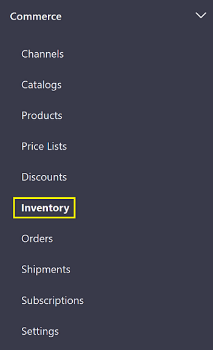
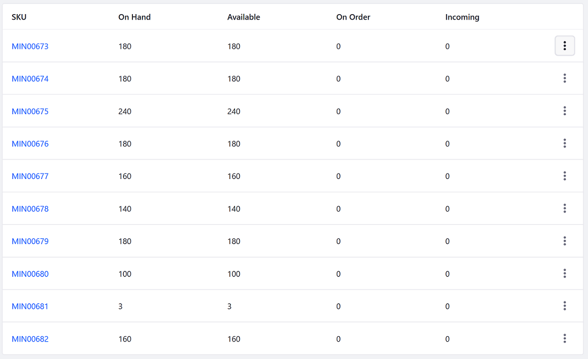
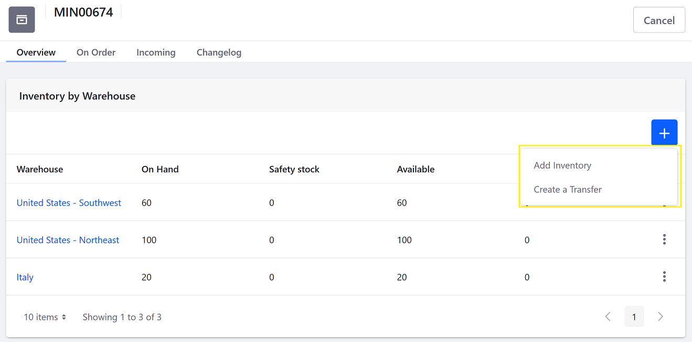
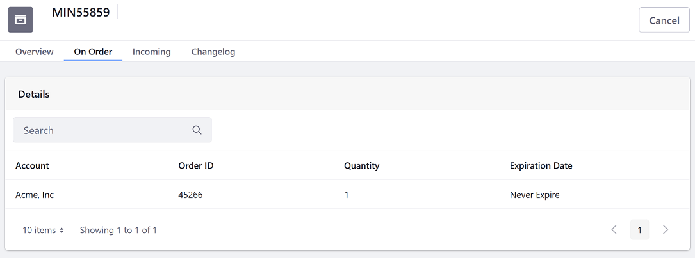

# Inventory Administration Reference Guide

> Commerce 2.1+

Liferay Commerce 2.1 introduces a dedicated Inventory Administration section to manage product availability in the _Control Panel_. This article introduces the functionality in the _Inventory_ section.

To access the Inventory Management, navigate to the _Control Panel_ &rarr; _Commerce_ &rarr; _Inventory_.

The first screen displays product variants identified by their SKU code (instead of Product code) and their availability details.

| Field | Description |
| --- | --- |
| SKU | This is the main identifier inside the inventory system. |
| On Hand | This represent the total number of items for a given SKU by aggregating all the quantities available from the different warehouses. |
| Available | This represents the quantity of items for a given SKU that are available to the storefront. This is calculated starting from the Stock Quantity and removing those that are already committed to an order or reserved in a warehouse. |
| On Order | This is the quantity booked to be used for fulfilling an order but not used yet (the order could be, for example, cancelled). IThese quantities are booked when an order is placed and then consumed when the order is shipped. |
| Incoming | This represents quantities that are going to be available. The values are just informative data and not based on any calculations. It can be used by commerce administrators to keep track of future quantities. |

## SKU

Click on a SKU. (Note that if you had used an accelerator like Minium to create a catalog, these products are created by default.) There are four tabs: Overview, On Order, Incoming, and a Changelog.

### Overview Tab

The _Overview_ tab displays a short summary of the inventory of a given SKU by warehouse.

| Field | Description |
| --- | --- |
| Warehouse | A list of warehouses where a particular SKU is located. |
| On Hand | Total quantity in a given warehouse. |
| Safety Stock | Represents a quantity reserved in a specific warehouse that cannot be sold.. Example: if there are 100 units in a warehouse, 20 units can be designated as Safety Stock. |
| Available | The actual quantity used for calculating the end-user stock availability. |
| Incoming | This represents quantities that will soon be available in that warehouse. |

Click Add () to update inventory or to transfer inventory between warehouses.

### On Order

The _On Order_ tab displays a list of Accounts that have placed an order for this SKU. The tab also displays the Order ID, the quantities ordered, and the expiration date.

### Incoming Tab

You can input a quantity that will be delivered to a particular warehouse at a future date.

Click Add () to enter your values.

|Field | Description |
| --- | --- |
| Quantity | This is the number of items to be added. |
| Destination | This represents the warehouse where the items will be arriving in. |
| Expected Delivery Date | This is the scheduled date of delivery. |

### Changelog

The Changelog tracks the following events:

* When an order is placed, the quantities are "booked" (allocated) to fulfill the order.
* When a shipment is created, the previously "booked" quantity is committed; the inventory is updated by removing the amount previously booked.
* When a quantity is added to the inventory
* When a quantity is moved between warehouses.
* When a shipment is cancelled, the previously allocated quantities need to be returned.
* Any update action to an inventory item.

## Additional Information

* [Adding SKUs to Your Products](../creating-and-managing-products/adding-skus-to-your-products.md)
* [Low Stock Action](./low-stock-action.md)
* [Adding a New Warehouse](./adding-a-new-warehouse.md)
* [Warehouse Reference Guide](./warehouse-reference-guide.md)
