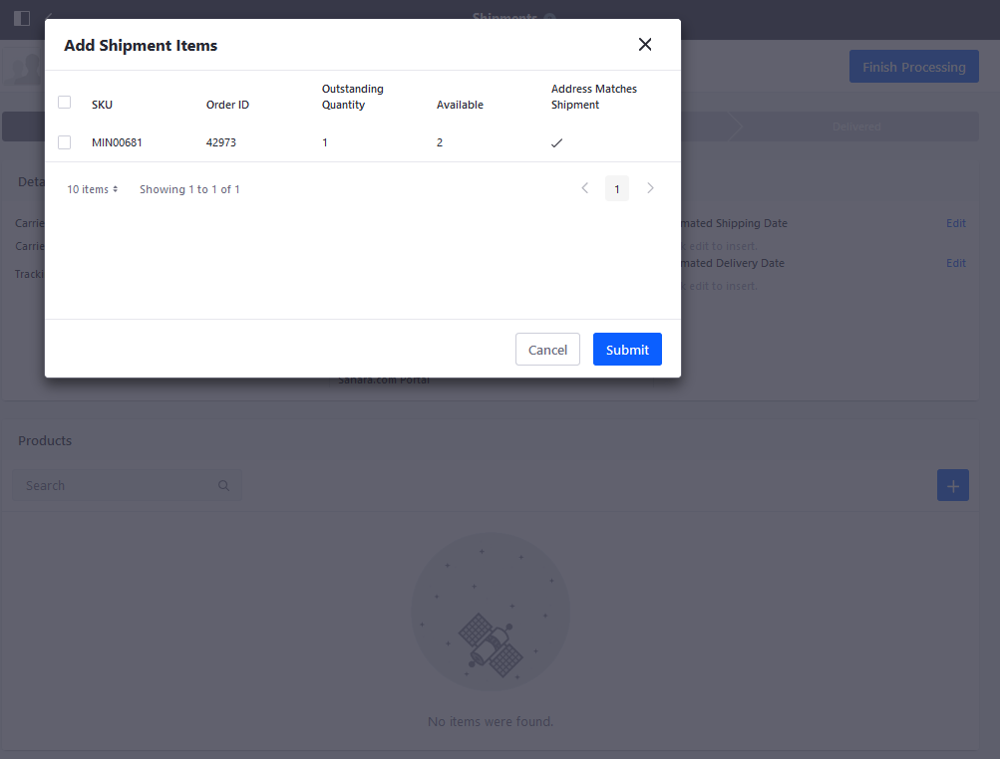
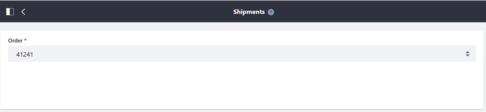
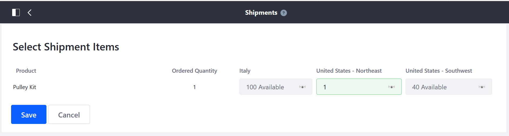
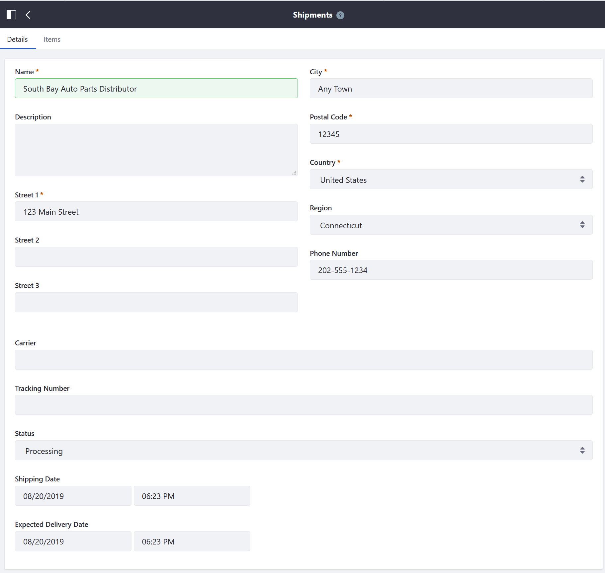
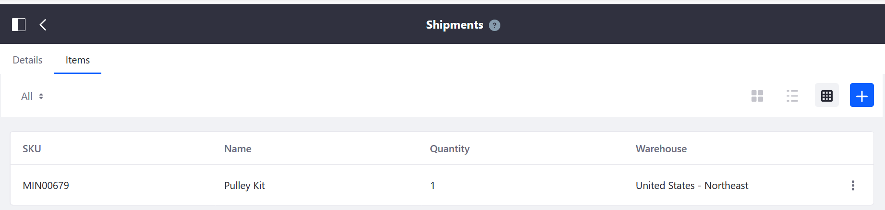
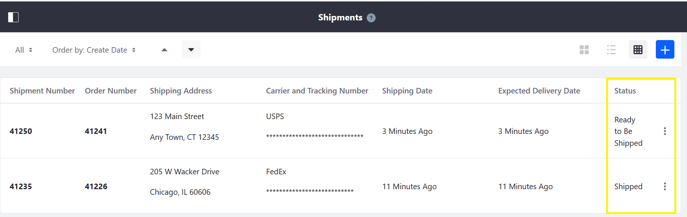

# Creating a Shipment

Beginning in Liferay Commerce 2.1, creating a shipment is now integrated with the _Orders_ menu. You do not have to navigate to the _Shipments_ menu just to create a shipment. (However, you can still manage all shipments in the _Shipments_ menu once an order is in the _Processing_ phase.)

To create a shipment:

1. Navigate to the _Control Panel_ &rarr; _Commerce_ &rarr; _Orders_.
1. Click on the _Pending_ tab and select an order.

    

1. Click the _Accept Order_ button.

    

1. Once an order has been accepted, click the _Create shipment_ button.

    

1. This redirects to the Shipments menu.

1. Click the Add ().
1. Select all the items associated with this order.

    

1. Click _Submit_.
1. Click _Edit_ next to the item to select a quantity and the sourcing warehouse.
1. Enter the quantity in the _Quantity in Shipment_ field.

    

1. Click _Save_.
1. Click _Finish Processing_.

When the order is ready to be shipped:

1. Click _Edit_ to enter an Estimated Shipping Date and an Estimated Delivery Date.

    

1. Click _Ship_ when ready.

## Liferay Commerce 2.0 and Below

To create a shipment in previous versions of Liferay Commerce:

## Creating a New Shipment

1. Navigate to the _Control Panel_ → _Commerce_ → _Shipments_.
1. Click the (+) button to add a new shipment.
1. Select an order from the dropdown menu (for example, _41241_).

    

1. Click _Save_.
1. Enter the quantity from the corresponding warehouse.

    

1. Click _Save_.
1. Verify the shipping address.

    

1. Click _Save_.

The new shipment has been created.

Once a shipment has been created, there are several further actions an order manager may do with a shipment.

### Verify the Items

1. Click the _Items_ tab to verify that the items are correct.

    

### Update the Shipping Status

1. Click the _Details_ tab.
1. Enter the name of the carrier in the _Carrier_ field (for example: USPS, FedEx, UPS)
1. Enter the _Tracking Number_.
1. Select a status from the _Status_ dropdown menu (for example: _Ready to be Shipped_).
1. Click _Save_.

The order manager can update the status of the shipment as needed, until the order is completed.

## Additional Information

* [Adding a New Warehouse](../../managing-a-catalog/managing-inventory/adding-a-new-warehouse.md)
* [Setting Inventory by Warehouse](../../managing-a-catalog/managing-inventory/setting-inventory-by-warehouse.md)
* [Order Life Cycle](../order-life-cycle.md)
* [Order Information](../order-information.md)
