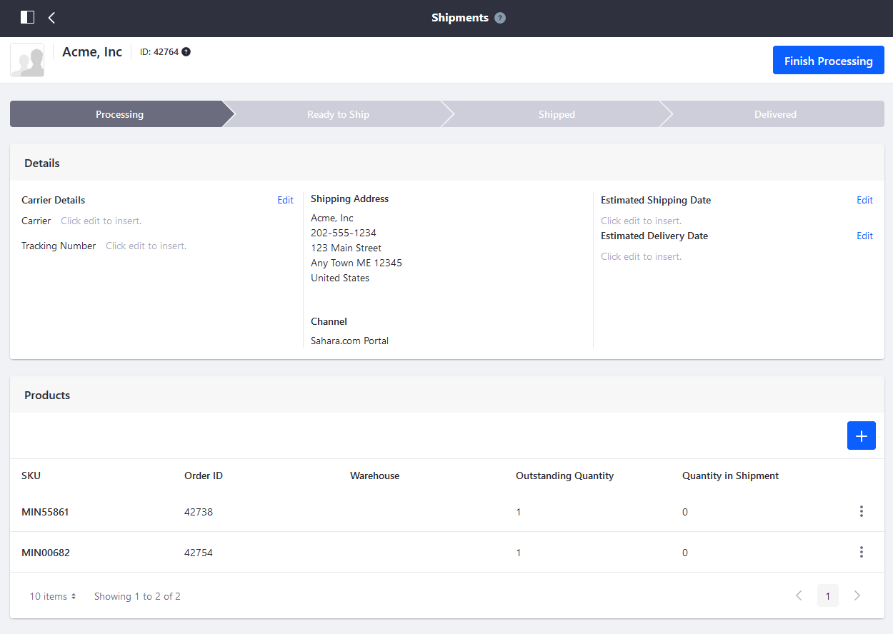
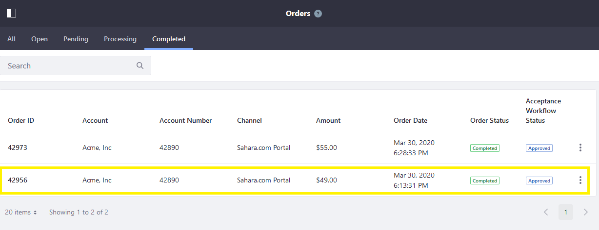
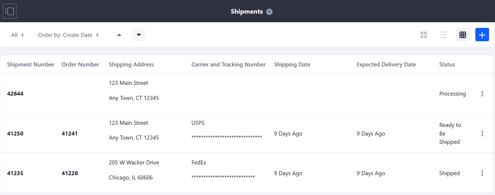
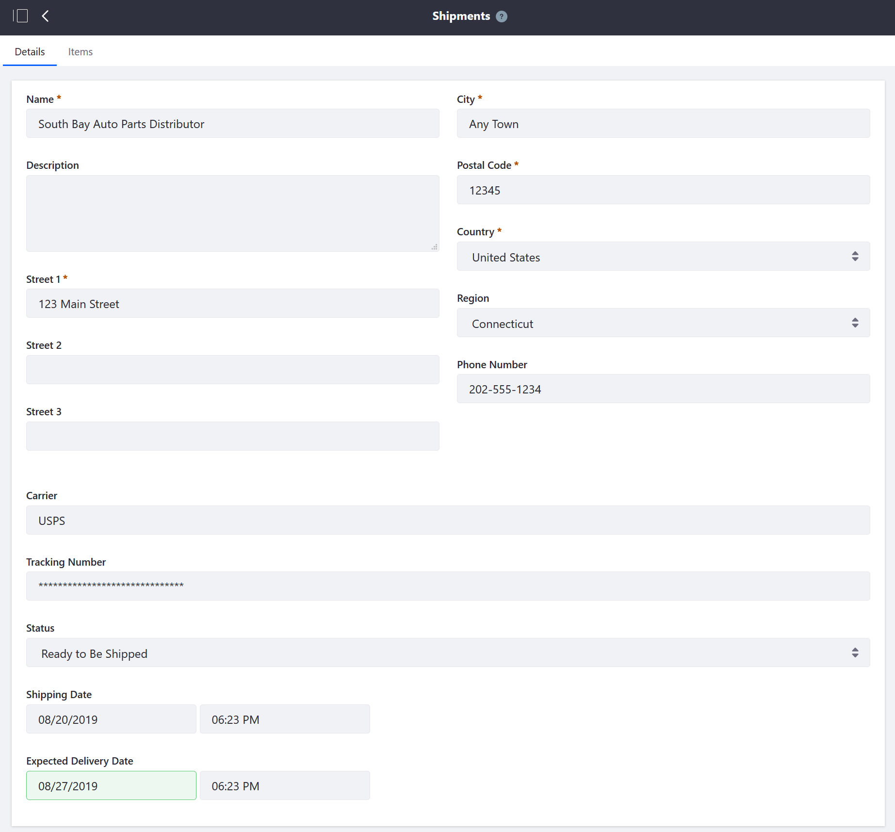
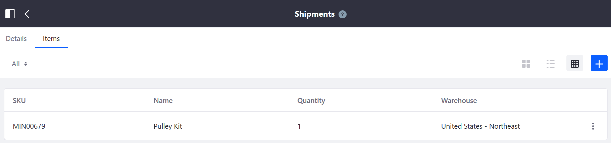

# Introduction to Shipments

Create shipments first in the _Orders_ menu as part of processing an order. Once an order is processed, you are redirected to the _Shipments_ menu to complete oder processing.

Navigate to _Control Panel_ → _Commerce_ → _Orders_. Select an order that is ready to be shipped and click the _Create Shipment_ button.

This takes the user automatically to the Shipments menu to finish processing the order. There are four stages: Processing, Ready to Ship, Shipped, and Delivered.

Once all the items and the sourcing warehouse chosen, the order is ready to ship. Here, you can view additional details such as the carrier, tracking number, and estimated delivery date. Clicking the _Ship_ button advances the order's process.

When delivery has been confirmed, the shipment process marked delivered and the order is marked completed.

## Liferay Commerce 2.0 and Below

The _Shipments_ menu is where store managers can create and track a shipment after receiving an order.

Navigate to the _Control Panel_ → _Commerce_ → _Shipments_.

The _Shipments_ menu displays all created shipments in all statuses. Click the Add () button to add a new shipment.

Clicking on a particular shipment number (for example, _41250_) displays the Shipment's _Details_ tab and the _Items_ tab. (Note that clicking the _Order Number_ (_41241_) redirects to the _Orders_ menu.)

### Shipment Details Tab

The _Shipment Details_ tab contains the following information:

| Field | Description |
| --- | --- |
| Name | Name of the Buyer |
| Description | Description field |
| Street 1 | Shipping address' first line |
| Street 2 | Shipping address' second line |
| Street 3 | Shipping address' third line |
| City | Shipping address' city |
| Postal Code | Shipping address' postal code |
| Country | Shipping address' country |
| Region | Shipping address' state or province |
| Carrier | Name of the carrier |
| Tracking Number | Shipping's tracking number generated by the **carrier** |
| Shipment Status | Dropdown menu with the options: _Processing_, _Ready to be Shipped_, _Shipped_, and _Delivered_  |
| Shipping Date | Date the shipment was delivered to the carrier  |
| Expected Delivery Date | Date the shipment is expected to arrive  |

### Shipment Items Tab

The _Shipment Items_ Tab contains the following information:

| Field | Description |
| --- | --- |
| SKU | SKU Number |
| Name | Name of the item |
| Quantity | Number of items in the shipment |
| Warehouse | Name of the warehouse sourcing the shipment |

In addition, clicking the (+) Add Shipment button opens a window to add more items to the order.

## Additional Information

* [Creating a Shipment](./creating-a-shipment.md)
* [Cancelling a Shipment](./cancelling-a-shipment.md)
