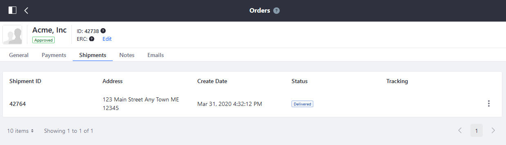
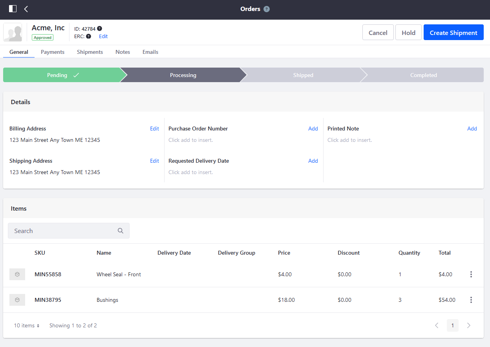
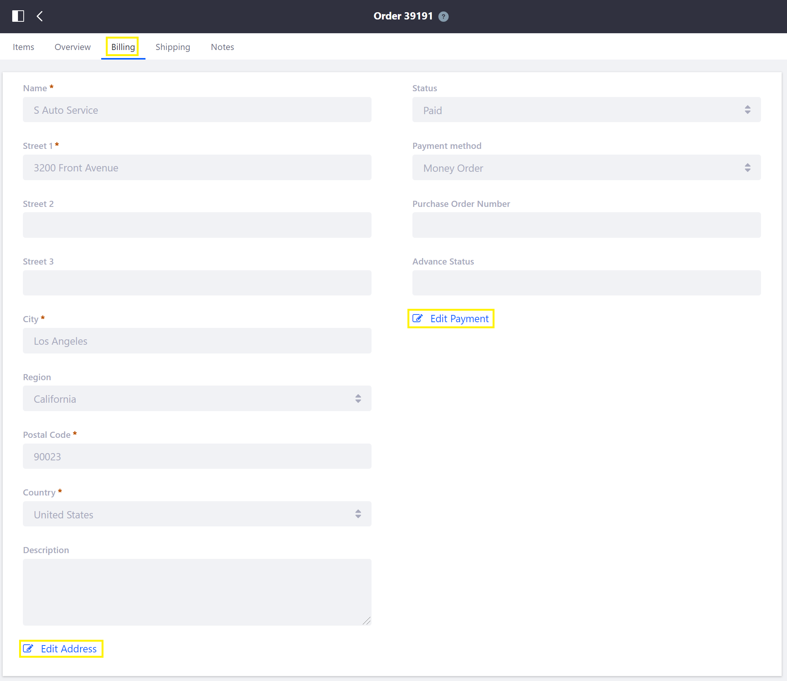
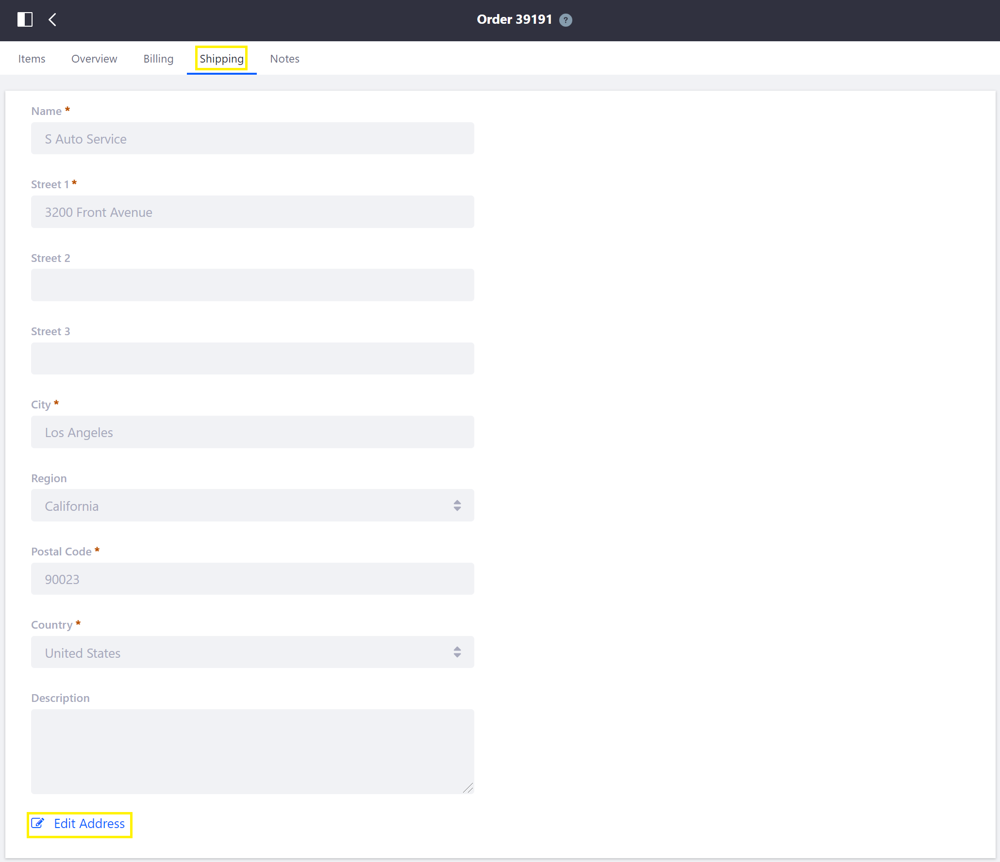

# Order Information

Administrators can view and edit order information by clicking an order in the [Orders Menu](./orders-menu.md).

There are five tabs: General, Payments, Shipments, Notes, and Emails.

## General

You can manage and track the order's status from start to finish on the _General_ tab.

## Payments

The Payments tab tracks the order's transaction history, payment method, and the payment status.

## Shipments

The _Shipments_ tab tracks the order's shipment history.

## Notes

The _Notes_ tab displays notes that have been previously added to an order and allows new notes to be added, with an optional flag for private (Admin view only) notes.

## Emails

The _Emails_ tab contains all the communications between the buyer and seller.

<!-- I don't think this information is different enough from 2.1 to justify adding it as a separate option. Just because we _can_ add it, doesn't mean we should, and in this case - it really doesn't feel like there's enough justification to keep it. Open to discussing though.

## Commerce 2.0 and Below

Administrators can view and edit order information by clicking an order in the [Orders Menu](./orders-menu.md).

   

### Items

The *Items* tab shows the products, by SKU, in an order. The quantity and price can be modified by clicking on a product.

   

### Overview

The *Overview* tab shows price information, order status, and the date & time the order was created. Click *Edit Order Status* to change the order status, or click *Edit Totals* to revise any price information.

> **Note:** This tab is only available for orders with an Order Status other than _Open_.

   

### Billing

The *Billing* tab shows the billing address with optional description, payment status, payment method, purchase order number, and advance status. Click *Edit Address* or *Edit Payment* to revise any billing or payment information.

   

### Shipping

The *Shipping* tab shows the shipping address with optional description. Click *Edit Address* to revise any shipping information.

   

### Notes

The *Notes* tab displays notes that have been previously added to an order and allows new notes to be added, with the option of making it private (visible only to administrators).

    -->

## Additional Information

* [Order Life Cycle](./order-life-cycle.md)
* [Orders Menu](./orders-menu.md)
* [Introduction to Order Workflows](./order-workflows/introduction-to-order-workflows.md)
* [Order Management Statuses](./order-management-statuses.md)
* [Enabling or Disabling Order Workflows](./order-workflows/enabling-or-disabling-order-workflows.md)
* [Approving or Rejecting Orders in Order Workflows](./order-workflows/approving-or-rejecting-orders-in-order-workflows.md)
