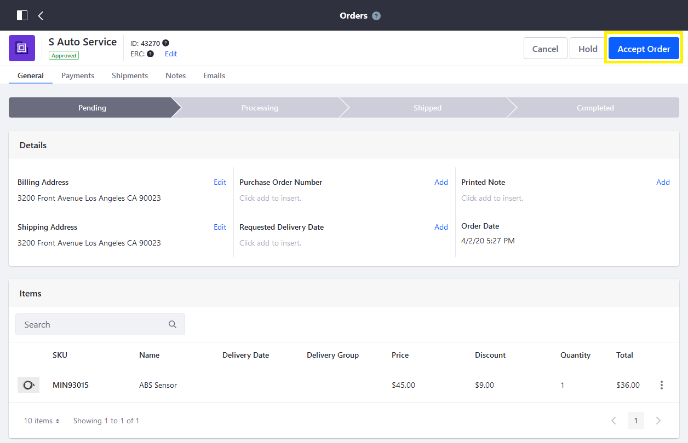
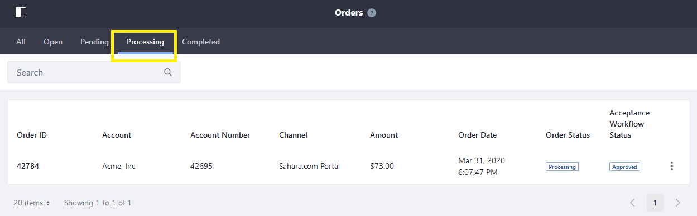
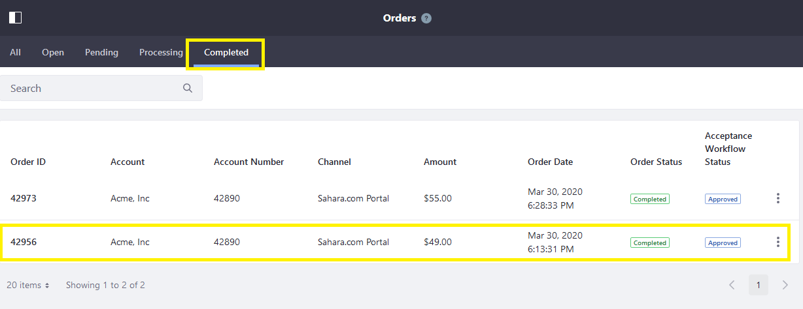
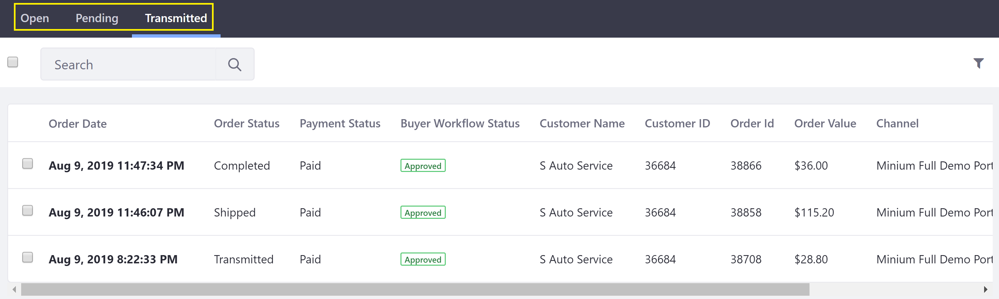
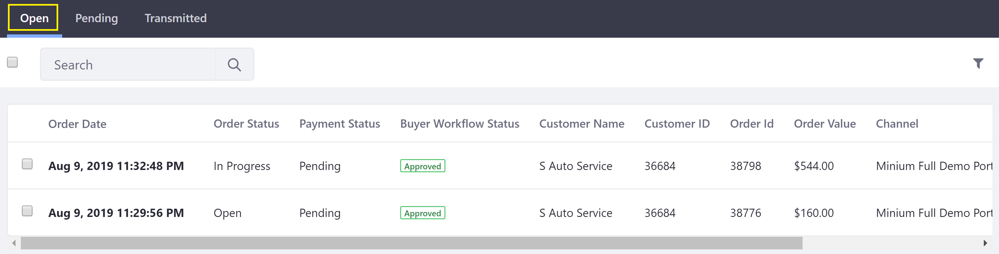

# Orders Menu

All orders in Liferay Commerce can be viewed and managed by an administrator in the _Orders_ menu. To access the _Orders_ menu, navigate to the _Control Panel_ &rarr; _Commerce_ &rarr; _Orders_.

There are five tabs at the top: _All_, _Open_, _Pending_, _Processing_, and _Completed_.


## All

The _All_ tab displays all orders regardless of their order status.

## Open

The _Open_ tab displays all the orders that have not completed the checkout process.


| Field | Description|
| --- | --- |
| Order ID | This is the Order ID. |
| Account | This is the name of the account. |
| Account Number | This is the generated account number. |
| Channel | This is the name of the channel or storefront where the order was placed. |
| Amount | This is the amount of the order. |
| Create Date | This displays the date the order was created. |
| Order Status | This is the status of the order. |

## Pending

The Pending tab displays all orders that have completed the checkout process.


There are three particular fields to note:

| Field | Description|
| --- | --- |
| Order Date | This is the date the order was created. |
| Order Status | This is the status of the order. |
| Acceptance Workflow Status | This displays the order's [buyer's acceptance workflow](./order-workflows/enabling-or-disabling-order-workflows.md) status. |

## Processing

To advance an order from Pending to Processing, click the _Accept Order_ button.



As the store begins to processing the order, the order is now in the _Processing_ tab.



## Completed

When delivery has been confirmed, the order is moved to the Completed tab.



## Liferay Commerce 2.0 and below

Orders are managed on the _Open_, _Pending_, and _Transmitted_ tabs according to the order’s progress through the [order life cycle](./order-life-cycle.md).

   

This article gives an overview of the _Open_, _Pending_, and _Transmitted_ tabs.

### Open

In this tab, the order activity is exclusively on the buyer's side. A new order is created in the _Open_ tab when a buyer adds products to their cart. The order remains in this tab until the buyer places the order.

```note::
   If _Approval Workflow_ is enabled, orders remain in the _Open_ tab until the workflow process has completed and the order is placed.
```

   

### Pending

The _Pending_ tab serves as a holding place for orders – this is helpful for business contexts where not all placed orders are immediately transmitted. When a buyer places an order, the order moves to the _Pending_ tab. Here, the seller can modify, cancel or transmit the order.

```note::
   If _Transmission Workflow_ is enabled, orders remain in the _Pending_ tab throughout the workflow process, even if the seller rejects an order, sending it back to the buyer.
```

   

### Transmitted

In this tab, the order activity is exclusively on the seller's side. The seller transmits a _Pending_ order by changing the order status (manually or via automation) from the “_To Transmit_” status to any other order status. At this point, the order moves to the _Transmitted_ tab and, if configured,  is sent to an external system, such as Microsoft’s Dynamics GP, Oracle’s NetSuite, or SAP. The seller may then proceed with delivery of the ordered products to the buyer. Additional information may also be added to the order, such as an updated order status, shipping information and estimated arrival time.

   

## Additional Information

Order information in the *Orders* menu can also be presented to other users – particularly buyers – using the *Open Carts* widget (for orders on the *Open* tab) and the *Orders* widget (for orders on the *Pending* or *Transmitted* tabs). See [Pending Orders](../../creating-store-content/commerce-storefront-pages/pending-orders.md) and [Placed Orders](../../creating-store-content/commerce-storefront-pages/placed-orders.md) for details.

* [Order Life Cycle](./order-life-cycle.md)
* [Order Information](./order-information.md)
* [Introduction to Order Workflows](./order-workflows/introduction-to-order-workflows.md)
* [Order Management Statuses](./order-management-statuses.md)
* [Enabling or Disabling Order Workflows](./order-workflows/enabling-or-disabling-order-workflows.md)
* [Approving or Rejecting Orders in Order Workflows](./order-workflows/approving-or-rejecting-orders-in-order-workflows.md)
