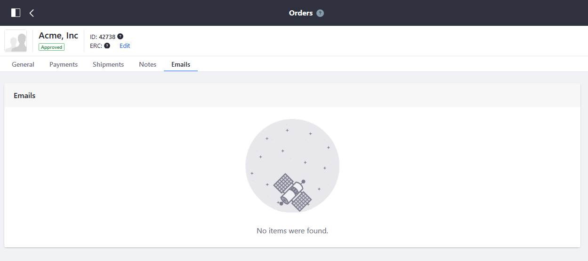

# Order Information

Administrators can view and edit order information by clicking an order in the [Orders Menu](./orders-menu-reference-guide.md).

There are five tabs: General, Payments, Shipments, Notes, and Emails.

## General

You can manage and track the order's status from start to finish on the _General_ tab.

## Payments

The Payments tab tracks the order's transaction history, payment method, and the payment status.

## Shipments

The _Shipments_ tab tracks the order's shipment history.

## Notes

The _Notes_ tab displays notes that have been previously added to an order and allows new notes to be added, with an optional flag for private (Admin view only) notes.

## Emails

The _Emails_ tab contains all the communications between the buyer and seller.

## Additional Information

* [Introduction to Order Workflows](../order-workflows/introduction-to-order-workflows.md)
* [Enabling or Disabling Order Workflows](../order-workflows/enabling-or-disabling-order-workflows.md)
* [Approving or Rejecting Orders in Order Workflows](../order-workflows/approving-or-rejecting-orders-in-order-workflows.md)
* [Managing Payment Methods](../../store-administration/configuring-payment-methods/managing-payment-methods.md)
* [Introduction to Shipments](../shipments/introduction-to-shipments.md)
* [Store Emails](../../store-administration/sending-emails/store-emails.md)