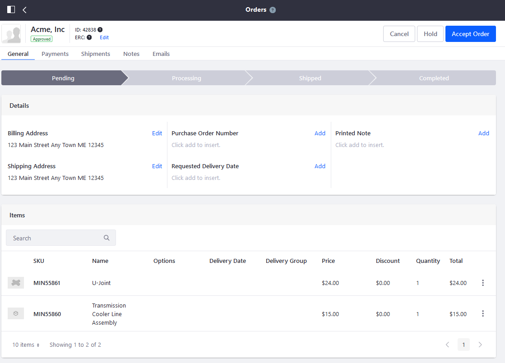
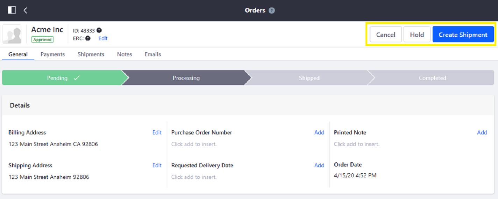
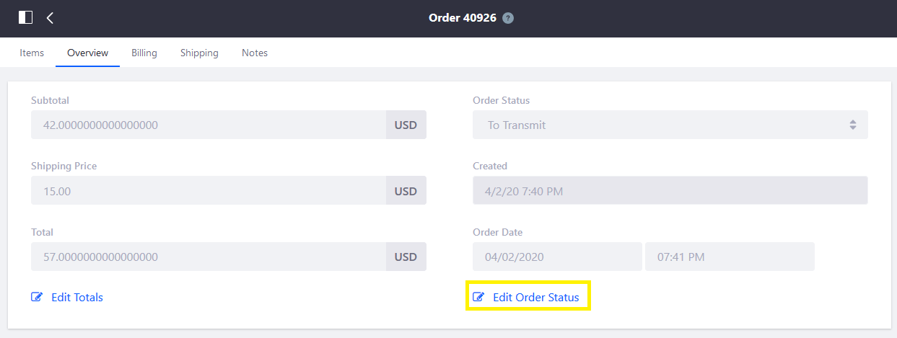

# Processing an Order

Processing an order in Liferay Commerce consists of three stages: accepting an order, processing an accepted order, and creating a shipment. To begin processing all orders, including [Subscriptions](../subscriptions/managing-subscriptions.md) (recurring orders), navigate to the [Orders](./orders-menu-reference-guide.md) menu in the _Control Panel_.

## Accepting an Order

Users can accept an order once it has completed the checkout process. Note that if [Order Workflows](../order-workflows/enabling-or-disabling-order-workflows.md) have been enabled, the order must first be reviewed and then [approved (or rejected)](../order-workflows/approving-or-rejecting-orders-in-order-workflows.md). Until the order is reviewed, the order has not completed the checkout process and thus cannot be accepted at this point.

To accept an order:

1. Navigate to the _Control Panel_ &rarr; _Commerce_ &rarr; _Orders_.

    

1. Click the _Open_ tab.
1. Click on the Order ID (for example, _42838_).
1. Click the _Accept Order_ button.

    

The order has been accepted and can be processed.

## Processing an Accepted Order

After the order has been accepted, there are three options:

* **Cancel**: The order is cancelled and on the Orders menu is moved automatically from the _Pending_ to the _Completed_ tab. The order cannot be edited again and customers must submit a new order.
* **Hold**: Processing the order is temporarily halted until additional actions are taken (for example, the store has to restock low inventory or resolve payment issues).
* **Create Shipment**: The order is ready to be shipped.

### Processing Subscription Orders

You can manage all subscription orders in the _Subscription_ menu in the _Control Panel_.

See the [Managing Subscriptions](../subscriptions/managing-subscriptions.md) article to learn more.

## Creating a Shipment

Creating a shipment begins in the _Orders_ menu as a continuation of processing an accepted order. See the [Creating a Shipment](../shipments/creating-a-shipment.md) article to learn more.

## Commerce 2.0 and Below

Order processing is done in two stages: transmitting an order and creating a shipment.

To process an order:

1. Navigate to the _Control Panel_ &rarr; _Commerce_ &rarr; _Orders_.
1. Click on the _Pending_ tab.
1. Click on an order (_40926_).

    

1. Click on the _Overview_ tab.
1. Click _Edit Order Status_.

     

1. Select _Transmitted_ from the Order Status dropdown menu.
1. Click _Save_ when finished.

The order is then moved to the _Transmitted_ tab. Once an order is transmitted, it is ready to be shipped.

See the [Creating a New Shipment on Liferay Commerce 2.0 and Below](../shipments/creating-a-shipment.md#creating-a-new-shipment-on-liferay-commerce-2-0-and-below) article section to learn more.

## Additional Information

* [Introduction to Orders Workflows](../order-workflows/introduction-to-order-workflows.md)
* [Approving or Rejecting Orders in Order Workflows](../order-workflows/approving-or-rejecting-orders-in-order-workflows.md)
* [Orders Menu Reference Guide](./orders-menu-reference-guide.md)
* [Inventory Administration Reference Guide](../../managing-a-catalog/managing-inventory/inventory-administration-reference-guide.md)
* [Subscription Administration Reference GUide](../subscriptions/subscription-administration-reference-guide.md)
