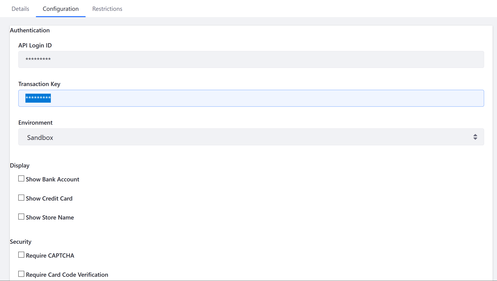

# Authorize.net

This article details how to enable Authorize.Net as a payment method. [Authorize.Net](https://www.authorize.net/about-us/) is a subsidiary of Visa and a provider of payment gateway services that manages the submission of billions of transactions to processing networks on behalf of merchant customers.

## Prerequisites

Before configuring your store to use Authorize.Net, it is necessary to [generate the following](https://support.authorize.net/s/article/How-do-I-obtain-my-API-Login-ID-and-Transaction-Key):

* An API Login ID
* A Transaction Key

## Activating Authorize.net as a Payment Method

### Commerce 2.1

1. Navigate to _Control Panel → Commerce → _Channels_.
1. Click on the desired Channel.
1. Scroll down then click _Edit_ next to Authorize.net.
1. Switch the _Active_ Toggle to _Yes_.
1. Click the _Configuration_ tab.
1. Enter the following:
    * **API Login ID**
    * **Transaction Key**
1. Select the desired environment settings in the _Environment_ dropdown menu.
1. Check the following options to enable to display the following:
    * _Show Bank Account_
    * _Show Credit Card_
    * _Show Store Name_
1. Check the following options to enable to display the following:
    * _Require CAPTCHA_
    * _Require Card Code Verification_

     

1. Click _Save_.
1. Click the _3-dot icon_ next to _Authorize.Net_ then _Activate_.

Once finished, Authorize.Net is now enabled.

### Commerce 2.0

1. Navigate to _Site Administration → Commerce → Settings → Payment Methods_.
1. Click _Authorize.Net_.
1. Click _Configuration_.
1. Enter the following:
    * **API Login ID**
    * **Transaction Key**
1. Select _Production_ if it is a live site or _Sandbox_ if it is a test environment.
1. Check the following options to enable to display the following:
    * _Show Bank Account_
    * _Show Credit Card_
    * _Show Store Name_
1. Check the following options to enable to display the following:
    * _Require CAPTCHA_
    * _Require Card Code Verification_

       

1. Click _Save_.
1. Click the _3-dot icon_ next to _Authorize.Net_ then _Activate_.

## Additional Information

* [Adding a New Currency](../../starting-a-store/store-administration/adding-a-new-currency.md)
* [Mercanet](./mercanet.md)
* [PayPal](./paypal.md)
