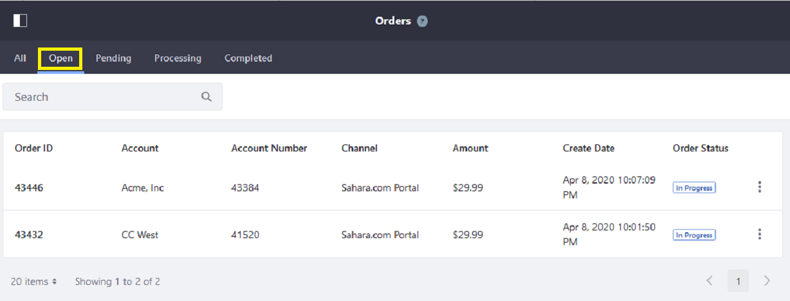
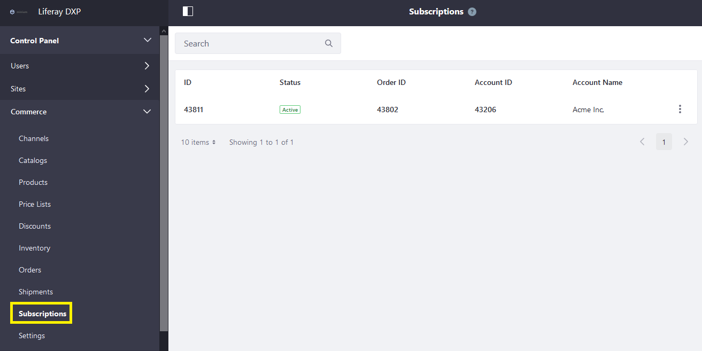
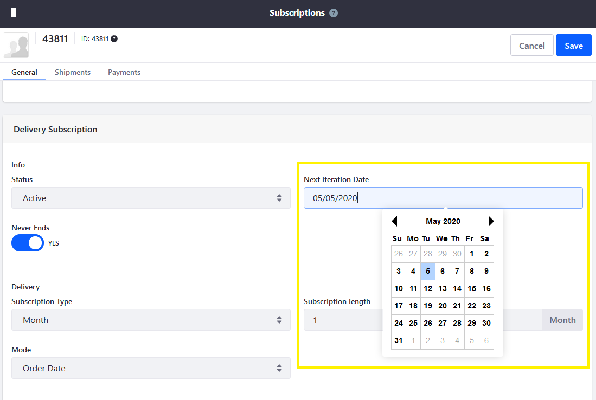
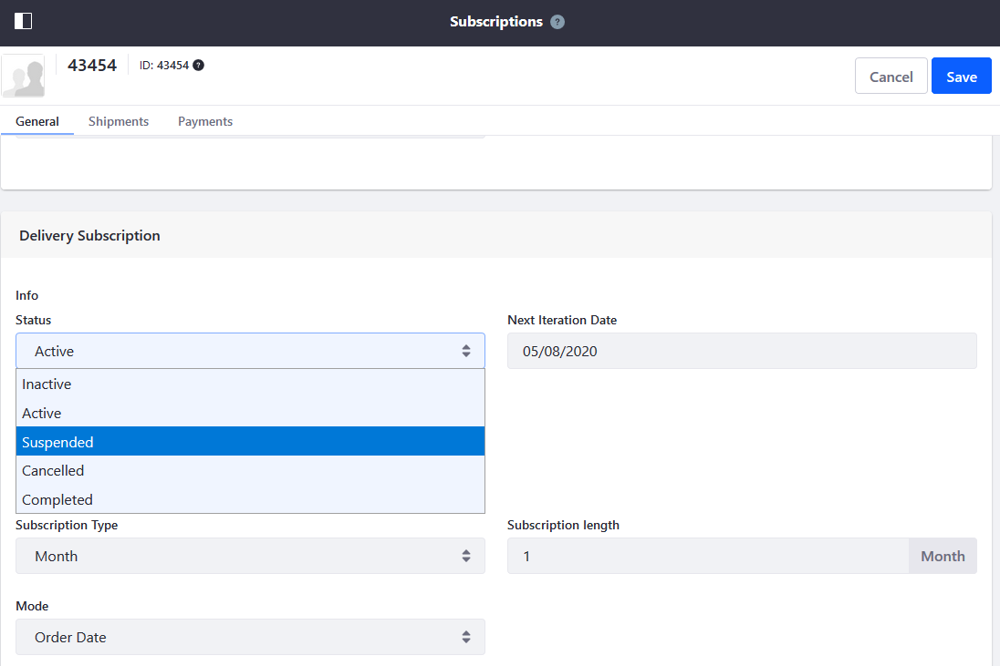
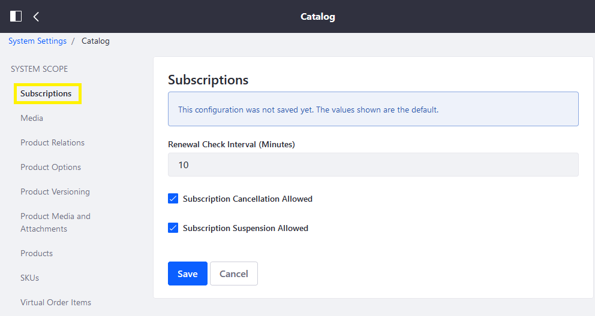

# Managing Subscriptions

Subscriptions are a special type of recurring order and are managed differently from [regular orders](../orders/processing-an-order.md). All orders, including Subscriptions, are accepted and processed in the [Orders Menu](../orders/orders-menu-reference-guide.md). However, once a *Subscription* order has been accepted, it is displayed in the [Subscriptions menu](./subscription-administration-reference-guide.md).

## Fulfilling a Subscription Order

To begin fulfilling a subscription order that has been placed:

1. Navigate to the _Control Panel_ &rarr; _Commerce_ &rarr; _Orders_.
1. Click on the _Open_ tab.

    

1. Click on the _Order ID_ to begin.
1. Click the _Pending_ button. This moves the order into the Pending status.

    

1. Click the _Accept Order_ button. This moves the order into the Processing status.

    

1. Once the subscription order has been accepted, follow the steps to create a shipment. See [Creating a Shipment](../shipments/creating-a-shipment.md) to learn more.

Once the order has been accepted, it appears on the [Subscriptions menu](./subscription-administration-reference-guide.md).

## Managing a Subscription Order

1. Navigate to the _Control Panel_ &rarr; _Commerce_ &rarr; _Subscriptions_.

    

2. Click on the _ID_ (43811). This ID is specific to subscriptions. (It is distinct from [normal Order](../orders/processing-an-order.md) or [Shipment](../shipments/introduction-to-shipments.md) IDs.)
3. On the _General_ tab, make any changes to either the Payment or Delivery options. For example, change the _Next Iteration Date_ under Delivery Subscription to an earlier date.

    

4. Click the _Save_ button.

### Suspending or Cancelling a Subscription Order

To suspend or cancel a subscription order:

1. On the _General_ tab, select _Suspended_ or _Cancelled_ from the _Status_ dropdown menu in the _Payment Subscription_ section.
1. Switch the _Never Ends_ toggle to _NO_.
1. Enter **1** in the _Ends After_ field.
1. Next, scroll down to the _Delivery Subscription_ section.
1. Select _Suspended_ or _Cancelled_ from the _Status dropdown menu.

    

1. Switch the _Never Ends_ toggle to _NO_.
1. Enter **1** in the _Ends After_ field.
1. Click _Save_ to apply the changes.

### Tracking Shipment Status

1. Click the _Shipments_ tab. From here, store managers can track shipment status.

    

### Tracking Payment History

1. Click the _Payments_ tab. From here, store managers can track payment history.

    

## Configuring Subscriptions

To configure subscriptions:

1. Navigate to the _Control Panel_ &rarr; _Configuration_ &rarr; _System Settings_.

    

1. Scroll down to _Commerce_ and click _Catalog_.
1. Click _Subscriptions_ in the left menu.

    

    Review the following available configurations:
      * **Renew Check Interval** - Determines how often the system will check check for renewals <!-- what does this really do? -->.
      * **Subscription Cancellation Allowed** - If checked, allows users to cancel a subscription.
      * **Subscription Suspension Allowed** - If checked, allows users to suspend a subscription.

1. Click the _Save_ button to apply the changes.

## Additional Information

* [Subscription Management Reference Guide](./subscription-administration-reference-guide.md)
* [Enabling Subscriptions for a Product](../../managing-a-catalog/creating-and-managing-products/products/enabling-subscriptions-for-a-product.md)
* [Processing an Order](../orders/processing-an-order.md)
* [Orders Menu Reference Guide](../orders/orders-menu-reference-guide.md)
* [Creating a Shipment](../shipments/creating-a-shipment.md)
* [Introduction to Shipments](../shipments/introduction-to-shipments.md)
