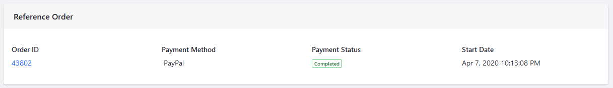

# Subscription Administration Reference Guide

Subscriptions are [managed](./managing-subscriptions.md) in the _Subscriptions_ menu in the _Control Panel_. This article describes the various functions and fields available in the _Subscriptions_ menu.

Navigate to the _Control Panel_ &rarr; _Commerce_ &rarr; _Subscriptions_.

There are five fields:

| Field | Description |
| --- | --- |
| ID | This is the Subscription's ID. |
| Status | The Status displays the [order's](../orders/processing-an-order.md) status |
| Order ID | This is the Order ID that the subscription is based on. |
| Account ID | The Account ID corresponds to the account that created the subscription. |
| Account Name | The Account Name corresponds to the account name.||

Click on the Subscription's _ID_ to view the subscription order's details.

There are three tabs: _General_, _Shipments_, and _Payments_.

## General Tab

The _General_ tab contains the basic details of the subscription [order](../orders/processing-an-order.md).

### Reference Order

The _Reference Order_ section displays [information about the Order](../orders/order-information.md):

### Payment Subscription

The Payment Subscription section tracks the following information:

| Field | Description |
| --- | --- |
| Status | This is the workflow status of the subscription. |
| Next Iteration Date | This is the next day payment is due. |
| Subscription Type | This is how the type of the subscription. |
| Subscription Length | This refers to the length of the interval between shipments. |
| Mode | This refers to the date on which the intervals are marked. Users can also select exact days of the month or _The Last Day of the Month_ as options.  |

### Delivery Subscription

The _Delivery Subscription_ section tracks the following information:

| Field | Description |
| --- | --- |
| Status | This is the workflow status of the subscription. |
| Next Iteration Date | This is the next day the [shipment](./shipments/introduction-to-shipments.md) is sent out. |
| Subscription Type | This is how the type of the subscription. |
| Subscription Length | This refers to the length of the interval between shipments. |
| Mode | This refers to the date on which the intervals are marked. Users can also select exact days of the month or _The Last Day of the Month_ as options.  |

### Items

The _Items_ section lists all the [products](../../managing-a-catalog/creating-and-managing-products/products/products-overview.md) in the subscription.

## Shipments Tab

The _Shipments_ tab displays the following information:

| Field | Description |
| --- | --- |
| Create Date | This is the date the order was [created](../orders/processing-an-order.md). |
| Shipment ID | This number is generated as the [Shipment](./shipments/introduction-to-shipments.md) ID |
| Status | This is the [Order](../orders/orders-menu-reference-guide.md)'s status. |
| Order ID | This refers to the subscription's underlying order. |
| Sent To | This is the account's shipping address. |
| Tracking | This is the carrier's tracking number. |

## Payments Tab

The _Payments_ tab tracks the order's payment history.

| Field | Description |
| --- | --- |
| Type | This refers to whether payment was made successfully or not. |
| Date | This is the date the order was [created](../orders/processing-an-order.md). |
| TXN ID | This is the transaction ID. |
| Amount | This refers to the order's total amount. |

## Additional Information

* [Enabling a Subscription](../../managing-a-catalog/creating-and-managing-products/products/enabling-subscriptions-for-a-product.md)
* [Managing Subscriptions](./managing-subscriptions.md)
* [Processing an Order](../orders/processing-an-order.md)
* [Introduction to Shipments](../shipments/introduction-to-shipments.md)
* [Order Information](../orders/order-information.md)
* [Products Overview](../../managing-a-catalog/creating-and-managing-products/products/products-overview.md)
* [Orders Menu Reference Guide](../orders/orders-menu-reference-guide.md)