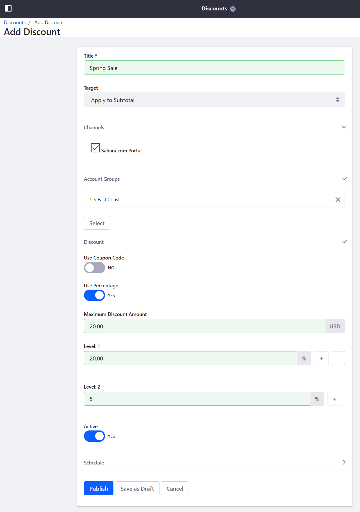
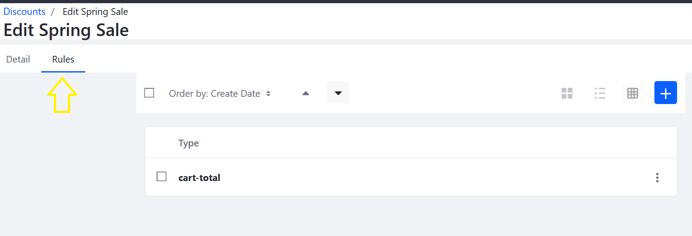

# Creating a Discount

Follow the steps below to create a discount by selecting the discount type, the target customers, and setting the discount rates. Once the discount has been created, specify additional conditions to qualify for the discount.

To create a new discount:

1. Go to the _Control Panel_ → _Commerce_ → _Discounts_.
1. Click the () button to add a new Discount.
1. Enter a name: _Spring Sale_.
1. Select a discount type (for example, _Apply to Subtotal_) from the _Target_ drop down. (See [Discount Types](./introduction-to-discounts.md/#types-of-discounts) to learn more about the different discount types.)
1. Check the box for which channel this discount applies to.
1. Select which [Account Groups](../account-management/creating-a-new-account-group.md) this discount applies to. In this example, _US East Coast_.
1. If using a coupon code, switch the _Use Coupon Code_ toggle to _Yes_. Then enter a code in the _Couple Code_ field. Otherwise leave it as _NO_.
1. If using a percentage, switch the _Use Percentage_ toggle to _Yes_. (See [Discount Percentages](./introduction-to-discounts.md/#discount-percentages) to learn more.)
1. Enter the _Maximum Discount Amount_: $20.00
1. Enter the _Level_: 20.00. This takes 20% off the subtotal.
1. Switch the _Active_ toggle to _YES_.

    

1. Click _Publish_.

Your store now has an active discount with 20% off selected goods for those in the specified Account Group.

## Adding Rules to a Discount

You can define rules that specify conditions to be met to qualify for a discount. See the [Discount Rules](./introduction-to-discounts.md#discount-rules) section to learn more.

1. Once the discount has been created, there are 2 tabs: _Detail_, and _Rules_. Click on the _Rules_ tab.

    

1. Click (+) button to add a new Discount Rule.
1. Select _Cart Total_ from the _Type_ drop down menu.
1. Enter 15.00 in the _Cart Total Minimum Amount_ field.
1. Click _Save_.

In this example, a Discount Rule has been applied to this particular Discount. Customers will receive this discount for all purchases over the set amount.

## Additional Information

* [Introduction to Discounts](./introduction-to-discounts.md)
* [Creating a New Account Group](../account-management/creating-a-new-account-group.md)
* [Creating a Price List](../managing-a-catalog/managing-price/creating-a-price-list.md)
* [Adding Tiered Pricing](../managing-a-catalog/managing-price/adding-tiered-pricing.md)
