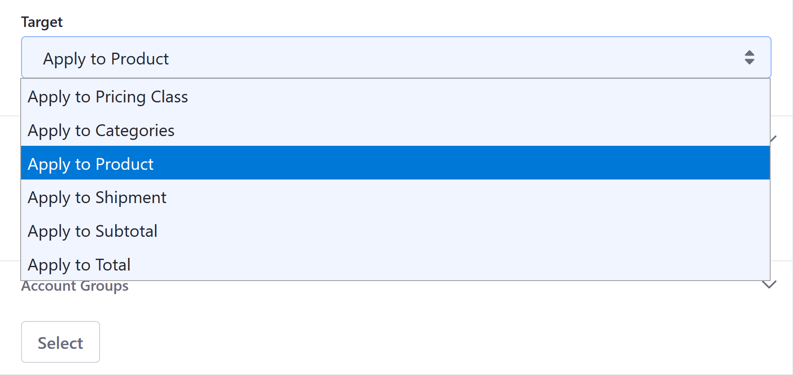
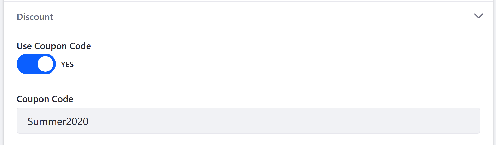
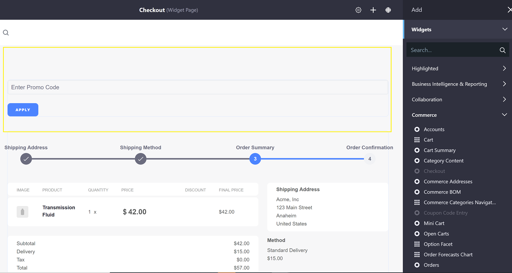
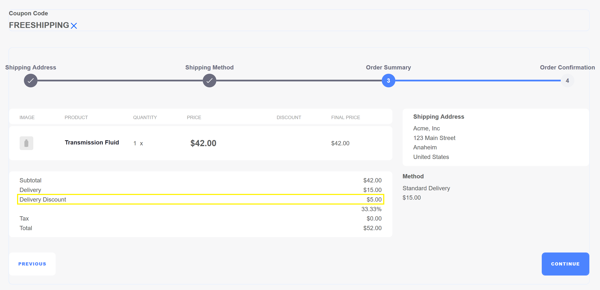
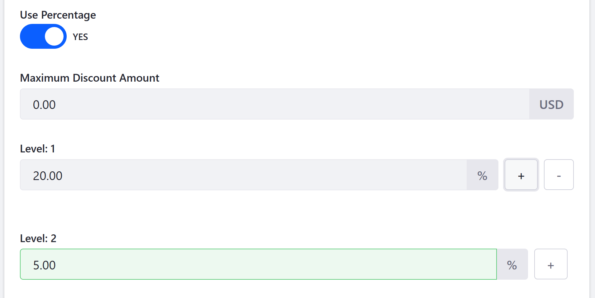
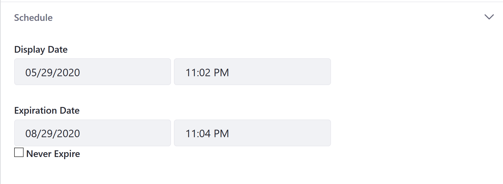
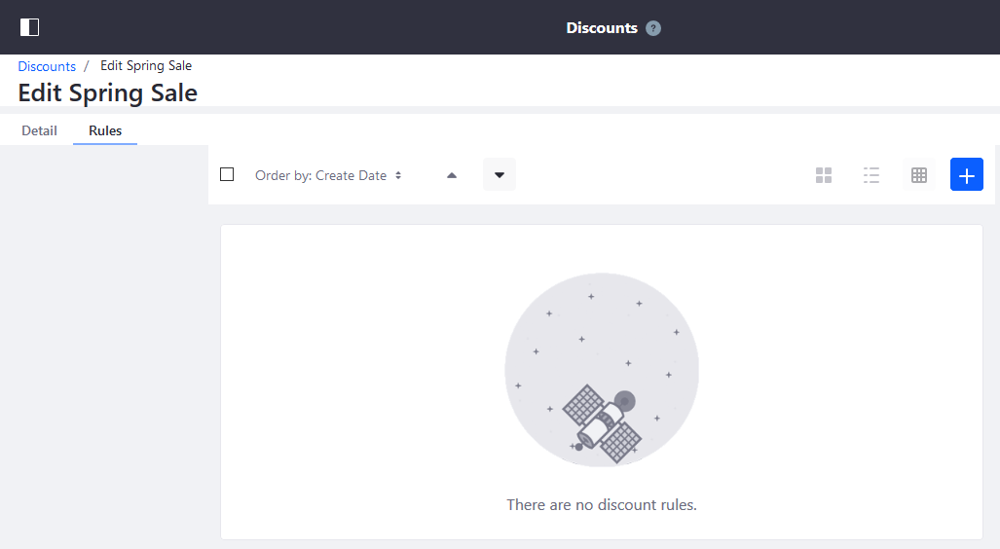
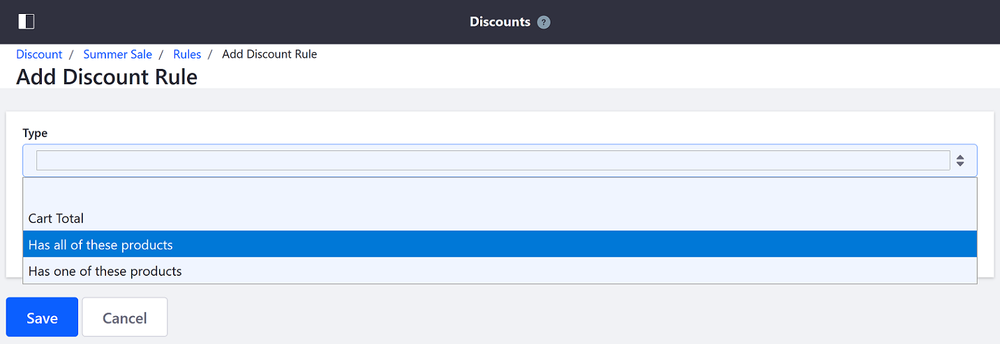

# Introduction to Discounts

Discounts are created in the _Discounts_ menu in the _Control Panel_. Users can create multiple types of discounts and incentives, such as:

* Reducing the price of specific products
* Offering free shipping
* Tailoring a discount for specific [Account Groups](../account-management/creating-a-new-account-group.md), or to a more narrowly defined group of customers
* Schedule a promotion for a period of time

```tip::
   Discounts are not the same as a *Price List*. For more information on Pricing see `Introduction to Product Pricing Methods <../managing-a-catalog/managing-price/introduction-to-product-pricing-methods.md>`_, `Creating a Price List <../managing-a-catalog/managing-price/creating-a-price-list.md>`_, and `Adding Tiered Pricing <../managing-a-catalog/managing-price/adding-tiered-pricing.md>`_.
```

## Discount Types

The following types of discounts are available:

| Discount Type | Description |
| --- | --- |
| Categories | The discount is applied to all products tagged with a specific [Category](../managing-a-catalog/creating-and-managing-products/products/organizing-your-catalog-with-product-categories.md). |
| Products | The discount is applied to a specific product or list of products.  |
| Shipments | The discount is applied to the shipment costs, either by a percentage or flat sum. |
| Subtotal | The order's subtotal is reduced, usually before taxes and other fees are applied. |
| Total | The discount is applied to the entire total. |

<!-- | Pricing Class | The discount is applied to all products in the same Product Group. | -->



<!--

The devs inadvertently added Pricing Class as a new discount type which adds a third tab called Pricing Classes. Unfortunately, it is not usable because the rest of the feature is not completed. It should be released in the 2.1.2 release.

-->

## Coupon Codes

Regardless of which discount type you choose, you can require a coupon code to qualify for a discount. User can specify a coupon code then share it through emails, newsletters, or ads.



In order to accept coupon codes, the _Coupon Code Entry_ widget must be deployed on a store's [Checkout](../creating-store-content/commerce-storefront-pages/checkout.md) page. (The Checkout page is created automatically if you had used the [Minium accelerator](../starting-a-store/using-the-minium-accelerator-to-jump-start-your-b2b-store.md) to build the store site.) In this example, the _Coupon Code Entry_ widget is placed on the page so that customers can enter their coupon code while they review their order.



Once the customer has entered his coupon code to apply the discount, the discount is reflected in the updated Order Summary.



## Tiered Discounts

Users can offered tiered discounts (Levels) for all Discount Types based on percentages. For example, you can set a base discount of 20% off as Level 1 and then offer an additional 5% off as Level 2 if your customer makes the purchase before a deadline.



## Expiration Date

All discounts can be configured to have expiration dates to coincide with promotional efforts.



## Discount Rules

You can define rules that specify requirements to qualify for a discount. There are three types of rules:

| Rule | Description |
| --- | --- |
| Cart Total | Cart subtotal must meet a minimum threshold to receive the discount. |
| Has all of these products | Orders must include all specified products in order to receive the discount. |
| Has one of these products | Orders must contain at least one product from a list of specified products to receive the discount. |

The discount rules are added on the _Rules_ tab. Developers can also [implement new discount rules](../developer-guide/tutorials/adding-a-new-discount-rule-type.md).



If using the _Has all of these products_ or the _Has one of these products_ discount rules, select which products in the catalog are eligible for the discount.



After selecting the applicable products, customers will receive a discount for these goods depending on which of these rules has been chosen.

## What's Next

* [Creating a Discount](./creating-a-discount.md)
