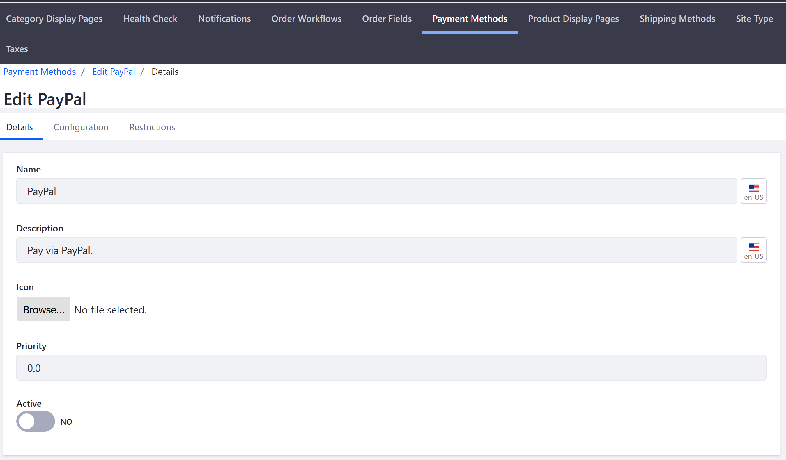
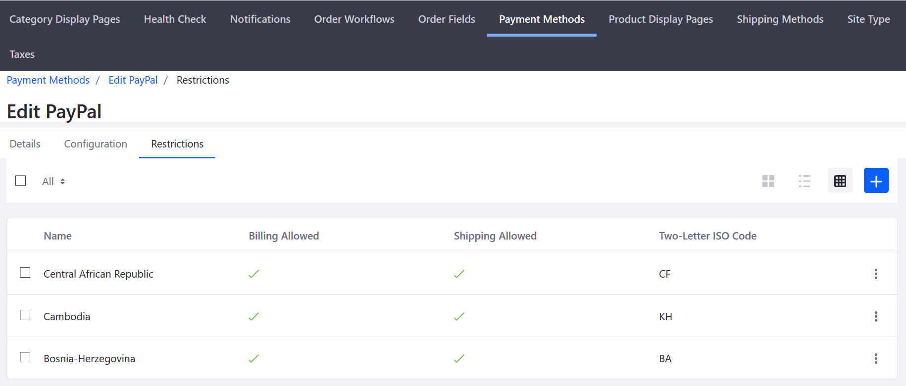

# Managing Payment Methods

Payment methods in Liferay Commerce scoped by [channel](../../managing-a-catalog/creating-and-managing-products/introduction-to-channels.md) and store [site](../../sites-and-site-types.md). If a Liferay Commerce instance has more than one storefront hosted on the same instance, administrators can use different payment methods on each site.

To manage payment methods, navigate to _Site Administration_ → _Commerce_ → _Settings_ and select the Payment Methods tab.

## Configuring a Payment Method

### Details Tab

Each details screen contains fields that determine how the payment method is rendered in the Checkout widget.

|Field | Description |
|----- | ----------- |
|Name  | Name of the Payment Method |
|Description | Short description of the payment method |
|Icon| Upload a small image or logo to represent the payment method |
|Priority | Determines the order in which the payment method is displayed in the checkout process; lower numbers are displayed higher |
|Active | Switch the toggle to activate or deactivate a payment method |  

### Configuration Tab

The _Configuration_ tab for a payment method is where the store administrator configures the integration for a payment method with the store.

See the corresponding articles to learn how to activate each payment method:

* [Authorize.net](../../orders-and-fulfillment/authorize.net.md)
* [Mercanet](../../orders-and-fulfillment/mercanet.md)
* [Money Orders](../../orders-and-fulfillment/money-orders.md)
* [PayPal](../../orders-and-fulfillment/paypal.md)

### Restrictions Tab

A restriction deactivates a payment method for buyers in specified countries.

