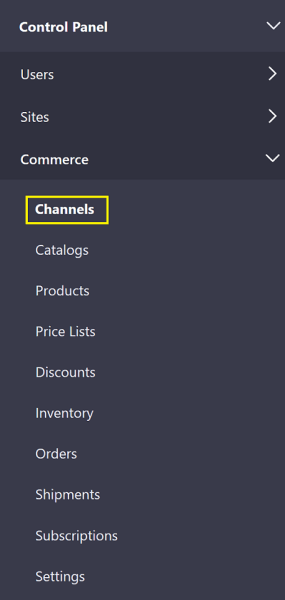

# Using the FedEx Shipping Method

> Subscribers

This article details how to configure and enable FedEx as a shipping method.

## Prerequisites

Before configuring your store to use FedEX as a shipping method, have the following:

1. FedEx business account number
1. FedEx account password
1. FedEx Web Services Developer Key (available from [FedEx Web Services](https://www.fedex.com/en-us/developer/web-services.html))
1. FedEx Meter Number

## Activate the FedEx Shipping Method

To activate FedEx as a shipping method for your chosen channel:

1. Navigate to the _Control Panel_ &rarr; _Commerce_ &rarr; _Channels_.

    

1. Click on the desired channel (for example, Sahara.com). (Note that if you had used an accelerator like Minium to create your site, there is already a corresponding channel created by default.)
1. Scroll down to _Shipment Methods_.

    

1. Click _Edit_ next to FedEX.
1. Switch the _Active_ toggle to _YES_.
1. Click the _Configuration_ tab.
1. Enter the following:
    * **URL**
    * **Key**
    * **Password**
    * **Account Number**
    * **Meter Number**
1. Select the Dropoff Type.
1. Check the appropriate checkboxes:
    * **Use Residential Rates**
    * **Use Discounted Rates**
1. Check the box for the _Service Type_.
1. Enter the _Max Weight_ in both pounds and kilograms.
1. Enter the _Max Size_ in both inches and centimeters.
1. Click _Save_.

The store is now configured to use FedEx as the shipping method.

### Commerce 2.0

To activate FedEx as a shipping method for your site:

1. Navigate to _Site Administration_ → _Commerce_ → _Settings_.
1. Click the _Shipping Methods_ tab.
1. Click _FedEx_.
1. Click the _Configurations_ tab.
1. Enter the following:
    * **URL**
    * **Key**
    * **Password**
    * **Account Number**
    * **Meter Number**
1. Select the Dropoff Type.
1. Check any of the _Service Types_ options applicable to your business needs.
1. Select the Packing Type.
1. Enter the _Max Weight_ in both pounds and kilograms.
1. Enter the _Max Size_ in both inches and centimeters.
1. Click _Save_.
1. Click the _Details_ tab.
1. Switch the _Active_ toggle to _YES_.

The store is now configured to use FedEx as a shipping method. Note that the store can have multiple shipping methods enabled and as long as credentials are valid, sellers may now select FedEx specific shipping options.

## Additional Information

FedEx Web Services Developer Guide

* [FedEx Web Services](https://www.fedex.com/en-us/developer/web-services.html)

To add other shipping methods in Liferay Commerce using extension points:

* [Creating New Shipping Methods](https://help.liferay.com/hc/en-us/articles/360020751831)
