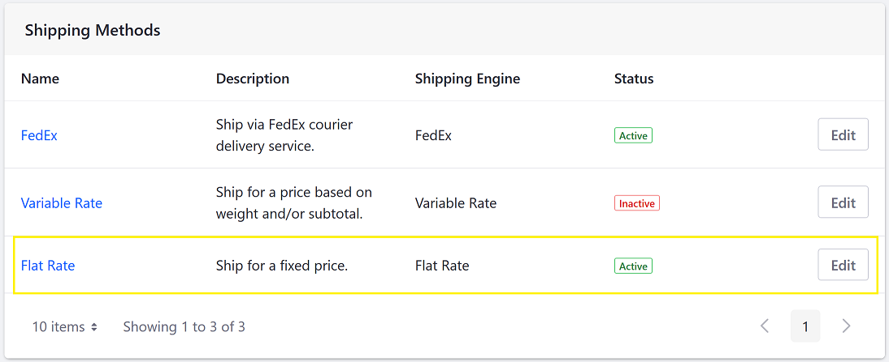
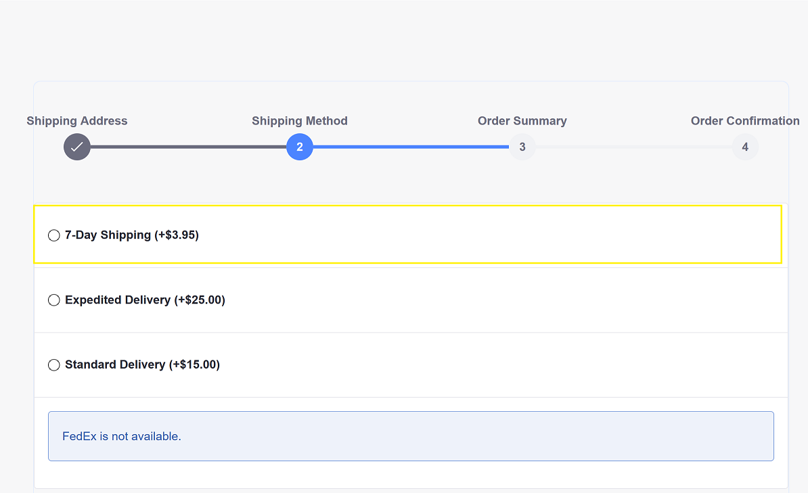

# Using the Flat Rate Shipping Method

Buyers can choose a flat rate shipping option to ship any product. By creating multiple flat rate options, you can give customers choices of cost, speed, or security.

Flat rate shipping imposes the same cost on every product in the catalog. You can create exceptions, however, for individual products from the _Shipping Extra Price_ field in the product’s [Configuration](../../managing-a-catalog/managing-inventory/product-inventory-configuration-reference.md) tab.

By default, the Flat Rate shipping method is enabled.

To add a new Flat Rate Shipping Option:

1. Navigate to the _Control Panel_ &rarr; _Commerce_ &rarr; _Channels_.

    

1. Click on the desired channel (for example, Sahara.com). (Note that if you had used an accelerator like Minium to create your site, there is already a corresponding channel created by default.)
1. Scroll down to _Shipment Methods_.

    

1. Click _Edit_.
1. Switch the _Active_ toggle to _YES_.
1. Click the _Shipping Options_ tab.
1. Click the Add () button to add a new Shipping option:
1. Enter the following:
    * **Name**: 7-Day Shipping
    * **Amount**: 3.95
    * **Priority**: 0.0

    

1. Click _Save_.
1. Close the window.

A new shipping method option has been added.

## Commerce 2.0 and Below

To add a new Flat Rate Shipping Option:

1. Navigate to _Site Administration_ → _Commerce_ → _Settings_.
1. Click the _Shipping Methods_ tab.
1. Click _Flat Rate_.
1. Click the _Shipping Options_ tab. (If using the Minium accelerator, the _Standard Delivery_ and _Expedited Delivery_ are created by default.)
1. Click the Add () button to add a new Shipping option:
1. Enter the following:
    * **Name**: 7-Day Shipping
    * **Amount**: 3.95
    * **Priority**: 0.0
1. Click _Save_.

The new Shipping Option has been added and is available during the checkout process.

## Additional Information

* [Using the Variable Rate Shipping Method](./using-the-variable-rate-shipping-method.md)
* [Using FedEx as a Carrier Method](./using-the-fedex-shipping-method.md)
* [Applying Shipping Method Restrictions](./applying-shipping-method-restrictions.md)
* [Implementing a New Shipping Engine](../../developer-guide/tutorials/implementing-a-new-shipping-engine.md)
