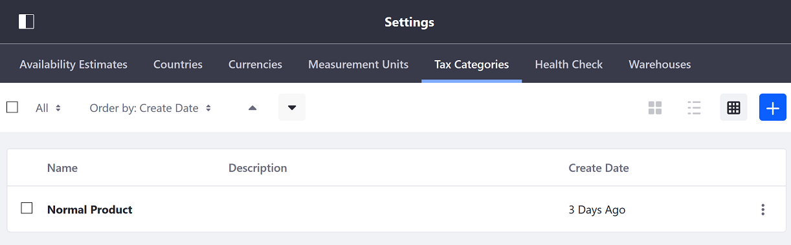
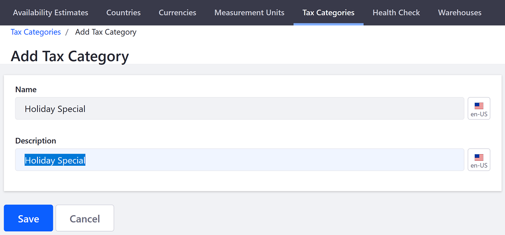
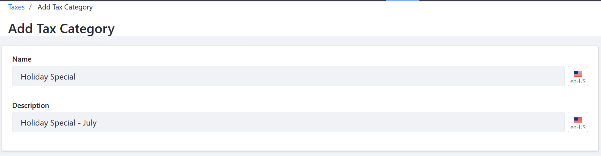

# Creating Tax Categories

Tax Categories are containers for one or more tax calculations in your store. Tax categories have to be created _first_ before applying any type of taxes.  Products can be taxed differently by assigning different tax categories to them.

To create a new tax category:

1. Navigate to the _Control Panel_ &rarr; _Commerce_ &rarr; _Settings_.
1. Click the _Tax Categories_ tab.

    

1. Click the Add Tax Category () button.
1. Enter the following:

    * **Name**: Holiday Special
    * **Description**: Taxes for holidays

    

1. Click _Save_.

A new tax category has been created.

## Commerce 2.0 and Below

To create a new tax category:

1. Go to _Site Administration_ → _Commerce_ → _Settings_.
1. Click the _Taxes_ tab.
1. Click the _Tax Categories_ sub-tab.
1. Click the _Add Tax Category_ button.
1. Enter a name and a description.

    

1. Click _Save_.

The Tax Category is now available for your store.

## Additional Information

* [Setting Tax Rates by Address](../configuring-taxes/setting-tax-rate-by-address.md)
* [Setting Fixed Tax Rates](../configuring-taxes/setting-tax-rate-by-fixed-rate.md)
