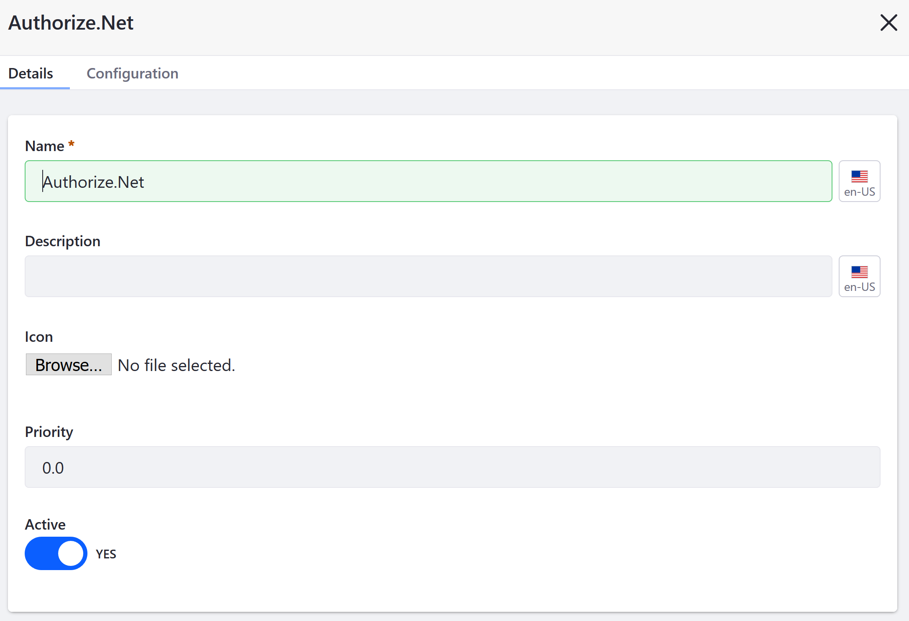
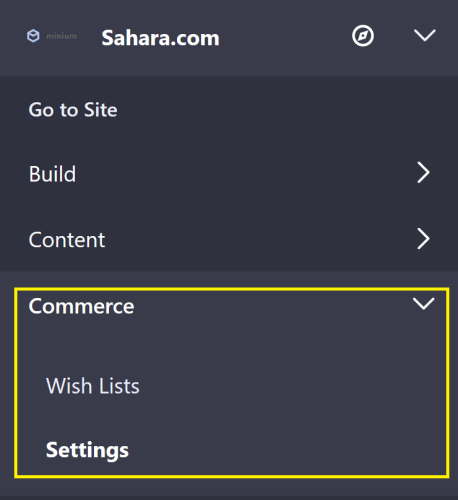
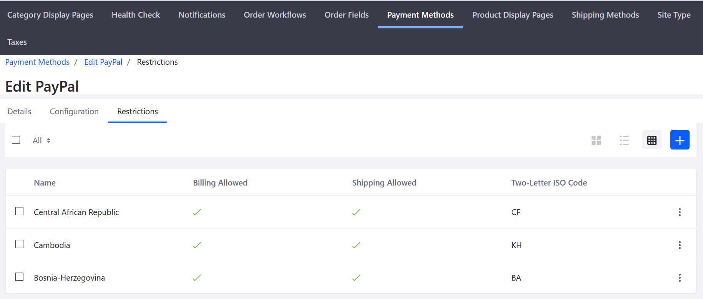

# Managing Payment Methods

Payment methods in Liferay Commerce scoped by [channel](../managing-a-catalog/creating-and-managing-products/channels/introduction-to-channels.md) and store [site](../starting-a-store/sites-and-site-types.md). If a Liferay Commerce instance has more than one storefront hosted on the same instance, administrators can use different payment methods on each site.

To manage payment methods, navigate to the _Control Panel_ &rarr; _Commerce_ &rarr; _Channels_.

Select the desired channel then click _Edit_ for the payment method for this store site.

Once the selected payment method is active, configure the payment method with your values.

## Configuring a Payment Method

### Details Tab

Each details screen contains fields that determine how the payment method is rendered in the Checkout widget.

|Field | Description |
|----- | ----------- |
|Name  | Name of the Payment Method |
|Description | Short description of the payment method |
|Icon| Upload a small image or logo to represent the payment method |
|Priority | Determines the order in which the payment method is displayed in the checkout process; lower numbers are displayed higher |
|Active | Switch the toggle to activate or deactivate a payment method |

### Configuration Tab

The _Configuration_ tab for a payment method is where the store administrator configures the integration for a payment method with the store.

See the corresponding articles to learn how to activate each payment method:

* [Authorize.net](./configuring-payment-methods/authorize.net.md)
* [Mercanet](./configuring-payment-methods/mercanet.md)
* [Money Orders](./configuring-payment-methods/money-orders.md)
* [PayPal](./configuring-payment-methods/paypal.md)

## Commerce 2.0 and Below

On previous versions of Liferay Commerce, payment methods are scoped by store [site](../sites-and-site-types.md).

To manage payment methods in Commerce 2.0 and below, navigate to _Site Administration_ → _Commerce_ → _Settings_.

Select the _Payment Methods_ tab.

### Details Tab (2.0)

### Restrictions Tab (2.0)

A restriction deactivates a payment method for buyers in specified countries.

