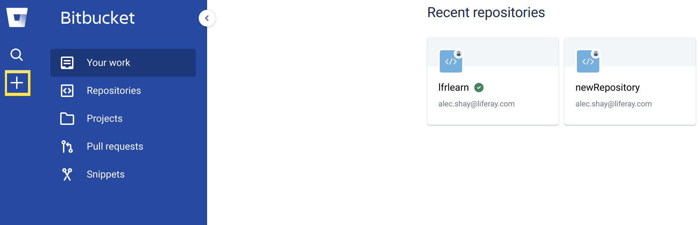
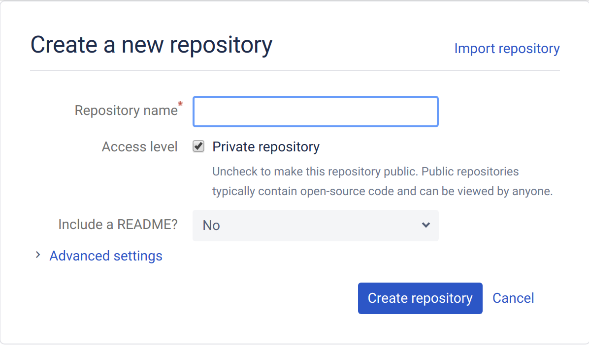
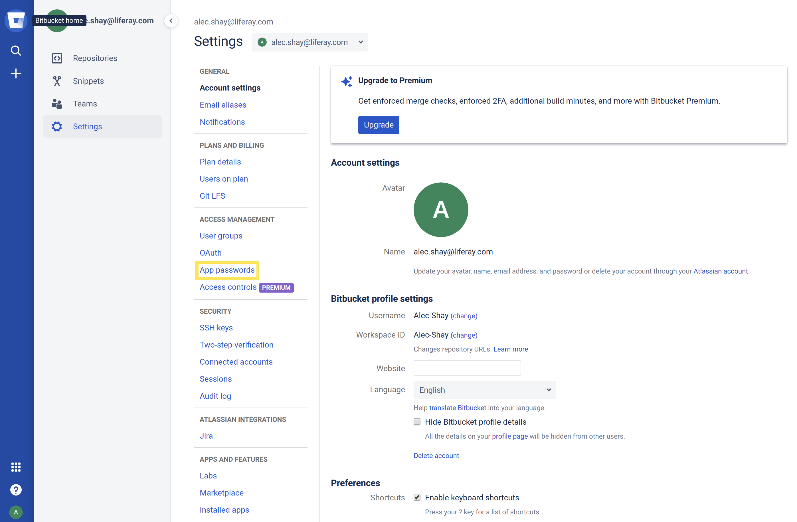
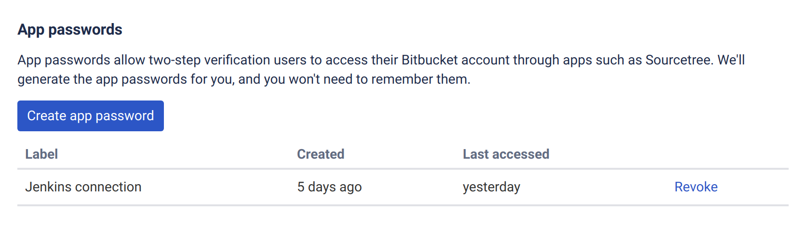

# Configuring Your Bitbucket Repository

Upon receiving a DXP Cloud onboarding email, you're provisioned a GitHub repository hosted in the `dxpcloud` organization. This repository should be used as a template for a team's separate private DXP Cloud development repository and is typically removed after 10 business days. Users are expected to:

1. Transfer the initial provisioned repository to their own private repository.
1. Integrate that repository with the Jenkins (CI) service in DXP Cloud using a Webhook.

The provisioned repository will be on GitHub, but you can transfer it to a BitBucket repository as of version 3.2.0 of the Jenkins service.

## Preparing the Jenkins service

Before you start, check the `LCP.json` for your `ci` service, and make sure that you're running the following Jenkins service or higher:

```
liferaycloud/jenkins:2.222.1-3.2.0
```

If not, then follow these steps to upgrade:

1. Update the Jenkins service to version `liferaycloud/jenkins:2.222.1-3.2.0`.

1. Delete the `Jenkinsfile` located on the root folder.

1. Add the following environment variable: `LCP_CI_USE_DEFAULT_JENKINSFILE: true`.

1. Deploy the Jenkins service.

```note::
    If you've customized your Jenkinsfile, follow this guide to `extend the Default Jenkinsfile <../platform-services/continuous-integration.md#extending-the-default-jenkinsfile>`__.
```

## Creating a Bitbucket Repository

First, create a new Bitbucket repository.

1. Go to [Bitbucket](https://bitbucket.org).

1. Click the "+" icon in the sidebar under the search icon.



1. Click _Repository_ to start creating a new repository.



1. Provide a name for the repository.

1. Ensure the access level is set to private.

1. Set _Include a README?_ to _No_.

1. Click _Create repository_.

## Transferring from GitHub to Bitbucket

Follow these steps to transfer the initial GitHub repository to your own Bitbucket repository:

1. Clone your initial GitHub repository locally:

    ```git clone git@github.com:dxpcloud/example.git```

    ```note::
       If you have already cloned the repository for work with another provider, then you can skip this step and work within the same clone.
    ```

1. Add a new Git remote and point to Bitbucket:

    ```git remote add bitbucket git@bitbucket.org:example/example.git```

1. Push the cloned repository to the new remote repository:

    ```git push bitbucket master```

If you need help creating, cloning, and pushing repositories, see [Bitbucket's documentation](https://confluence.atlassian.com/bitbucket/create-a-git-repository-759857290.html).

## Generating App Password for BitBucket

Next, create an access token that will be used by the Webhook to trigger Jenkins builds:

1. From your user settings page, under _Access Management_ click _App passwords_.



1. Click _Create app password_.



1. Provide a label for the app password.

1. Grant the app the following permissions:

    * `Pull request - read, write` (this should also flag Repositories - read, write)
    * `Webhooks -  read, write`

1. Click _Create_.

1. Copy the app password (you won't see it again otherwise). This is BitBucket's equivalent of a personal access token.

## Connecting BitBucket to Your Jenkins service

Lastly, set environment variables in the Jenkins service's to point to your new repository:

1. Log in to the DXP Cloud console and navigate to your Jenkins service in the `infra` environment.

1. Navigate to the _Environment Variables_ tab.

1. Configure the following environment variables:

| Name | Value |
| ---  | ---   |
| `LCP_CI_SCM_PROVIDER` | bitbucket  |
| `LCP_CI_SCM_REPOSITORY_OWNER` | <repo_owner> |
| `LCP_CI_SCM_REPOSITORY_NAME` | <repo_name> |
| `LCP_CI_SCM_TOKEN` | <app_password> |

After updating these environment variables, the Jenkins service will restart. Any pushed branches and pull requests in your new repository should now trigger.

## Verifying Builds

Pushed branches and pull requests should trigger builds that you can see or deploy from the _Builds_ tab in the DXP Cloud console. After setting up integration with the Jenkins service, a good next step to verify these builds, to ensure that the integration was successful.

### Verifying Builds from Pushed Branches

To confirm that new Git pushes are triggering Jenkins builds:

1. Make a change to the repository (like adding a file), then commit it to the branch:

    ```bash
    git commit -m "Add file to test builds"
    ```

1. Push the branch up to BitBucket:

    ```bash
    git push bitbucket branch-name
    ```

1. Navigate to the _Builds_ page in the DXP Cloud console.

1. Verify that the build displays for the pushed branch on the _Builds_ page.

### Verifying Builds from Pull Requests

To confirm that new pull requests are triggering Jenkins builds:

1. Create a pull request from the any branch to the `develop` branch.

1. Verify that a new build is created for the pull request.

1. Navigate to the _Builds_ page in the DXP Cloud console.

1. Click the links for the branch and commit in the appropriate build.


1. Verify that the links redirect to the correct BitBucket pages.

## Additional Information

* [Configuring Your GitHub Repository](./configuring-your-github-repository.md)
* [Configuring Your GitLab Repository](./configuring-your-gitlab-repository.md)