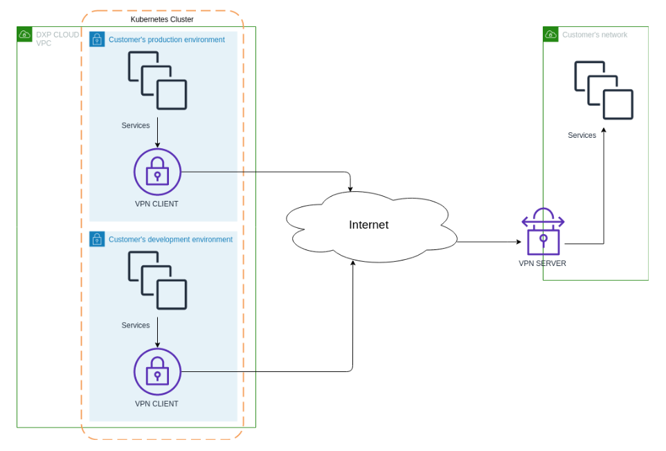
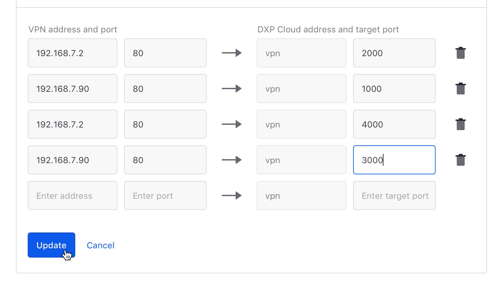
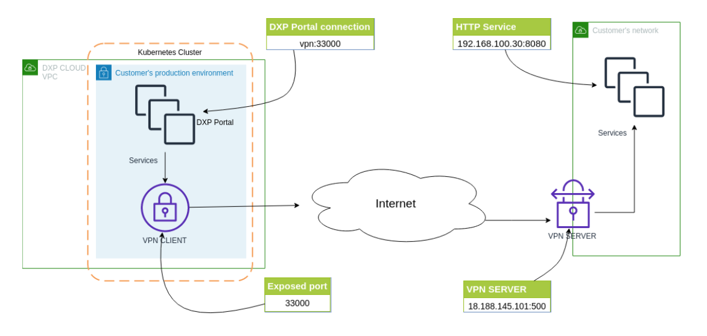

# Client-to-Site VPN

Liferay DXP Cloud provides a VPN client-to-site connection that has port forwarding and redundant tunnels support. This feature is commonly used to connect a subscriber's production environment on DXP Cloud to their internal network. For security and reliability, these VPN connections are segregated for each environment (production, staging, or development).



Subscribers can use redundant VPN tunnels by mapping their connections between their DXP Cloud services to their corresponding VPN server's IP addresses. The redundancy is placed in different availability zones to provide resiliency. The client-to-site approach covers connecting to a service running on the company network. This model is recommended for the containerized architecture and Kubernetes network layer provided.

## Configuration

The client to site VPN feature supports the following protocols:

* IPsec (IKEv1, IKEv2, L2TP)
* OpenVPN

Subscribers can choose one of the protocols (IPSec or OpenVPN) to perform the connection from DXP Cloud Console settings page for the desired environment. See [Connecting a VPN to DXP Cloud](./connecting-a-vpn-to-dxp-cloud.md) for more information.


The image below demonstrates how the addresses and ports are mapped between the VPN server and DXP Cloud.



## Connecting DXP Cloud to an IPSec VPN Server

In this use case, assume there is a DXP Portal instance running inside DXP Cloud and needs to access an HTTP service running inside an internal network.



Note the following:

* The Hello World service on `192.168.100.30:8080` running inside the customer's internal network is accessible from the DXP Portal service via the server address `vpn:33000`.
* The client-to-server connection is made through the customer's VPN server running on `18.188.145.101:500`.
* The port forwarding rule exposes the local port **33000** which maps to the application running on `192.168.100.30:8080`.

After the connection and port forwarding rule are configured, requests to the Hello World service can be made from any DXP Cloud service.

```bash
curl vpn:33000

<body><h1>Hello world!</h1></body></html>
```

### DXP Cloud IP Ranges for Shared Cluster

DXP Cloud uses a broad range of available IP addresses which can be mapped to a VPN server. By default all outgoing external IP addresses for the DXP Cloud services are not fixed.

The best way to get stable outgoing external IP addresses is to use the DXP Cloud Private Cluster feature.

### DXP Cloud IP Ranges for Private Cluster

Liferay DXP Cloud offers optional Private Clusters which isolate each subscriber's services into their own dedicated cluster. Each cluster is configured with a dedicated gateway for all outbound Internet traffic from the subscriber's cluster and is assigned a static external IP.
