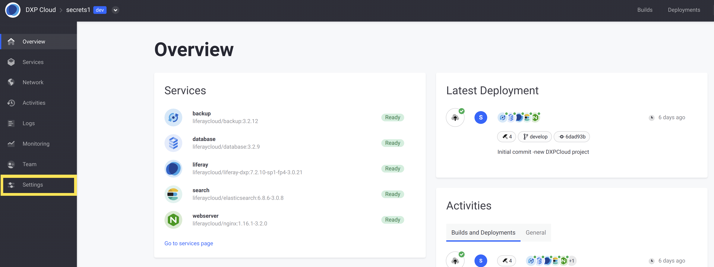
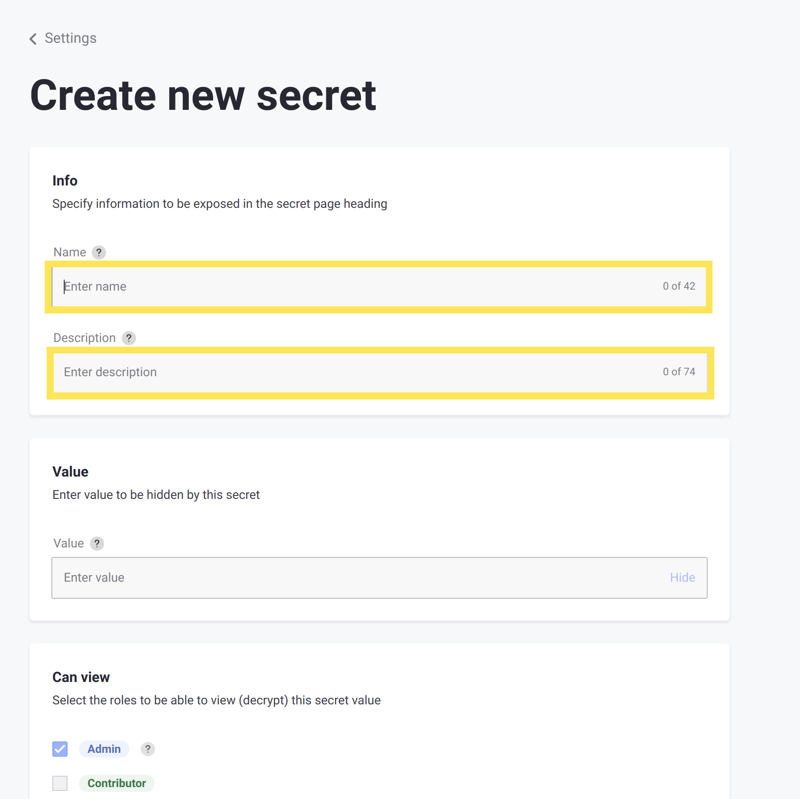
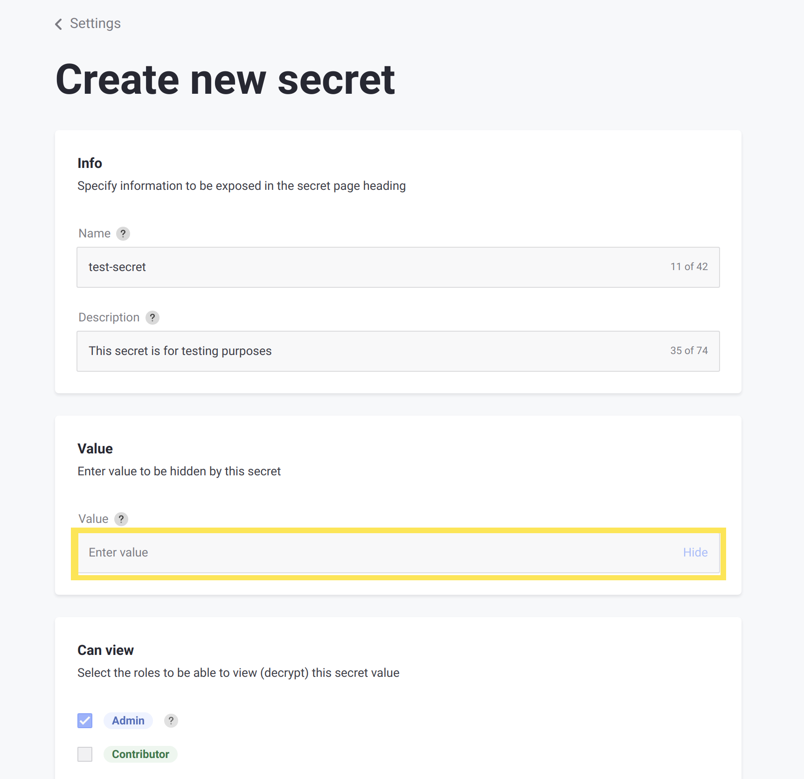
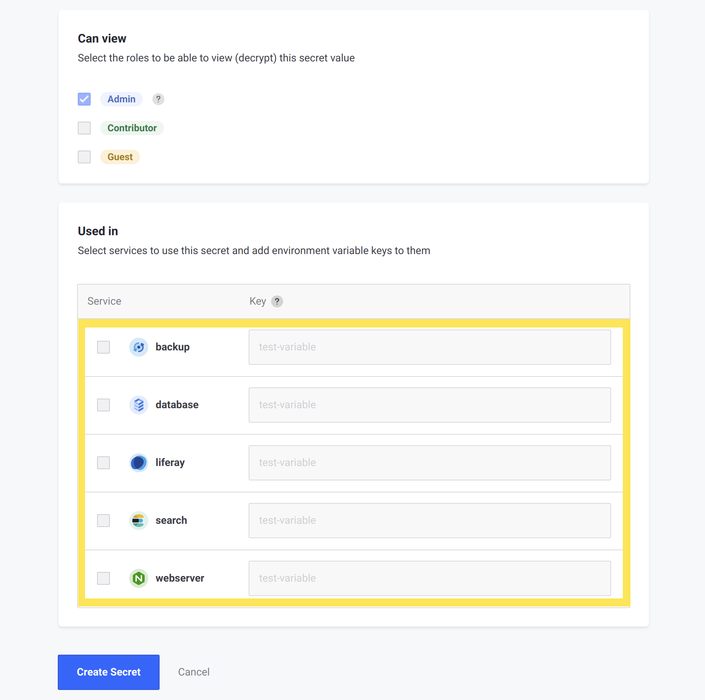

# Managing Secure Environment Variables with Secrets

Secrets allow you to securely store variables for any environment within DXP Cloud. Whereas any user with permission to view your DXP Cloud project can view your [environment variables](../../reference/defining-environment-variables.md), secrets are only viewable if their role has been given permission to view them.

## What is a Secret?

Secrets are environment variables with extra security measures to protect their values. Any environment variables that define sensitive or private information (such as credentials) should be stored as secrets. A secret may be defined as a secure variable for any number of services in the environment.

Users with permission to view secrets can see them on the _Environment Variables_ tab for any service. They are shown on the same page as other environment variables, but they are in their own distinct section.


By default, secrets can only be viewed by Users with the _Admin_ role. However, secrets can be configured to be viewable by Users with other roles, as well.

Secrets are also stored with encryption, so they have more security in the backend of DXP Cloud than regular environment variables. Viewing a secret through the UI decrypts the stored value before it is shown.

## Adding a New Secret

New secrets are added through the _Settings_ screen in DXP Cloud. Only Users with the _Admin_ role can add new secrets.

```warning::
   Adding a new secret to a service causes the service to restart, so that the value can take effect.
```

Follow these steps to add a new secret:

1. Log into the DXP Cloud console.

1. Navigate to the _Settings_ screen for any environment.

    

1. Under the _Secrets_ section on the page, click _Create New Secret._

    

1. Enter a name and description.

    

1. Enter the value for the secret to securely store. This value works the same as the value for any environment variable, except it is encrypted before it's stored.

    

1. If applicable, select whether to allow the _Contributor_ or _Guest_ roles to view the secret. Users with the _Admin_ role can always view secrets.

    

1. Select which services to add the new secret environment variable to. For each selected service, fill in the key used for the environment variable (multiple services can use the secret with the same key).

    

1. If any services were selected in the previous step, then check the boxes that appear below, indicating that you accept the effects of adding this secret on the affected services. You must check these boxes to enable the button to create the secret.

    

1. Click _Create Secret._

The chosen services restart with the new secret applied as an environment variable.

## Viewing and Modifying an Existing Secret

To view or modify an existing secret, navigate to the _Settings_ page for any environment. Then, within the _Secrets_ section, click the Actions menu for any secret listed. The options to view, edit, or delete the secret are shown. 


```note::
   Even if a User has permission to view a secret, only Users with the `Admin` role can edit or delete an existing secret. If a User without the `Admin` role clicks the Actions menu for a secret, then only the option to view the secret is shown.
```

This is the page shown when a User (with the permission to view) clicks the _View_ option for a secret:


## Additional Information

* [Configuration via LCP.json](../../reference/configuration-via-lcp-json.md)
* [Defining Environment Variables](../../reference/defining-environment-variables.md)