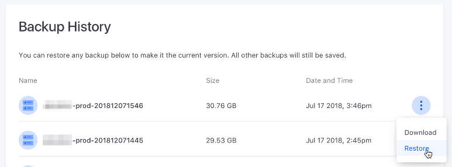

# Backup and Restore

It's important for production applications' data to be safe. DXP Cloud can 
backup and restore data. All backups save a dump of the database, environment 
volumes, and the Documents and Media folder. Here, you'll learn how to create 
and restore backups manually via the DXP Cloud web console: 

-   [Creating a Manual Backup](#creating-a-manual-backup)
-   [Restoring from a Backup](#restoring-from-a-backup)
-   [Applying Custom SQL Scripts with a Data Restore](#applying-custom-sql-scripts-with-a-data-restore)

For instructions on configuring the backup service, including automatic backups, 
see 
[Backup Service](./backup-service.md). 

> **Note:** The Backups tab is only available on production environments. From this tab, you can restore backups to any environment that a user has access to. 

## Creating a Manual Backup

Follow these steps to create a manual backup: 

1.  On your production environment's page, select the *Backups* tab in the left 
    menu. 

2.  Click *Backup Now*. 


## Restoring from a Backup

The Backups tab contains a table that shows each backup in the environment. The 
table displays each backup's name, size, and creation date and time. To restore 
from a backup, click that backup's *Actions* button 
() 
in the table and select *Restore*. 



## Applying Custom SQL Scripts with a Data Restore

You can also use custom SQL scripts to perform additional updates to your database with a normal data restore. This approach is ideal for sanitizing sensitive data, since it allows you to apply the scripts to separately maintained database backups.

```note::
   Your backup service must be at least at version 3.0.7 (using at least the Docker image: liferaycloud/backup:3.0.7) to use this feature.
```

### Preparing SQL Scripts

The following formats are supported for SQL scripts:

* `.sql` for individual scripts
* `.zip`, `.tgz`, or `.gz` for multiple scripts within a compressed file

Note that scripts are run in alphanumerical order when they are executed. SQL scripts must also reference the exact database to run on (for example, with `USE lportal;` or `lportal.User_`).

Place the scripts into the subfolder for the appropriate environment within `lcp/backup/script/`:

```
lcp
└── backup
    ├── LCP.json
    └── script
        ├── common
        ├── dev
        ├── local
        ├── prd
        └── uat
```

### Performing the Data Restore

Once you have prepared your SQL script(s), [deploy your service](../build-and-deploy/overview-of-the-dxp-cloud-deployment-workflow.md) so that these are included in your backup service online.

Then, navigate to your production environment's page, and click _Backups_ from the menu on the left.

![Establishing screenshot of Backups page]

Restore from any of the shown backups by clicking the Actions menu (![actions]) and clicking _Restore_.

Choose which environment to restore to, and then click _Restore Backup and Make it the Current Version_. Once the database has been restored, the SQL scripts from your backup service's `script` folder will run:

```
Jun 20 14:46:41.795 build-39 [backup-57488f8b8-rjq4f] Running Script: SanitizeOrg.sql
Jun 20 14:46:41.970 build-39 [backup-57488f8b8-rjq4f] Running Script: SanitizeUsers.sql
```