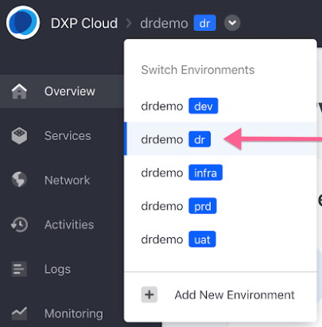
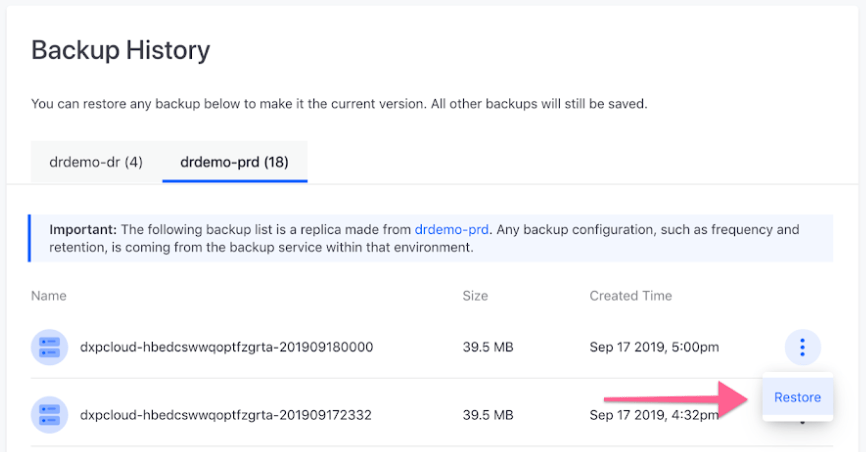
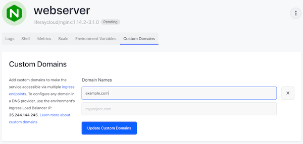
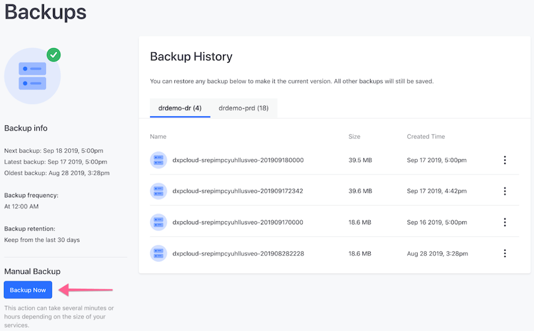
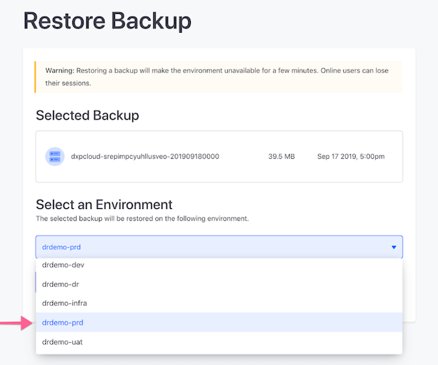
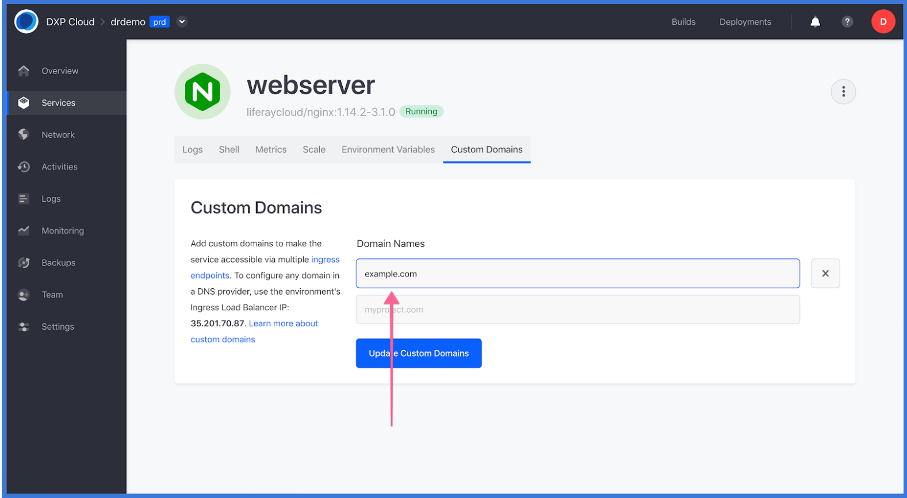

# Configuring Cross-Region Disaster Recovery

DXP Cloud provides two ways for customers to take advantage of the Disaster Recovery (DR) procedure in the case of major incidents: Automatic Disaster Recovery and Cross-Region Disaster Recovery. DXP Cloud's approaches to disaster recovery scenarios can be reviewed in greater detail in the [Disaster Recovery Overview](./disaster-recovery-overview.md).

This article documents the steps required to help a customer recover data manually during a cross-region disaster. These steps are required only when there is a compromise in all three Availability Zones in the same region at the same time.

* [Initial Setup](#initial-setup)
* [During an Incident](#during-an-incident)
* [Post-incident Recovery](#post-incident-recovery)

## Initial Setup

Liferay offers a dedicated DXP Cloud environment to manage a cross region disaster. For this example, assume that a Production environment is stored in the *europe-west2* region and the region is compromised. To prevent downtime and data loss on the Production environment, the Disaster Recovery environment should be shifted to outside the region of operation, such as *us-west1*. This fifth Disaster Recovery (shortened to DR) environment thus serves as a backup to store new user data generated during the incident.

DXP Cloud customers wishing to set up a Disaster Recovery environment must first contact their sales representative in order for the DR environment to be provisioned. This new environment is listed with the other available environments (e.g., `dev`, `infra`, `uat`, and `prd`).

DXP Cloud systems administrators must have full administrative rights on both the DR environment and the Production environment.

### Verify VPN Settings in the DR environment

If VPN is enabled on the Production environment, verify that the DR environment's VPN has also been enabled.

To ensure the two environments are connected:

1. Click the DR environment's *Settings* tab in the left menu.

1. In the VPN section, enter the following:

    * **VPN Type**: OpenVPN
    * **Server Address**: The server address.
    * **Account Name**: The administrator's email address.
    * **Password**: The administrator's password.
    * **Certificate**: The certificate code.
    * **Forwarding IP**: The forwarding IP address.
    * **Forwarding Port**: The forwarding port number.
    * **Local Hostname**: The VPN's hostname.
    * **Local Port**: The local port number.

1. Click *Connect VPN*.

For more information on connecting to a VPN, see
[VPN Connection](../infrastructure-and-operations/networking/connecting-a-vpn-to-dxp-cloud.md).

### Deploy the Latest Stable Build from Production to the DR Environment

Now you must deploy the latest stable build on Production to the DR environment. To do so, follow the same steps outlined in [Overview of the DXP Cloud Deployment Workflow](../build-and-deploy/overview-of-the-dxp-cloud-deployment-workflow.md).

## During an Incident

Continuing the example above, assume that the Production environment hosted in the *europe-west2* region is scheduled to be backed up hourly at 2:00 PM local time. In this scenario, the region is then compromised at 2:30 PM local time. Because no backups have been generated in the intervening half hour, it is necessary to restore a backup of the database and documents from the Production environment to the Disaster Recovery environment. The last stable environment is the version created at 2:00 PM.

### Copy Latest Production Data to the DR Environment

Follow these steps to restore the latest stable backup of Production to the DR environment:

1. In the DR environment, click the *Backups* tab.
1. Click the tab corresponding to the Production environment.

    > Note: The Backup History lists the backups in two tabs: one for the DR environment and one for the Production environment.

1. Click the *Actions* button (), for the latest stable backup in the Production environment,  then select *Restore*.

    

### Direct Custom Domain Traffic to the DR Environment

The web server service's custom domain in the DR environment must match that of the original Production environment. You must also delete that configuration from the Production environment. Follow these steps to do so:

1. In the DR environment, select *Services* in the left menu.
1. Click *webserver* in the list of Services.
1. Click the *Custom Domains* tab and configure the custom domain to match that of the Production environment.
1. Navigate to the same settings in the Production environment, and remove the custom domain configuration.
1. Update the DNS records. For more information, see [Custom Domains](../infrastructure-and-operations/networking/custom-domains.md).

This will result in all traffic being directed to the DR environment.

## Post-incident Recovery

Once the regional incident is over, you must shift back to the original region's Production environment (*europe-west2* in this example). Follow these steps:

* [Create a Manual Backup in the DR Environment](#create-a-manual-backup-in-the-dr-environment)
* [Restore the Manual Backup from DR to Production](#restore-the-manual-backup-from-dr-to-Production)
* [Update the Web Server Custom Domain in Production](#update-the-web-server-custom-domain-in-Production)

### Create a Manual Backup of the DR Environment

During the incident, the DR environment functions as the Production environment and therefore contains any new data that was generated during the disaster event. To preserve this data, you must back up the DR environment. Follow these steps to do so:

1. In the DR environment, click *Backups* in the menu on the left.
1. Click *Backup Now*.

### Copy Latest DR Environment Data to Production

1. In the DR environment, click *Backups* in the menu on the left.
1. Click the tab corresponding to the DR environment.

    > **Note:** The Backup History lists the backups in two tabs: one for the DR environment and one for the Production environment.

1. For the most recent backup (the one you just created), click the *Actions* button () then select *Restore*.
1. Select the Production environment and click *Deploy Build*.

### Restore Server Custom Traffic to Production

Because the webserver service redirected all traffic to the DR environment during the incident, these settings must be updated again so that all traffic is redirected back to the original Production environment.

1. Navigate to _Services_ on the left menu.
1. Click on _webserver_ in the list of Services.
1. Click the _Custom Domains_ tab.

    

1. Remove the custom domain from the Production environment.
1. Update the DNS records. For more information, see the [Custom Domain](https://help.liferay.com/hc/en-us/articles/360032856292) article.
1. Click _Update Custom Domain_.

Traffic should now be directed back to the original Production environment and the disaster recovery process concluded.
