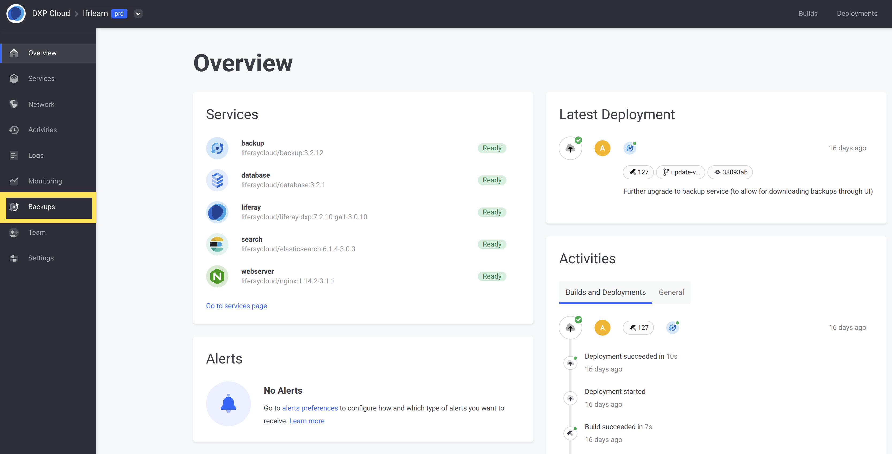
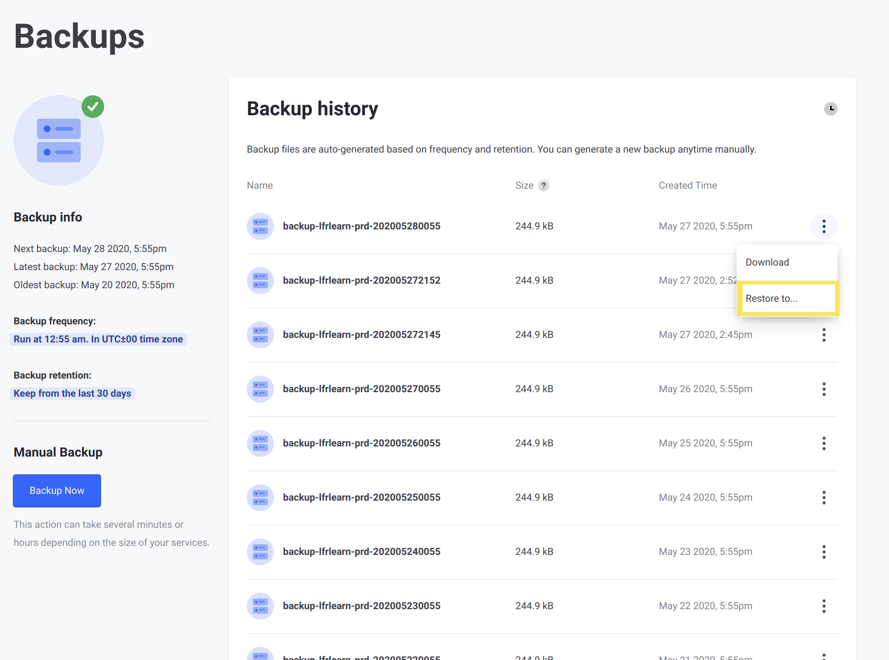
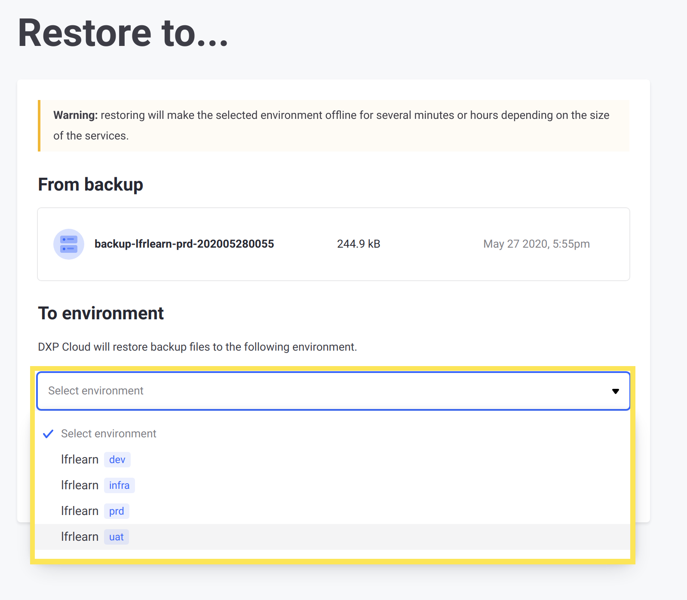

# Upgrading Your Liferay DXP Instance

Liferay periodically releases new minor and major versions of Liferay DXP that include security and bug fixes, as well as enhancements. To upgrade to a new major Liferay DXP version increment, you must upgrade the DXP database.

```note::
   For large data sets in production, there are several additional considerations to performing for a smooth upgrade. See `the guide to upgrading Liferay DXP <https://learn.liferay.com/dxp-7.x/installation-and-upgrades/upgrading-liferay-dxp/upgrade-basics/upgrade-overview.html>`__ for a comprehensive overview of the core upgrade.
```

```important::
   Upgrading an environment in DXP Cloud requires restoring an upgraded database, and therefore involves downtime for the Liferay service to restart. Plan ahead for this downtime for production environments.
```

Review the following steps to perform a database upgrade:

1. [Install prerequisites](#install-prerequisites)
1. [Download a backup](#download-a-backup)
1. [Extract and import the data](#extract-and-import-the-data)
1. [Perform the data upgrade](#perform-the-data-upgrade)
1. [Compress the database and document library](#compress-the-database-and-document-library)
1. [Call the upload API](#call-the-upload-api)
1. [Restore the backup](#restore-the-backup)

## Install Prerequisites

Before beginning the upgrade procedure, make sure you have the following prerequisites:

* [A locally available MySQL installation](https://dev.mysql.com/doc/mysql-installation-excerpt/5.7/en/).
* [Downloaded bundle of Liferay DXP](https://customer.liferay.com/en_US/downloads) for the version of DXP you are upgrading to.

```important::
   Download a fresh bundle for the upgrade instead of reusing an old one. Otherwise, data from previous usage of the bundle may interfere with the data upgrade.
```

## Download a Backup

Perform the following steps to download a backup of the DXP instance currently running in your `prd` environment:

1. Log in to the DXP Cloud console.

1. Navigate to your production environment, then select _Backups_ from the menu.

    

1. Choose one of the backups listed and select _Download_ from the Actions menu. Repeat this to download both the data volume and database as separate zip files. <!-- Is this common knowledge -- That a "backup" is comprised of a data volume zip and a database zip? Is it explained somewhere? I checked the backup articles and didn't see any reference. We should add that information to the existing backup articles and reference that. -->

    

## Extract and Import the Data

The next step is to extract the data from the downloaded archives and move the data to where it is needed for the upgrade.

### Extract the Data Volume

Perform the following steps to extract the data volume from the backup:

1. If you have not done so already, extract the downloaded DXP bundle:

    ```bash
    tar -xvzf BUNDLE_NAME.tar.gz
    ```

1. Move the downloaded `.tgz` archive of the data volume (named `backup-lfr-<PROJECT_NAME>-prd-<BACKUP_ID>.tgz`) into the `LIFERAY_HOME/data` folder of your Liferay bundle.

1. Extract the archive by running this command:

    ```bash
    tar -xvzf ARCHIVE_NAME.tgz
    ```

### Extract and Import the Database

Open a command prompt at the location of the downloaded database archive (named `backup-db-<PROJECT_NAME>-prd-<BACKUP_ID>.tgz`) and perform the following steps to import it to MySQL:

1. Extract the database archive:

    ```bash
    tar -xvzf ARCHIVE_NAME.tgz
    ```

1. Log into the MySQL client on your local system:

    ```bash
    mysql -u root -ppassword
    ```

1. Create the database before importing, using the name of the file (minus the extension) as the database name:

    ```
    create database DATABASE_NAME;
    ```

    ```note::
       If the database already exists, then this command will fail (with ``ERROR 1007``). This error will not affect any data, so it is still safe to run.
    ```

1. Import the database from the extracted `.sql` dump:

    ```
    use DATABASE_NAME;
    ```

    ```
    source DATABASE_NAME.sql;
    ```

1. Finally, disconnect from the MySQL client:

    ```
    exit
    ```

The database and document library are now in place and ready for you to perform the data upgrade.

## Perform the Data Upgrade

DXP bundles provide an upgrade tool that is used for data upgrades. This tool is invoked through a script included in the bundle, `db_upgrade.sh`.

```note::
   The database upgrade tool can be pre-configured for more flexibility when running it. See `Using the Database Upgrade Tool <https://learn.liferay.com/dxp-7.x/installation-and-upgrades/upgrading-liferay-dxp/upgrade-basics/using-the-database-upgrade-tool.html>`__ for more information on advanced usage.
```

Open a command prompt within your `LIFERAY_HOME/tools/portal-tools-db-upgrade-client` folder. Then, run the following command:

```bash
db_upgrade.sh -j "-Dfile.encoding=UTF-8 -Duser.timezone=GMT -Xmx2048m" -l "output.log"
```

The upgrade tool prompts you for information about your installation before beginning the data upgrade. If you have downloaded a Liferay bundle with Tomcat, then it automatically detects some of the directories as default values.

Here is an example interaction with the upgrade tool entering this information:

```
Please enter your application server (tomcat):
tomcat

Please enter your application server directory (../../tomcat-9.0.17):

Please enter your extra library directories (../../tomcat-9.0.17/bin):

Please enter your global library directory (../../tomcat-9.0.17/lib):

Please enter your portal directory (../../tomcat-9.0.17/webapps/ROOT):

[ db2 mariadb mysql oracle postgresql sqlserver sybase ]
Please enter your database (mysql):
mysql

Please enter your database host (localhost):

(etc.)
```

Once you enter the required information, the upgrade tool performs the data upgrade. Watch the console logs as the upgrade processes execute to observe when the last upgrade process finishes. You can use the bundle itself to run your DXP instance and make sure the upgrade completed smoothly: `LIFERAY_HOME/tomcat-9.x.x/bin/`.

Once the upgrade is complete and verified, your instance is ready to be pushed back into DXP Cloud.

## Compress the Database and Document Library

Now that your Liferay installation has been upgraded, use the following steps to prepare to upload them again to your `backup` service:

1. Open a command prompt within your `LIFERAY_HOME/data` folder.

1. Run the following command to compress your document library into a `.tgz` archive:

    ```
    tar -czvf volume.tgz document_library
    ```

    ```important::
       If the data volume you downloaded contained more folders (such as a ``license/`` folder), then add these as additional arguments after ``document_library``.
    ```

1. Run the following command to perform a database dump:

    ```
    mysqldump -uroot -ppassword --databases --add-drop-database lportal | gzip -c | cat > database.gz
    ```

1. Further compress this file into a `.tgz` archive with the following command:

    ```bash
    tar zcvf database.tgz database.gz && rm database.gz
    ```

The database and Liferay data volume are now ready for you to upload them using the `backup` service's upload API.

## Call the Upload API

Upload the database and document library archives to the `backup` service by calling the upload API:

1. If you are not already logged in, log into the DXP Cloud console.

1. Open `https://api.liferay.cloud/user` in a browser.

1. Copy your user session token from the JSON string shown at this URL. Copy only the value for the `token` property (removing the quotation marks). 

1. Run the following command to call the upload API:

    ```bash
    curl -X POST https://backup-<PROJECT-NAME>-prd.lfr.cloud/backup/upload -H 'Content-Type: multipart/form-data' -H 'Authorization: Bearer <USER-TOKEN>' -F 'database=@/path/to/folder/database.tgz' -F 'volume=@/path/to/folder/volume.tgz'
    ```

When the call is complete, a new backup appears from your upload, on the _Backups_ page in the DXP Cloud console.

## Restore the Backup

Follow these steps to restore a backup to your chosen environment:

1. Log into the DXP Cloud console, if you are not already logged in.

1. Navigate to your production environment, then click _Backups_ from the side menu.

1. Choose a backup from the list, and then click _Restore to_ from the Actions menu for that backup.

    

1. Select one of your environments to restore to from the drop-down list (e.g., your `dev` environment).

    

1. Click _Restore to environment_.

    ```note::
       The chosen environment will be unavailable for some time while the the backup is being deployed.
    ```

<!-- I'd also want to know if there is a zero downtime way to do an upgrade - because that's one of the next questions I would ask if I put myself in the shoes of someone trying to run a prod and business critical env. We may not be ready to say anything about that - but just a thought to put in your mind as potentially a future iteration of this - or let's say if we find out that you CAN do a zero downtime upgrade using a DR environment, then we should update this article to say so. An example:

Upgrading the liferay service requires a database upgrade and restoring the liferay service using the upgraded database. The process of restoring the upgraded database from backup requires some downtime and we recommend testing your upgrade on the DEV or UAT environments first. Zero downtime upgrades are possible using a DR environment. 

-->

Congratulations! You have upgraded your DXP database to the new version and deployed it to your chosen environment. You can also [restore the same backup](#restore-the-backup) again to other environments as needed.

## Additional Information

See the following information pertaining to general DXP upgrades:

* [Liferay DXP Upgrade Overview](https://learn.liferay.com/dxp-7.x/installation-and-upgrades/upgrading-liferay-dxp/upgrade-basics/upgrade-overview.html)
* [Using the Database Upgrade Tool](https://learn.liferay.com/dxp-7.x/installation-and-upgrades/upgrading-liferay-dxp/upgrade-basics/using-the-database-upgrade-tool.html)
