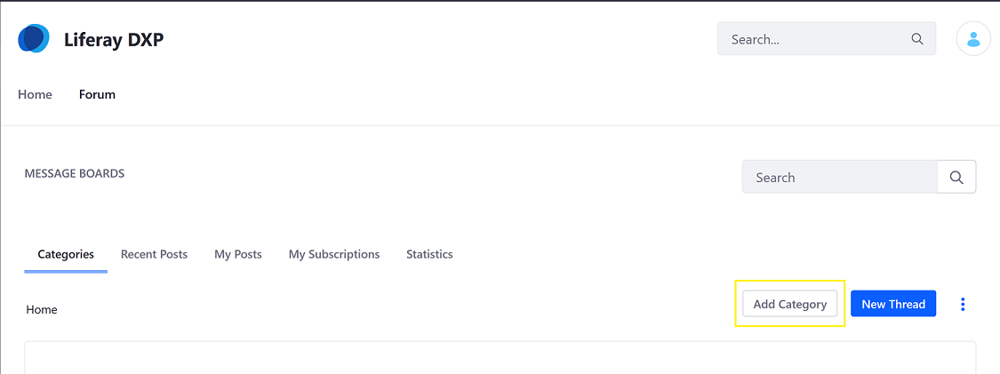

# Creating Message Board Categories

Message Board categories organize threads by topic. This makes it easier to find the right topic for discussion and can also help discussions stay on topic. For example, a message board about raising tropical fish may have separate categories for freshwater and saltwater topics.

This article describes how to create and manage message board categories.

## Adding Categories

There are two ways to add categories:

* Through the _Site Administration_
* On the _Message Boards_ app on a site page

### Using the _Site Administration_

1. Navigate to _Site Administration_ &rarr; _Content & Data_ &rarr; _Message Boards_.
1. Click the *Add* icon () and select *Category*. This opens the Add Category form.

    

1. Enter a name for the category (for example, Lunar Resort).
1. Enter a description.
1. Select the category's _Display Style_. This controls how threads in the category appear. By default, you can choose these display styles:

    * **Default:** Classic display style for general purpose discussions.
    * **Question:** Threads appear in a question and answer style.

1. In the _Mailing List_ section, switch the *Active* toggle to *YES* to enable a mailing list for the category.
1. To enable anonymous emails in the list, set the *Allow Anonymous Emails* toggle to *YES*.
1. Open the *Permissions* section and set the category's permissions. The *Viewable by* selector lets you pick who can view the category:

* Anyone (Guest Role)
* Site Members
* Owner

    > To show more permissions options, click *More Options*. A table appears with the rest of the category's permissions, which you can assign to the Guest and Site Member roles. For more information about the different permissions, see the [Message Boards Permissions Reference](./08-message-boards-permissions-reference.md)

1. Click *Save*.

The new category now appears in the table.

New categories appear on the message board's home screen. The list displays the category names and the numbers of subcategories, threads, and posts in each one.

### Using the _Message Boards_ App

As noted above, administrators can add categories on the _Message Boards_ app already deployed on a site page. The process is the same (with some minor changes in the UI).

On the _Message Boards_ app, click the _Add Category_ button then follow the same steps to add a category.

## Adding Subcategories

Categories can contain as many subcategories as you like. If, however, you nest categories too deep, users can have trouble finding them.

Follow these steps to add a subcategory to a category:

1. Click the category's name in the list (continuing the example above- **Lunar Resort**).
1. Click the *Add* icon () and select *Category*.
1. Enter a name for the subcategory.
1. Enter a description for the subcategory.
1. Although the subcategory inherits the parent category's settings, administrators and content creators can change the values for the subcategory's _Display Style_ and _Mailing List_ options.
1. Click *Save*.

The subcategory now appears in the table.

## Moving and Merging Categories

Each category can have any number of threads and just as many subcategories. To manage categories, administrators can also move and merge categories.

Follow these steps to move a category or merge it with another:

1. Click the category's *Actions* icon () and select *Move*. This brings up the Move Category form.
1. Select a new parent category via the *Select* button under the *Parent Category* field. Note that this field is empty for top-level categories.
1. If you want to merge the category with the selected parent category, select *Merge with Parent Category*.
1. Click *Move*.

Regardless of how many categories (and subcategories) there are, a category is just a container to organize a message board's threads. To start creating threads, see the [Creating Threads]() article.

## Additional Information

* Developers can create custom display styles and make them available for selection in this form. Set the available display styles via the [portal property](https://docs.liferay.com/dxp/portal/7.2-latest/propertiesdoc/portal.properties.html#Message%20Boards%20Portlet) `message.boards.category.display.styles`. Similarly, set the default display style in `message.boards.category.display.styles.default`.
* The default for both toggles in the _Mailing List_ is *NO*. For an explanation of these features, see [the documentation on mailing lists for Message Boards](https://help.liferay.com/hc/en-us/articles/360028720852-User-Subscriptions-and-Mailing-Lists).
