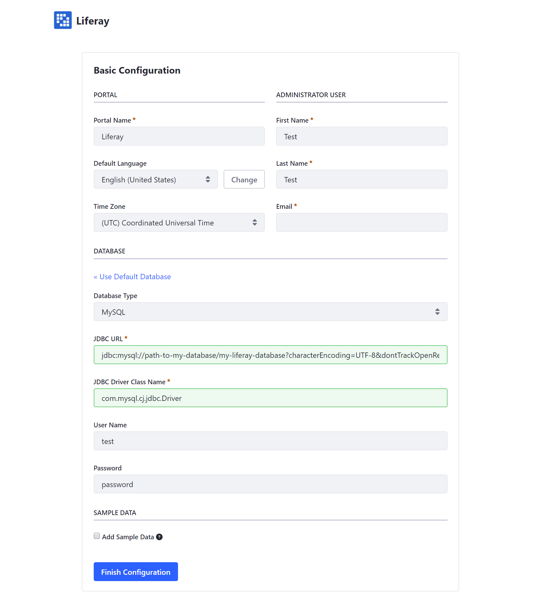

# Connecting a Database

By default, Liferay DXP uses an embedded HSQL database for demonstration purposes. For purposes beyond demonstrations and tours of Liferay DXP, we recommend using a full RDBMS. This includes but is not limited to the following databases:

* MySQL
* MariaDB
* Oracle
* PostgreSQL

For a complete listing of databases and versions supported, see the [Liferay DXP Compatibility Matrix](https://web.liferay.com/documents/14/21598941/Liferay+DXP+7.2+Compatibility+Matrix/b6e0f064-db31-49b4-8317-a29d1d76abf7).

## Database Configuration

In the database of your choice, the following configurations should be completed for optimal functionality and performance of your instance of Liferay DXP.

> **Note:** When configuring a database, always consult the database vendor's documentation first before making any changes.

### Use GMT Time Zone

Ensure that your database is configured to use the GMT Time Zone. Setting the database server time zone to GMT preserves database integrity through Liferay Portal database upgrades no matter the time zones you set in Liferay Portal.

### Create a Blank Database With UTF-8 Support

Using UTF-8 is a requirement to allow for multilingual character sets.

An example command in MySQL to create a UTF-8 compliant database named `lportal`:

```sql
create database lportal character set utf8;
```

### Database Migration Considerations

If you plan to migrate from one database vendor to another, configure the database to use the default query result order you expect for entities Liferay Portal lists. See [this article](https://help.liferay.com/hc/en-us/articles/360029315971-Sort-Order-Changed-with-a-Different-Database) for more information.

### Configuring User Database Access

Liferay DXP uses the database user's credentials to connect to the database either directly or through the application server.

#### Create a Database User With Full Permissions

The best method for ease of use and simplicity of maintenance is to create a database user for Liferay DXP that has full permissions for a database up to and including permissions to Create and Drop tables. This enables Liferay DXP to maintain its database automatically during upgrades and seamless functionality of any Liferay DXP plugins that are deployed that interact with the database.

#### Supporting High Security Practices

Some organizations may have more stringent security practices that require limiting database permissions from the database user once the database is initialized. If permissions for Select, Insert, Update and Delete operations are the only ones allowed for the user, administrators must initialize and maintain the database manually. In order to accomplish this we recommend the following:

1. Grant full rights for the Liferay DXP database user to do anything to the database.
1. Install Liferay DXP and start it so that it automatically populates the database.
1. Once the database has been populated with the Liferay DXP tables, remove all permissions from that user except permissions to perform Select, Insert, Update and Delete operations.

> **Warning:** There are some caveats to running Liferay DXP with these constraints. Many plugins create new tables when they’re deployed. Additionally, administrators must manually run the database upgrade function to upgrade Liferay DXP. If the Liferay DXP database user does not have adequate rights to create/modify/drop tables in the database, administrators must grant those rights to that user before deploying one of these plugins or start upgrading Liferay DXP. Once the tables are created or the upgrade completes, administrators can remove those rights until the next deploy or upgrade. Additionally, developers might create plugins that must create their own tables.

## Configuring the Database Connection to Liferay DXP

### JDBC Dependencies

#### Open Source Databases

The Liferay DXP bundle includes several open source JDBC connectors to allow Liferay to connect to a variety of databases. These files are normally located in a global `/lib/ext` (for example, Tomcat) or a `module` (JBoss EAP and WildFly 10) folder. Proprietary database like Oracle or DB2 require a separate download of the appropriate JDBC driver from the relevant vendor.

#### Proprietary Databases

Liferay DXP does not ship with JDBC connectors to proprietary databases. In order to connect to a proprietary database, the relevant JDBC connector should be obtained from the database vendor and deployed to the application server.

If using an Oracle database, the `ojdbc8.jar` is required. Download the jar from [Oracle](https://www.oracle.com/index.html).

> **Note:** The `ojdbc8.jar` driver library with at least Oracle 12.2.0.1.0 JDBC 4.2 versioning is required because of [data truncation issues](https://issues.liferay.com/browse/LPS-79229) that have been detected reading data from CLOB columns.

If using an IBM database, the `db2jcc4.jar` is required. Download the jar from [IBM](https://www.ibm.com/).

> **Note:** The `dbc2jcc` has been deprecated after 3.72.

Add the jar(s) to the application server’s `/lib/ext` or `module` folder.

### Configure a Data Source

There are two methods for connecting Liferay DXP to a database: Using the built-in data source or using an application server to manage the data source.

The best option for most people is to use the built-in data source.

#### Using the Built-In Data Source

To connect Liferay DXP to a database using the built in data source follow these steps:

1. Create a [`portal-ext.properties`](https://help.liferay.com/hc/en-us/articles/360028712292-Portal-Properties) file if one does not already exist.
    > **Note:** Many Liferay DXP configurations are done by writing them to a [`portal-ext.properties`](https://help.liferay.com/hc/en-us/articles/360028712292-Portal-Properties) file and placing that file in the [`LIFERAY_HOME`](../14-reference/01-liferay-home.md) directory.
1. Copy a set of `jdbc.*` properties from one of the [JDBC templates](../14-reference/05-database-templates.md) into the `portal-ext.properties` file.

    The MySQL JDBC connection properties listed as an example:

    ```properties
        jdbc.default.driverClassName=com.mysql.cj.jdbc.Driver
        jdbc.default.url=jdbc:mysql://localhost/lportal?characterEncoding=UTF-8&dontTrackOpenResources=true&holdResultsOpenOverStatementClose=true&serverTimezone=GMT&useFastDateParsing=false&useUnicode=true
        jdbc.default.username=
        jdbc.default.password=
    ```

1. Modify the `jdbc.*` property values to specify the database and database user credentials.

    ```properties
        jdbc.default.driverClassName=com.mysql.cj.jdbc.Driver
        jdbc.default.url=jdbc:mysql://path-to-my-database/my-liferay-database?characterEncoding=UTF-8&dontTrackOpenResources=true&holdResultsOpenOverStatementClose=true&serverTimezone=GMT&useFastDateParsing=false&useUnicode=true
        jdbc.default.username=test
        jdbc.default.password=password
    ```

1. Put the `portal-ext.properties` file into the [`LIFERAY_HOME`](../14-reference/01-liferay-home.md) once it has been created based on the specific installation.

Liferay DXP will now connect to the data source when the application server is started.

Users may also [use the Setup Wizard](./05-using-the-setup-wizard.md) to configure the built-in data source from the [Basic Configuration page](./05-using-the-setup-wizard.md) (available when Liferay DXP starts up the first time). Completing the Setup Wizard creates a `[LIFERAY_HOME]/portal-setup-wizard.properties` file which stores the settings entered.



#### Using a Data Source on Your Application Server

If using the application server to manage the data source, review the installation documentation for the relevant application server:

* [Installing Liferay DXP on Tomcat](./01-installing-liferay-on-an-application-server/01-installing-liferay-on-tomcat.md#database-configuration)
* [Installing Liferay DXP on WildFly](https://help.liferay.com/hc/en-us/articles/360029123751-Installing-Liferay-DXP-on-Wildfly#database-configuration)
* [Installing Liferay DXP on JBoss EAP](https://help.liferay.com/hc/en-us/articles/360028810012-Installing-Liferay-DXP-on-JBoss-EAP#database-configuration)
* [Installing Liferay DXP on WebLogic 12c R2](https://help.liferay.com/hc/en-us/articles/360028831932-Installing-Liferay-DXP-on-WebLogic-12c-R2#database-configuration)
* [Installing Liferay DXP on WebSphere](./01-installing-liferay-on-an-application-server/05-installing-liferay-on-websphere.md)

## Next steps

Once the database connection has been configured - either through the [use of the Setup Wizard](./05-using-the-setup-wizard.md) or through the creation of a `.properties` file - the application server may be started. See the [Installation Overview](./02-installation-overview.md) for more information.
