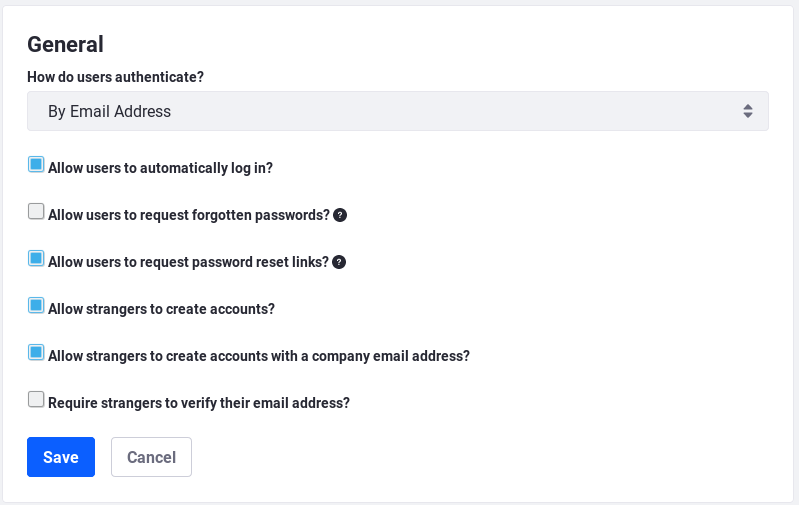
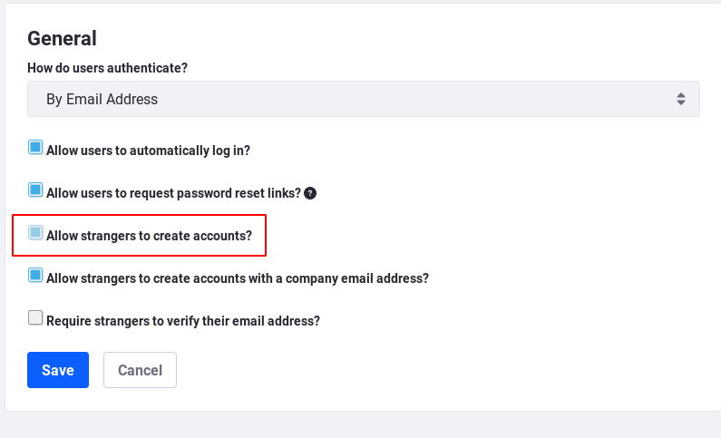

# Configuring Authentication

Users can authenticate in several ways: 

- Form authentication using the Sign In Portlet, an extensible app that by default can check and store credentials in the portal database and LDAP
- Using Single Sign-On (SSO) solutions such as Kerberos, Token-Based Authentication, or OpenID Connect
- Using Liferay's SAML plugin

You can authenticate and authorize applications remotely using [Authentication Verifiers](./04-using-auth-verifiers.md): 

- Password-based HTTP Basic + Digest authentication
- Token-based OAuth 2.0 plugin
- Portal session-based solution for JavaScript applications

User authentication and remote application authentication are [extensible](../../platform/frameworks/authentication-pipelines.md). You can create custom portlets for logging in, extend the default Sign In portlet authentication pipeline, create `AutoLogin` extensions for Single Sign-On, or create custom authentication verifier implementations. 

The first step is to have users *authenticate* so you know who they are and can apply the appropriate permissions. 

You can determine the type of credentials required and configure the Sign In portlet, which is the interface presented to users for authentication. 

## Authentication Types

There are three authentication types: 

- By email address
- By screen name
- By User ID

Only one authentication type can be in use at any time. There are two ways to choose an authentication type: 

1.  Via the UI
2.  Via the `portal-ext.properties` file

To use the UI, navigate to the Control Panel, click on *Configuration* &rarr; *Instance Settings* &rarr; *Platform* &rarr; *User Authentication* and use the *How do users authenticate?* selector to make a selection.



To use the `portal-ext.properties` file, paste in the below properties and uncomment the authentication type you want: 

```properties
company.security.auth.type=emailAddress
#company.security.auth.type=screenName
#company.security.auth.type=userId
```
The default authentication type is by email address. Administrators or users choose screen names when accounts are created. User IDs are auto-generated when the account is created. Regardless of the authentication type, users must always enter a password. [Password Policies](../../user-and-system-administration/password-policies.md) place restrictions on password length, special characters, or other requirements. 

## The Sign In Portlet

The interface for logging in comes from the Sign In portlet. The default home page contains a Sign In portlet. You can access this page at `http[s]://[server-name:port]/web/guest/home`. If the Sign In portlet doesn't appear on any page, you can access it via its URL: 

```
http[s]://[server-name:port]/c/portal/login
```

By default, guest users can create accounts by completing and submitting the form behind the *Create Account* link in the Sign In portlet. Users can reset forgotten passwords by clicking the *Forgot Password* link. 

### Preventing Guests from Creating Accounts

If you require users be registered by administrators, you can prevent guest users from creating new user accounts: 

1.  Navigate to the Control Panel &rarr; *Configuration* &rarr; *Instance Settings* &rarr; *Platform* &rarr; *User Authentication*. 

2.  Uncheck *Allow strangers to create accounts?*. 

3.  Click *Save*. 



### Preventing Users from Resetting Passwords

If users should not be able to reset their own passwords, you can configure this from the same screen: 

1.  Navigate to the Control Panel &rarr; *Configuration* &rarr; *Instance Settings* &rarr; *Platform* &rarr; *User Authentication*. 

2.  Uncheck *Allow users to request password reset links?*. 

3.  Click *Save*. 

## CAPTCHA and reCAPTCHA

You can prevent bots from creating and logging into accounts by using CAPTCHA or reCAPTCHA: 

1.  Navigate to the Control Panel &rarr; *Configuration* &rarr; *System Settings* &rarr; *Security Tools* &rarr; *CAPTCHA*. 

2.  By default, Create Account CAPTCHA and Send Password CAPTCHA are enabled. If necessary, enable Message Boards CAPTCHA. 

3.  Choose your CAPTCHA engine. By default, Simple CAPTCHA is enabled. You can also select Google's reCAPTCHA, which requires you configure the external service separately. If you select reCAPTCHA, supply your public and private key from Google. 

4.  The other options allow developers to customize the Simple CAPTCHA engine. 

5.  Click *Save* when finished. 

## Other Authentication Mechanisms

The Sign In portlet is the default user interface for authentication. There are other ways to authenticate: 

- Accounts can be imported from and exported to [LDAP directories](../06-sso/06-ldap.md). 
- [Kerberos](../06-sso/05-kerberos.md) can be used to authenticate to Windows networks. 
- You can use Single Sign-On (SSO), such as [SAML](../06-sso/08-saml.md), [OpenID Connect](../06-sso/02-openid-connect.md), or [token-based solutions](../06-sso/01-token-based-authentication.md). 
- Users can use [OAuth 2.0](../06-sso/07-oauth-2.md) to authorize application access to some of their data. 

Liferay Portal makes authentication flexible and gives you the options you need to integrate it into your systems. 
