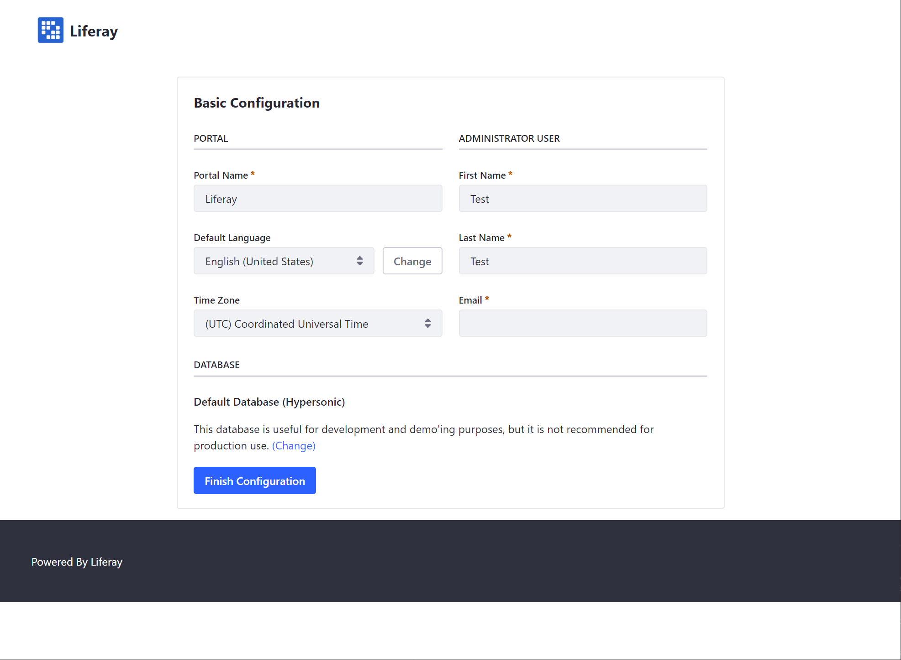

# Getting Started with Liferay DXP

Follow these steps to quickly take Liferay DXP for a test drive and tour its features on your own Linux, macOS, or Windows machine.

## Run Liferay DXP locally on Linux, macOS, or Windows

> JAVA JDK 8 or 11 are required to run Liferay DXP. Learn more by visiting [www.java.com](https://www.java.com/).

1. Download

    `curl -L -O https://github.com/liferay/liferay-portal/releases/download/7.2.1-ga2/liferay-ce-portal-tomcat-7.2.1-ga2-20191111141448326.tar.gz`

1. Extract

    `tar -xzf liferay-ce-portal-tomcat-7.2.1-ga2-20191111141448326.tar.gz`

1. Run

    `./liferay-ce-portal-7.2.1-ga2/tomcat-9.0.17/bin/startup.sh`

    > `INFO: Server startup in x ms` indicates server startup completion.

1. Go to `http://localhost:8080/`. Follow the prompts to complete basic configuration and get started!

    

## Next Steps

Now you're ready to explore Liferay DXP! To learn more about what you can build with Liferay DXP see [Building Solutions on DXP](https://github.com/liferay/liferay-learn/tree/master/docs/dxp/7.2.x/en/solutions). To learn more about installing Liferay see the [Installation Overview](./installation-overview.md).
