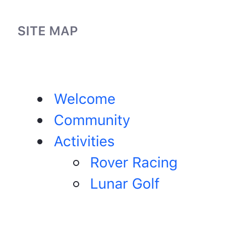

# Site Hierarchies

Sites can be organized hierarchically, just like Organizations, with child Sites. The difference between Sites and Organizations is that Sites organize pages, content, application data, and Users (via site memberships), whereas Organizations only group Users. Site hierarchy is discussed in more detail below.

- [Site Hierarchy Roles and Permissions](#site-hierarchy-roles-and-permissions)
- [Content Sharing between Sites](#content-sharing-between-sites)
- [Site Hierarchy Applications](#site-hierarchy-applications)
- [The Sites Directory Application](#the-sites-directory-application)
- [The Site Map Application](#the-site-map-application)

## Site Hierarchy Roles and Permissions

These rules apply to Site hierarchy:

- Each child site in the hierarchy has its own Administrator

- The Site Administrator Role permissions don't flow down to child Sites in the hierarchy

- If a Site Administrator creates a child Site, he or she has the same permissions in that child Site. This is because creating a Site makes you the Owner of that Site (not inheritance).

- A Site Administrator has no default Role in any child Sites created by other Site Administrators.

>**Note:** If you want a User to have administrative access to all Sites in a Site/child Site hierarchy, you must create a Role based on the Site Administrator Role that has the permission *Manage Subsites*.

## Content Sharing Between Sites

Content sharing is available for Sites within the same hierarchy. For instance, if a parent Site has a document type called *Devcon Presentation* and all its child Sites should have a copy, the parent Site's administrator can enable content sharing to share the document type automatically with its child Sites. Also, content sharing privileges can be set to let every Site Administrator share content across Sites they manage. You can share these content types across Sites:

- Web Content Structures
- Web Content Templates
- Document Types
- Vocabularies and Categories
- Widget Templates
- Data Definitions (Dynamic Data Lists)

See the [Sites Admin Portlet](https://docs.liferay.com/portal/7.2-latest/propertiesdoc/portal.properties.html#Sites%20Admin%20Portlet) section of Liferay's `portal.properties` file for a list of relevant configurable properties. For example, the `Sites.content.sharing.with.children.enabled` property can disable/enable content sharing between Sites and child Sites, while letting Site Administrators configure it per Site.

## Site Hierarchy Applications

Liferay Portal includes Site-specific applications out-of-the-box that let you view the hierarchy. These applications are discussed below.

### The Sites Directory Application

The Sites Directory application is a configurable app that shows a hierarchy of Sites and child Sites. It enables Users to navigate to any of the displayed Sites. To use this app to display Site hierarchies, follow these steps:

1.  Add the Sites Directory application to a page

2.  Open its *Configuration* window

3.  Select *List Hierarchy* under Display Style 

The My Sites Directory application is similar to the Sites Directory application, except that it lists only the Sites a User belongs to. You can view the available open and restricted Sites by adding the My Sites application to a page and accessing the *Available Sites* tab. You can request access to any of the Sites you're not a member of by selecting the Site's *Options* button () and clicking *Join*.

### The Site Map Application

The Site Map application helps Users navigate a Site. A Site Administrator can configure a root page and a display depth. Just as Sites can have hierarchies, so can the pages within a Site. The display depth of the Site Map application determines how many levels of nested pages to display.

