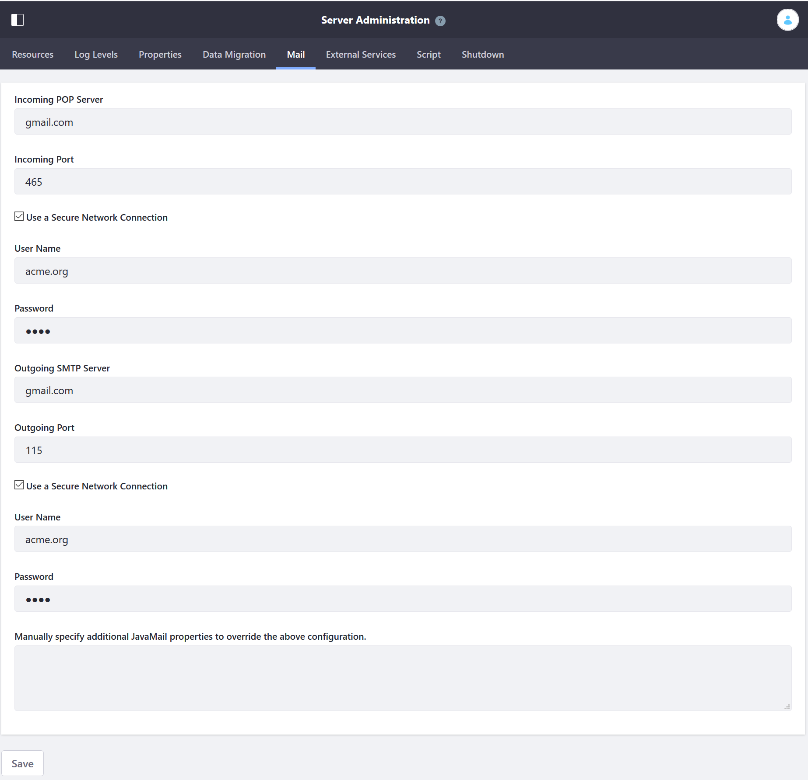

# Connecting to a Mail Server

Liferay DXP can be configured to use a mail server to send email notifications for a variety of purposes: User registration and password management, Site membership notifications, and content updates. This article will demonstrate how to configure DXP to use Gmail as its mail server.

```warning::
   If using the `IMAP <https://support.google.com/mail/answer/7126229?hl=en>`__ protocol for a category’s mailing list, make sure to `configure the IMAP inbox to delete messages <https://support.google.com/mail/answer/78892?hl=en>`__ as they are pulled by the email client that sends messages to the users on the mailing list. Otherwise, each email message retained on the server is sent to the mailing list each time there's a new post or update in the category.
```

## Configuring DXP Built-in Mail Session

Follow these steps to configure the mail session from the Control Panel:

1. Sign in as the administrative User (the User specified on the [Basic Configuration page](../01-installing-liferay-dxp/05-using-the-setup-wizard.md)).
1. Navigate to *Control Panel &rarr; Configuration &rarr; Server Administration &rarr; Mail*.
1. Enter your values for the following fields:

    * **Incoming POP Server:** pop.gmail.com
    * **Incoming Port:** _465_
    * **Use a Secure Network Connection:** Flagged
    * **User Name:** joe.bloggs
    * **Password:** *****
    * **Outgoing SMTP Server:** smtp.gmail.com
    * **Outgoing Port:** _110_
    * **Use a Secure Network Connection:** Flagged
    * **User Name:** joe.bloggs
    * **Password:** *****
    * **Manually specify additional JavaMail properties to override the above configuration:** If there are additional properties you need to specify, supply them here.

      

1. Click *Save*.

DXP connects to the mail session immediately.

## Additional Information

* [Advanced Email Configurations](./advanced-email-configurations.md)
* [Mail Server Configuration Reference](./mail-server-configuration-reference.md)
