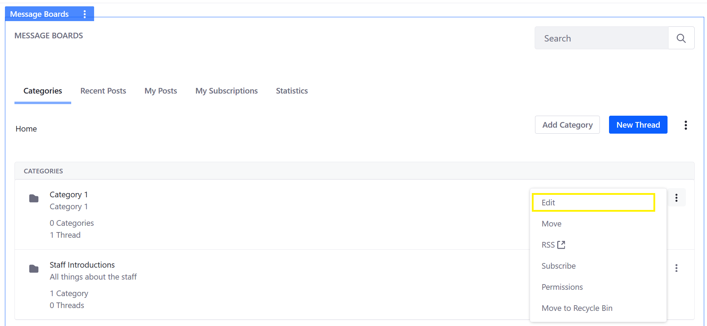
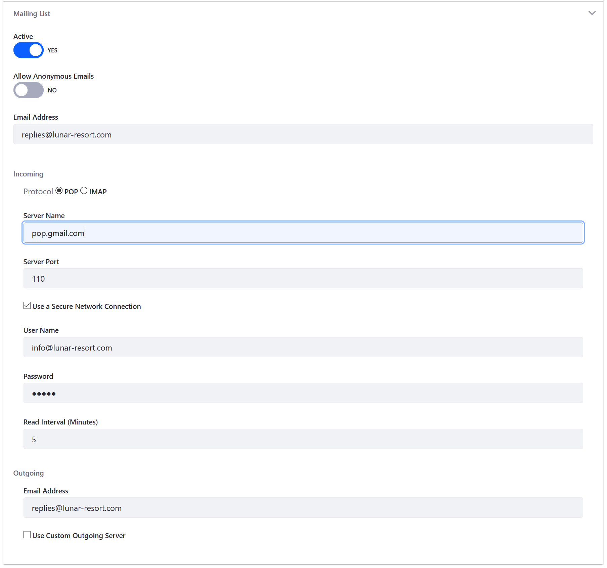

# Configuring a Message Boards Category Mailing List

This article documents how to configure a mailing list for a message board category in a **site-scoped** or **page-scoped message board**. See the [Scoping Your Message Boards](./scoping-your-message-boards.md) article to learn how to use scopes. Globally scoped messages boards do not support subscriptions and mailing lists. Any category in a message board can have its own mailing list.

## Prerequisites

Before configuring the Message Boards app's email lists, see the [Connecting to a Mail Server](../../../installation-and-upgrades/02-setting-up-liferay-dxp/connecting-to-a-mail-server.md) article for general instructions on how to configure a mail server for the entire DXP instance.

## Adding a Mailing List to a Message Boards Category

To add a mailing list to a Message Boards Category:

1. On the _Message Boards_ widget, click the _Actions_ () icon next to a Category (in this example, _Category 1_).

    

1. Click _Edit_ to modify an existing category.
1. Expand the _Mailing List_ section.
1. Switch the _Active_ toggle to _YES_.
1. Leave the _Allow Anonymous Emails_ toggle as _NO_.

    

1. Enter the following:

   * **Email address**: The dedicated email address or alias for this category (for example: replies@lunar-resort.com)
   * **Protocol**: POP
   * **Server Name**: The mail server’s host name
   * **Server Port**: The port on which the mail service is running (110)
   * **Use a Secure Network Connection**: Check if applicable
   * **User Name**: info@lunar-resort.com
   * **Password**: *****
   * **Read Interval (Minutes)**: 5
   * **Email Address (Outgoing)**: Use the same email if you want your users to reply to the categories using email
   * **Use Custom Outgoing Server**: Leave blank if using a different mail server than the global default

1. Click _Save_.

The mailing list is now active for this category. Users who have subscribed to this category now receive email notifications for new threads in the category.

```important::
   If using the `IMAP <https://support.google.com/mail/answer/7126229?hl=en>`_ protocol for a category’s mailing list, make sure to `configure the IMAP inbox to delete messages <https://support.google.com/mail/answer/78892?hl=en>`_ as they are pulled by the email client that sends messages to the users on the mailing list. Otherwise, each email message retained on the server is sent to the mailing list each time there's a new post or update in the category.
```

## Related Information

* [Connecting to a Mail Server](../../../installation-and-upgrades/02-setting-up-liferay-dxp/connecting-to-a-mail-server.md)
* [Creating Message Board Categories](./creating-message-boards-categories.md)
